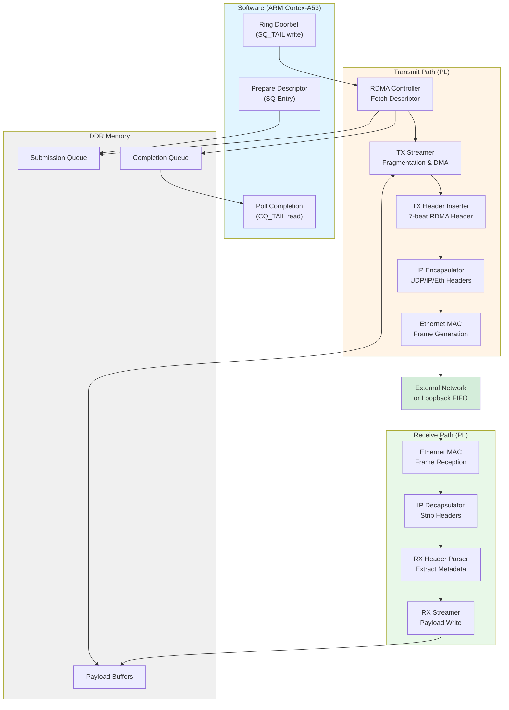

# RDMA Engine on Kria KR260

A custom RDMA-style data transfer pipeline implemented on the AMD/Xilinx Kria KR260 FPGA platform, targeting high-throughput, low-latency data movement between host memory and a physical Ethernet network interface.


## Overview

This project implements a fully hardware-driven RDMA data path that minimizes CPU involvement by offloading packet handling, queue management, and bulk memory transfers into FPGA logic. The system follows the architectural principles of RDMA systems while remaining lightweight, modular, and suitable for experimental validation.

**Key Features:**
- Queue-based work submission (Submission Queue / Completion Queue model)
- Hardware-driven descriptor execution via AXI DataMover
- IP/UDP packetization for standard Ethernet transport
- AXI 1G/2.5G Ethernet Subsystem with RGMII PHY
- Loopback mode for deterministic validation

## Architecture



## Project Structure

```
rdma_final_project/
├── rdma_tx/                    # Transmit path implementation
│   ├── Vivado/                 # FPGA design files
│   │   ├── rdma_tx_project.tcl # Project generation script
│   │   ├── src/                # Verilog source files
│   │   ├── bd/                 # Block design
│   │   ├── ip/                 # IP cores
│   │   ├── ip_repo/            # Custom IP repository
│   │   └── xdc/                # Constraints
│   └── Vitis/                  # Software application
│       └── rdma_tx_app/        # Bare-metal test application
│
├── rdma_rx/                    # Receive path implementation
│   ├── Vivado/                 # FPGA design files
│   │   ├── rdma_rx.tcl         # Project generation script
│   │   ├── src/                # Verilog source files
│   │   ├── bd/                 # Block design
│   │   ├── ip/                 # IP cores
│   │   ├── ip_repo/            # Custom IP repository
│   │   └── xdc/                # Constraints
│   └── Vitis/                  # Software application
│       └── rdma_rx/            # Bare-metal test application
│
docs/                           # Project documentation (MkDocs)
```

## Requirements

### Hardware
- AMD/Xilinx Kria KR260 Robotics Starter Kit
- Ethernet cable (for external loopback or network connection)
- JTAG/USB cable for programming

### Software
- Vivado 2024.1
- Vitis 2024.1 

## Quick Start

### 1. Generate Vivado Projects

**For TX Path:**
```bash
cd rdma_final_project/rdma_tx/Vivado
vivado -mode batch -source rdma_tx_project.tcl
```

**For RX Path:**
```bash
cd rdma_final_project/rdma_rx/Vivado
vivado -mode batch -source rdma_rx.tcl
```

### 2. Build the Hardware

1. Open the generated Vivado project
2. Run Synthesis
3. Run Implementation
4. Generate Bitstream
5. Export Hardware (including bitstream) for Vitis

### 3. Build and Run Software

1. Open Vitis and create a new platform project using the exported `.xsa` file
2. Import the application project from `Vitis/rdma_tx_app/` or `Vitis/rdma_rx/`
3. Build the application
4. Program the FPGA and run the application

## Hardware Modules

### TX Path (`rdma_tx`)
| Module | Description |
|--------|-------------|
| `rdma_axilite_ctrl.v` | AXI-Lite register interface for queue management |
| `tx_streamer.v` | Fragmentation and payload DMA coordination |
| `tx_header_inserter.v` | RDMA header serialization (7-beat, 28 bytes) |
| `rdma_ip_encap_integrated.v` | IP/UDP/Ethernet header encapsulation |
| `ip_eth_tx_64_rdma.v` | Ethernet frame generation |

### RX Path (`rdma_rx`)
| Module | Description |
|--------|-------------|
| `rdma_axilite_rx_ctrl.v` | AXI-Lite register interface |
| `rx_header_parser.v` | RDMA header extraction |
| `rx_streamer.v` | Payload writeback to DDR |
| `rdma_ip_decap_integrated.v` | IP/UDP/Ethernet header removal |
| `ip_eth_rx_64_rdma.v` | Ethernet frame reception |

**Documentation sections:**
- [Part 1: RDMA Core & Queue Engine](docs/project/RDMA_logic/)
- [Part 2: IP/UDP Packetization](docs/project/ip_encapsulator/)
- [Part 3: Ethernet MAC & PHY](docs/project/part1_ethernet/)

## Testing

The project includes bare-metal C applications for validating the hardware:

- **TX Test** (`rdma_tx_app`): Submits work requests to the Submission Queue, monitors Completion Queue, measures throughput
- **RX Test** (`rdma_rx`): Initializes Ethernet MAC/PHY, monitors DDR for received RDMA writes

### Loopback Testing
For initial validation, the TX and RX paths can be tested using internal loopback (AXI-Stream FIFO) before connecting to external Ethernet.

## Performance

| Metric | Value |
|--------|-------|
| Peak Throughput | ~950 MB/s |
| Block Size Range | 32 B - 16 KB |
| Fragmentation | 1 KB per packet |

## Team

| Member | Responsibility |
|--------|----------------|
| Emir Yalcin | Ethernet MAC/PHY subsystem (Part 3) |
| Tubi Soyer | IP/UDP packetization (Part 2) |
| Tolga Kuntman | RDMA Core & Queue Engine (Part 1) |

## References

- [AMD Kria KR260 Documentation](https://www.xilinx.com/products/som/kria/kr260-robotics-starter-kit.html)
- [AXI DataMover Product Guide (PG022)](https://www.xilinx.com/support/documents/ip_documentation/axi_datamover/v5_1/pg022_axi_datamover.pdf)
- [AXI Ethernet Subsystem Product Guide](https://www.xilinx.com/support/documents/ip_documentation/axi_ethernet/v7_2/pg138-axi-ethernet.pdf)
