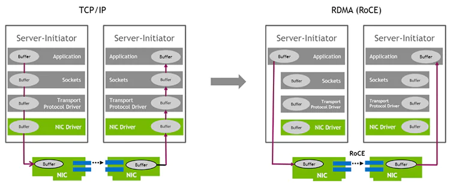
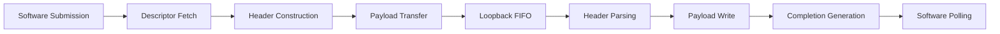

# RDMA Engine for FPGA-Based SoC

## 1. Introduction

**Remote Direct Memory Access (RDMA)** is a communication protocol that enables direct data transfer between the memory spaces of endpoints with minimal CPU involvement. Unlike traditional network stacks, RDMA offloads data movement, segmentation, and completion handling to dedicated hardware, allowing applications to achieve:

- **Low latency** through kernel bypass
- **High throughput** via zero-copy data transfers
- **Predictable performance** with explicit completion semantics

---

## State of the Art RDMA Protocols

Several RDMA-capable transport protocols are deployed in practice today:

- **InfiniBand**: Native RDMA fabric with tightly specified semantics and hardware-managed reliability. Provides the lowest latency but requires dedicated infrastructure.

- **RoCE (RDMA over Converged Ethernet)**: Enables RDMA semantics on Ethernet networks, relying on lossless fabric assumptions (typically via Priority Flow Control). Offers a balance between performance and infrastructure reuse.

- **iWARP**: Implements RDMA over TCP, trading some performance for routability and compatibility with existing Ethernet infrastructure. Provides reliable delivery without requiring lossless Ethernet.

Despite differences in transport mechanisms, all RDMA protocols share a **common programming model** based on queue pairs and work queue elements.

---

### Why Not Use Existing Protocols?

While InfiniBand, RoCE, and iWARP are mature and widely deployed, they introduce significant complexity that is beyond the scope of this educational project. InfiniBand requires specialized hardware and switches not readily available in typical lab environments. RoCE depends on lossless Ethernet configurations (PFC, ECN) that add network management overhead and require compatible switch infrastructure. iWARP, though more accessible over standard Ethernet, still demands a full TCP/IP stack implementation with its associated state management, congestion control, and reliability mechanisms. By implementing a simplified RDMA-style engine with a custom header format, this project isolates the core RDMA concepts—queue-based submission, DMA-driven data movement, and explicit completion semantics—without the burden of protocol compliance, enabling a clearer understanding of the fundamental hardware-software interactions that make RDMA efficient.

---

## RDMA vs. Traditional TCP/IP Communication

Compared to conventional TCP/IP-based communication, RDMA offers key architectural advantages:

| **Aspect** | **TCP/IP** | **RDMA** |
|------------|-----------|----------|
| **CPU Involvement** | High (system calls, protocol processing) | Minimal (hardware offload) |
| **Data Copies** | Multiple (user ↔ kernel buffers) | Zero-copy (direct memory access) |
| **Latency** | Higher (context switches, buffering) | Lower (kernel bypass) |
| **Completion Model** | Implicit (socket ready events) | Explicit (completion queue entries) |
| **Predictability** | Variable (depends on OS scheduling) | Deterministic (hardware-driven) |

**Key RDMA Benefits:**

1. **Kernel Bypass**: Eliminates system calls and data copies between user and kernel space, reducing overhead on the data path.

2. **Zero-Copy Transfers**: Network or DMA engines read from and write to application memory directly, avoiding intermediate buffering.

3. **Explicit Completion Semantics**: Software can reason precisely about when data movement has finished through hardware-generated completion queue entries.

In contrast, TCP prioritizes reliability and generality but incurs higher latency and CPU overhead due to protocol processing, buffering, and context switches.

---

### Why Not Use Existing Protocols?

While InfiniBand, RoCE, and iWARP are mature and widely deployed, they introduce significant complexity that is beyond the scope of this project. InfiniBand requires specialized hardware and switches not readily available in typical development environments. RoCE depends on lossless Ethernet configurations (PFC, ECN) that add network management overhead and require compatible switch infrastructure. iWARP, though more accessible over standard Ethernet, still demands a full TCP/IP stack implementation with its associated state management, congestion control, and reliability mechanisms. This project isolates the core RDMA concepts—queue-based submission, DMA-driven data movement, and explicit completion semantics—without the burden of protocol compliance, enabling a clearer understanding of the fundamental hardware-software interactions that make RDMA efficient by implementing a simplified RDMA-style engine with a custom header format.

---

## Project Objectives

The goal of this project is **not** to implement a full standards-compliant RDMA stack or to compete with production-grade NICs. Instead, the objective is to **design and validate a hardware-centric RDMA-style data path on an FPGA-based SoC**, focusing on the core mechanisms that make RDMA efficient:

- **Descriptor-driven execution**: Software submits work via memory-mapped queue structures
- **DMA-based data movement**: Hardware DataMover IP orchestrates memory transfers
- **Explicit completion reporting**: Completion queue entries provide status visibility
- **Clear hardware–software contract**: Pre-defined register interface and memory formats

---

## Design Philosophy: Loopback Architecture

To keep the design **tractable and verifiable**, the project adopts a **loopback architecture** in which transmitted packets are routed directly back into a receive pipeline on the same device.

### What is Included

- Submission Queue (SQ) and Completion Queue (CQ) management
- Descriptor fetch and parsing
- RDMA header construction (7-beat custom format)
- DataMover-controlled payload transfers (MM2S and S2MM)
- Header insertion and parsing logic
- Completion generation and pointer management
- Software polling interface via AXI-Lite registers
- Ethernet framing, MAC/PHY integration
- Congestion control and flow control mechanisms

---

## System Overview

The resulting system serves as a **proof-of-concept RDMA engine** that demonstrates an end-to-end transaction lifecycle:

---

## Target Platform

- **Hardware**: AMD Kria KR260 (Zynq UltraScale+ MPSoC)
  - Processing System: ARM Cortex-A53 quad-core
  - Programmable Logic: FPGA fabric for RDMA controller and data path
  - Memory: DDR4 for queue structures and payload buffers (BRAM or URAM can also be used for both)
  
- **Software**: Bare-metal application (no OS)
  - Direct register access via memory-mapped I/O
  - Explicit cache management (flush/invalidate operations)
  - Polling-based completion detection

---

**Next**: See [Section 2: System Overview](ch2_sytem_overview.md) for high-level architecture and design principles.