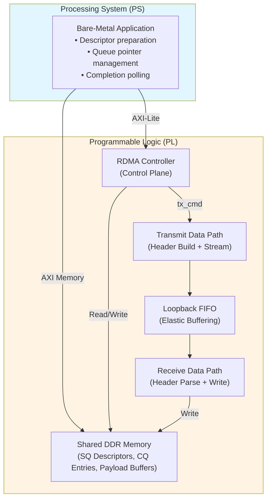

# Section 2: System Overview

This section presents a high-level overview of the RDMA engine system, its major components, and the design principles that guide the overall architecture. Detailed control flow, data path behavior, and register-level interfaces are described in later sections.

---

## 2.1 Design Principles

The system architecture is guided by the following principles:

| Principle | Description |
|-----------|-------------|
| **Hardware-driven data movement** | All payload transfers are performed by DMA engines in the programmable logic (PL), without CPU involvement on the data path. |
| **Queue-based control model** | Software interacts with hardware through submission and completion queues residing in DDR memory. |
| **Deterministic execution** | Operations are processed sequentially, ensuring precise ordering and straightforward verification. |
| **Minimal protocol scope** | Only essential RDMA mechanisms are implemented; transport-layer features (retransmission, congestion control) are excluded. |

---

## 2.2 System Block Diagram

The system comprises six functional domains spanning the Processing System (PS) and Programmable Logic (PL):

---

## 2.3 Functional Block Descriptions

### Processing System (PS) — ARM Cortex-A53

The PS hosts the bare-metal software application responsible for:

- Preparing work descriptors in DDR memory
- Configuring hardware through memory-mapped registers
- Polling for operation completions

The PS communicates with the PL through two paths: an AXI-Lite interface for register access and AXI memory transactions for DDR access.

---

### RDMA Controller — Control Plane

The central coordinator residing in the PL that orchestrates descriptor processing. The controller fetches work requests from the submission queue, dispatches them to the transmit path, and generates completion entries upon transaction completion.

For queue ownership semantics and execution flow details, see [Chapter 3](ch3_hardware_architecture.md).

---

### Transmit Data Path — Header Construction and Payload Streaming

The transmit path converts work descriptors into RDMA packets by:

- Constructing protocol headers from descriptor fields
- Reading payload data from DDR via DMA
- Streaming the combined header and payload downstream

Architectural details are provided in [Section 3.3](ch3_hardware_architecture.md#33-transmit-path-tx).

---

### Ethernet Interface — Primary External I/O

The primary data path uses the AXI 1G/2.5G Ethernet Subsystem with RGMII PHY for external network connectivity:

- **IP Encapsulator**: Wraps RDMA packets in UDP/IP/Ethernet headers for transmission
- **IP Decapsulator**: Strips transport headers from received packets, extracting RDMA payload
- **AXI Ethernet MAC**: Handles Ethernet frame generation, CRC, and PHY interface timing
- **RGMII PHY**: Physical layer interface to external Ethernet network

This path enables communication with remote endpoints over standard Ethernet infrastructure.

---

### Loopback FIFO — Validation Mode

An AXI-Stream FIFO that routes transmitted packets directly back to the receive path, bypassing the Ethernet MAC and PHY. This component is used during bring-up and regression testing:

- Preserving packet boundaries (TLAST semantics)
- Providing elastic buffering between TX and RX clock domains
- Handling backpressure when the receive path is busy

---

### Receive Data Path — Header Parsing and Payload Write

The receive path processes incoming packets by:

- Parsing protocol headers to extract transfer metadata
- Computing destination addresses from header fields
- Writing payload data to DDR via DMA

The receive path operates independently from the RDMA controller. See [Section 3.4](ch3_hardware_architecture.md#34-receive-path-rx) for implementation details.

---

### Shared DDR Memory — Queue Structures and Payload Buffers

DDR memory hosts all persistent data structures:

- **Submission Queue (SQ)**: Work descriptors posted by software
- **Completion Queue (CQ)**: Status entries generated by hardware
- **Payload Buffers**: Source and destination regions for data transfers

The PS accesses DDR through a cache-coherent path, while PL components use non-coherent DMA via the [AXI DataMover](https://www.xilinx.com/support/documents/ip_documentation/axi_datamover/v5_1/pg022_axi_datamover.pdf). Queue structure formats are defined in [Section 3.2](ch3_hardware_architecture.md#32-queue-management-blocks-sq-and-cq).

---

## 2.4 Control Plane vs. Data Plane Separation

A key architectural decision is the **strict separation** between control and data responsibilities:

| Plane | Components | Responsibilities |
|-------|------------|------------------|
| **Control Plane** | RDMA Controller | Descriptor lifecycle, queue pointer management, operation sequencing, completion generation |
| **Data Plane** | TX/RX Paths, DataMover | Byte movement between DDR and AXI-Stream, header construction/parsing, backpressure handling |

This separation ensures that control overhead does not block data throughput and allows independent optimization of each path.

---

## 2.5 Descriptor-Driven Execution

All operations are initiated by **software-posted descriptors** residing in DDR. The hardware never speculates or generates work autonomously—it processes only what software explicitly submits.

This model mirrors the execution semantics of production RDMA devices: software posts work, hardware executes it, and hardware reports completion. The specific queue ownership rules, pointer semantics, and execution flow are detailed in [Chapter 3](ch3_hardware_architecture.md).

