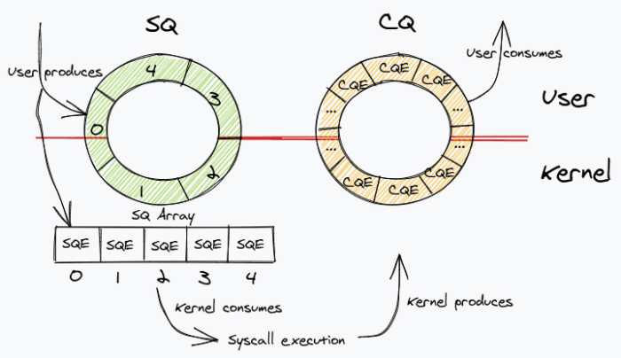

# Section 2: System Overview

This section presents a high-level overview of the RDMA engine system, its major components, and the design principles that guide the overall architecture. Detailed control flow, data path behavior, and register-level interfaces are described in later sections.

---

## 2.1 Design Objectives

The system is designed with the following core principles:

### Primary Objectives

**Hardware-driven data movement**  
All payload transfers are performed by data movers in the PL, without CPU involvement on the data path. Software submits work but does not touch payload bytes.

**Explicit queue-based control model**  
Software interacts with hardware exclusively through submission and completion queues in DDR memory, following industry-standard RDMA semantics.

**Deterministic execution flow**  
One work request is processed at a time by a single controller FSM, ensuring precise ordering and easy verification. No concurrent operations or speculative execution.

**Minimal protocol scope**  
Only the essential RDMA mechanisms are implemented. Transport-layer features (retransmission, congestion control) are intentionally excluded for clarity.

**Verifiability and traceability**  
Every observable software-visible event (e.g., SQ_HEAD or CQ_TAIL update) corresponds to a clearly defined hardware state transition, enabling precise debugging.

---

## 2.2 Top-Level System Composition

The system comprises six functional domains that interact through well-defined interfaces:

### 1. Processing System (PS) — ARM Cortex-A53

**Responsibilities:**
- Run bare-metal software application
- Prepare 64-byte work descriptors in DDR
- Manage queue pointers via memory-mapped AXI-Lite registers
- Poll for completions and verify results
- Perform explicit cache flush/invalidate operations

**Interface:** AXI-Lite register access, cache-coherent DDR access

---

### 2. RDMA Controller (PL) — Control Plane FSM

**Responsibilities:**
- Implement the control plane for RDMA operations
- Fetch SQ descriptors via [DataMover](https://www.xilinx.com/support/documents/ip_documentation/axi_datamover/v5_1/pg022_axi_datamover.pdf) MM2S channel
- Orchestrate data movement by issuing commands to TX streamer
- Generate 32-byte CQ entries and write to DDR via [DataMover](https://www.xilinx.com/support/documents/ip_documentation/axi_datamover/v5_1/pg022_axi_datamover.pdf) S2MM
- Own SQ_HEAD and CQ_TAIL hardware pointers
- Interface with [DataMover](https://www.xilinx.com/support/documents/ip_documentation/axi_datamover/v5_1/pg022_axi_datamover.pdf) command and status channels

**Implemented in:** `rdma_controller.v`  
**Key signals:** `tx_cmd`, `tx_cpl`, `SQ_HEAD`, `CQ_TAIL`

---

### 3. Transmit Data Path (PL) — Header + Payload Streaming

**Responsibilities:**
- Convert SQ descriptor into RDMA packet format
- Construct 7-beat (28-byte) RDMA headers with field serialization
- Issue MM2S [DataMover](https://www.xilinx.com/support/documents/ip_documentation/axi_datamover/v5_1/pg022_axi_datamover.pdf) commands for payload reads from DDR
- Serialize header + payload as continuous AXI-Stream
- Handle fragmentation for 4 KB boundary alignment

**Implemented in:** `tx_streamer.v`, `tx_header_inserter.v`  
**Key signals:** `start_tx`, `hdr_tx_done`, `mm2s_rd_xfer_cmplt`

---

### 4. Loopback AXI STREAM FIFO (PL) — Elastic Buffering

**Responsibilities:**
- It's only implemented to test the RDMA logic in one board. 
- It acts like the IP modules and the ethernet modules of the project.
- Buffer transmitted packets using AXI-Stream FIFO
- Preserve packet boundaries (TLAST propagation)
- Handle backpressure between TX and RX paths
- Enable self-contained validation without external networking

**Implemented in:** `axis_data_fifo_0` (Xilinx IP)  
**Interface:** 32-bit AXI-Stream with TVALID/TREADY/TLAST

---

### 5. Receive Data Path (PL) — Header Parsing + Payload Write

**Responsibilities:**
- Parse 7-beat RDMA headers from incoming AXI-Stream
- Extract operation metadata (opcode, addresses, length)
- Issue S2MM [DataMover](https://www.xilinx.com/support/documents/ip_documentation/axi_datamover/v5_1/pg022_axi_datamover.pdf) commands to write payload to DDR
- Compute destination address as `remote_addr + fragment_offset`
- Operate independently from RDMA controller (no CQ write on RX)

**Implemented in:** `rx_header_parser.v`, `rx_streamer.v`  
**Key signals:** `header_valid`, `s2mm_wr_xfer_cmplt`

---

### 6. Shared DDR Memory — Queue Structures and Payload Buffers

**Contents:**
- **SQ buffer**: 64-byte descriptors at `SQ_BASE + (index × 64)`
- **CQ buffer**: 32-byte completions at `CQ_BASE + (index × 32)`
- **Payload buffers**: Application data at arbitrary addresses

**Access:**
- **PS**: Cache-coherent path (requires explicit flush/invalidate)
- **PL**: Non-coherent DMA via [DataMover](https://www.xilinx.com/support/documents/ip_documentation/axi_datamover/v5_1/pg022_axi_datamover.pdf) (MM2S/S2MM)

---

## 2.3 Control Plane vs. Data Plane Separation

A key architectural decision is the **strict separation** between control plane and data plane responsibilities:

| **Plane** | **Components** | **Responsibilities** |
|-----------|----------------|----------------------|
| **Control Plane** | RDMA controller FSM | • Descriptor lifecycle management<br/>• Queue pointer updates (SQ_HEAD, CQ_TAIL)<br/>• Operation sequencing<br/>• Completion generation |
| **Data Plane** | TX/RX streamers<br/>[DataMover](https://www.xilinx.com/support/documents/ip_documentation/axi_datamover/v5_1/pg022_axi_datamover.pdf) IP | • Moving bytes between DDR and AXI-Stream<br/>• Inserting and parsing headers<br/>• Handling backpressure and TLAST propagation<br/>• Fragmentation logic |

---

## 2.4 Descriptor-Driven Execution Model

All operations are initiated by **software-posted descriptors** residing in DDR. The hardware **never speculates** or generates work autonomously.




### Execution Pipeline

Once the SQ_TAIL pointer is advanced by software, the descriptor becomes visible to hardware and progresses through a **strictly ordered execution pipeline**:

```
1. Fetch   → [DataMover](https://www.xilinx.com/support/documents/ip_documentation/axi_datamover/v5_1/pg022_axi_datamover.pdf) reads 64 bytes from SQ_BASE + (SQ_HEAD × 64)
2. Parse   → Extract fields into internal registers
3. Execute → TX streamer reads payload, constructs packet, streams to FIFO
4. Complete → Write 32-byte CQ entry to DDR, update SQ_HEAD and CQ_TAIL
```

This model mirrors the execution semantics of production RDMA devices while remaining **fully transparent** to software and debug tools.

---

## 2.5 Single-Operation Execution Policy

The current design processes **one work request at a time**. The RDMA controller does not fetch a new SQ entry until:

1. The current payload transmission has completed (`mm2s_rd_xfer_cmplt` detected)
2. The corresponding CQ entry has been written to DDR (`s2mm_wr_xfer_cmplt` detected)
3. SQ_HEAD and CQ_TAIL pointers have been updated atomically

### Trade-offs

**Advantages:**
- Eliminates reordering and race conditions
- Simplifies completion correlation (1:1 SQ entry → CQ entry)
- Makes hardware/software interaction easy to verify
- Deterministic behavior suitable for functional validation

**Limitations:**
- Reduced throughput (no pipelining of multiple operations)
- Single-threaded execution (FSM idle between operations)

This conservative policy is a **deliberate trade-off** aligned with the project's architectural validation goals. Software may post multiple descriptors to the SQ, but hardware processes them sequentially.

