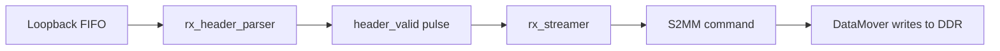
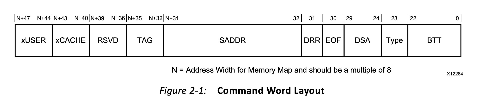
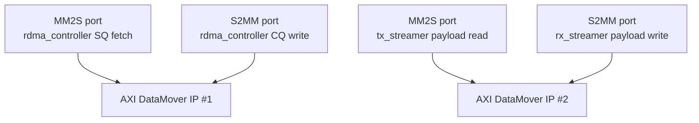

# Section 3: Hardware Architecture and RDMA Execution Model

This section describes the structural organization of the programmable logic (PL), the queue-based execution model, and the complete lifecycle of an RDMA operation from software submission through completion. It serves as the core technical reference for understanding the system's hardware-software interactions.

---

## 3.1 Top-Level PL Architecture

The programmable logic is organized around a **single control authority** (the RDMA controller) and **multiple specialized data path components**. Each block has well-defined ownership boundaries, ensuring clear separation between control and data plane responsibilities.

### Block Diagram

```mermaid
graph TB
    subgraph PL["Programmable Logic (PL)"]
        CTRL["RDMA Controller<br/>• Queue pointer management (SQ_HEAD, CQ_TAIL)<br/>• Descriptor fetch and parsing<br/>• Completion entry generation<br/>• Operation sequencing"]
        
        DM1["DataMover #1 (Control)<br/>• MM2S: SQ descriptor fetch<br/>• S2MM: CQ entry write"]
        
        TX["TX Streamer<br/>• Fragmentation logic<br/>• MM2S command generation<br/>• Header inserter control"]
        
        HDR_INS["TX Header Inserter<br/>• 7-beat header serialize<br/>• Payload pass-through"]
        
        DM2["DataMover #2 (Data)<br/>• MM2S: TX payload read<br/>• S2MM: RX payload write"]
        
        ENCAP["IP Encapsulator<br/>• UDP/IP/Eth headers<br/>• Endpoint lookup"]
        
        MAC_TX["AXI Ethernet MAC (TX)<br/>• Frame generation<br/>• RGMII PHY interface"]
        
        NET["External Network<br/>or Loopback"]
        
        MAC_RX["AXI Ethernet MAC (RX)<br/>• Frame reception"]
        
        DECAP["IP Decapsulator<br/>• Header strip<br/>• RDMA payload extract"]
        
        HDR_PARSE["RX Header Parser<br/>• 7-beat header extract<br/>• Payload pass-through"]
        
        RX["RX Streamer<br/>• S2MM command generation<br/>• Opcode validation"]
        
        LOOP["Loopback FIFO<br/>(Validation Mode)"]
    end
    
    CTRL -->|tx_cmd| TX
    CTRL -->|CQ write| DM1
    CTRL <-->|SQ fetch| DM1
    
    TX --> HDR_INS
    HDR_INS <-->|Payload DMA| DM2
    
    HDR_INS --> ENCAP
    ENCAP --> MAC_TX
    MAC_TX --> NET
    
    HDR_INS -.->|Optional| LOOP
    LOOP -.->|Validation| HDR_PARSE
    
    NET --> MAC_RX
    MAC_RX --> DECAP
    DECAP --> HDR_PARSE
    
    HDR_PARSE --> RX
    RX <-->|Payload write| DM2
    
    style CTRL fill:#e8f4f8
    style DM1 fill:#fff4e6
    style DM2 fill:#fff4e6
    style LOOP stroke-dasharray: 5 5
    style NET fill:#d4edda
```



### Component Responsibilities

#### RDMA Controller

The global coordinator and sole authority over queue management.

| Responsibility | Description |
|----------------|-------------|
| Queue ownership | Maintains SQ_HEAD and CQ_TAIL pointers; no other block accesses queue state |
| Descriptor lifecycle | Fetches, parses, and commits SQ entries to execution |
| Completion generation | Constructs and writes CQ entries to DDR |
| Operation sequencing | Ensures single-operation-at-a-time execution model |

**File:** `rdma_controller.v`

---

#### TX Streamer

Owns the transmit-side data movement and packetization process.

| Responsibility | Description |
|----------------|-------------|
| Fragmentation | Computes chunk boundaries for 1 KB packetization and block size limits |
| Payload DMA | Issues MM2S commands to DataMover for payload reads |
| Header coordination | Programs and triggers the header inserter |
| Completion signaling | Reports transmission status back to controller |

**File:** `tx_streamer.v`

---

#### TX Header Inserter

A stateless stream-processing block that serializes RDMA metadata into AXI-Stream beats.

| Responsibility | Description |
|----------------|-------------|
| Header serialization | Converts structured fields into 7 × 32-bit beats (28 bytes) |
| Stream ordering | Ensures headers precede payload data |
| Pass-through mode | Relays payload directly after header transmission |

**File:** `tx_header_inserter.v`

---

#### RX Header Parser

Performs the inverse of header insertion, extracting metadata from incoming packets.

| Responsibility | Description |
|----------------|-------------|
| Header extraction | Accumulates 7 beats and decodes RDMA fields |
| Downstream notification | Asserts `header_valid` when parsing completes |
| Payload forwarding | Passes payload stream to RX streamer |

**File:** `rx_header_parser.v`

---

#### RX Streamer

Orchestrates receive-side memory writes. Operates independently of the RDMA controller.

| Responsibility | Description |
|----------------|-------------|
| Address computation | Calculates destination: `remote_addr + fragment_offset` |
| Opcode validation | Processes only WRITE operations (0x01, 0x06, 0x07, 0x08, 0x0A) |
| Payload DMA | Issues S2MM commands to DataMover for DDR writes |

**File:** `rx_streamer.v`

---

#### AXI DataMover

Provides all DDR access for both control and data paths. The design uses two DataMover instances to avoid command contention:

| Instance | MM2S Channel | S2MM Channel |
|----------|--------------|--------------|
| DataMover #1 | SQ descriptor fetch | CQ entry write |
| DataMover #2 | TX payload read | RX payload write |

Each channel has a single logical owner, eliminating arbitration complexity.

**Type:** [Xilinx AXI DataMover IP](https://www.xilinx.com/support/documents/ip_documentation/axi_datamover/v5_1/pg022_axi_datamover.pdf)

---

## 3.2 Queue Architecture and Ownership

Queue management is **centralized entirely** within the RDMA controller. This single-source-of-truth design eliminates race conditions and simplifies verification.


### Submission Queue (SQ)

The SQ holds work descriptors posted by software for hardware execution.

| Property | Value |
|----------|-------|
| Location | DDR memory (circular buffer) |
| Entry size | 64 bytes |
| Address calculation | `SQ_BASE + (index × 64)` |

**Pointer Ownership:**

| Pointer | Owner | Access |
|---------|-------|--------|
| SQ_TAIL | Software | Read/Write via AXI-Lite |
| SQ_HEAD | Hardware | Read-only to software |

**Semantics:**

- Software advances SQ_TAIL after writing descriptors, signaling work availability
- Hardware advances SQ_HEAD after completing an operation, freeing the slot
- Work is available when `SQ_HEAD ≠ SQ_TAIL`
- Queue is full when `(SQ_TAIL + 1) mod SQ_SIZE == SQ_HEAD`

---

### Completion Queue (CQ)

The CQ holds completion entries generated by hardware after operation execution.

| Property | Value |
|----------|-------|
| Location | DDR memory (circular buffer) |
| Entry size | 32 bytes |
| Address calculation | `CQ_BASE + (index × 32)` |

**Pointer Ownership:**

| Pointer | Owner | Access |
|---------|-------|--------|
| CQ_TAIL | Hardware | Read-only to software |
| CQ_HEAD | Software | Read/Write via AXI-Lite |

**Semantics:**

- Hardware advances CQ_TAIL after writing a completion entry
- Software advances CQ_HEAD after consuming the entry, freeing the slot
- Completions are available when `CQ_HEAD ≠ CQ_TAIL`

---

### Circular Buffer Wraparound

Both queues use modulo arithmetic for pointer management:

```
next_pointer = (current + 1 == SIZE) ? 0 : (current + 1)
```

This ensures indices remain in the range [0, SIZE-1], allowing the buffer to function as a circular ring.

---

### SQ Descriptor Format

Each 64-byte SQ entry contains the following fields:

| Offset | Field | Size | Description |
|--------|-------|------|-------------|
| 0-3 | WQE ID | 32 bits | Application-assigned work request identifier |
| 4-5 | Opcode | 16 bits | Operation type (WRITE variants) |
| 6-7 | Flags | 16 bits | Reserved |
| 8-15 | Local Address | 64 bits | Source DDR address for payload |
| 16-23 | Remote Address | 64 bits | Destination DDR address (receiver side) |
| 24-27 | Length | 32 bits | Payload size in bytes |
| 28-63 | Reserved | 36 bytes | Future use |

---

### CQ Entry Format

Each 32-byte CQ entry contains completion status:

| Offset | Field | Size | Description |
|--------|-------|------|-------------|
| 0-3 | SQ Index | 32 bits | Index of completed SQ entry |
| 4-7 | Status | 32 bits | Completion status (0 = success) |
| 8-11 | Bytes Sent | 32 bits | Actual bytes transmitted |
| 12-15 | Debug | 32 bits | Diagnostic field |
| 16-19 | Original ID | 32 bits | WQE ID from original descriptor |
| 20-23 | Original Length | 32 bits | Requested transfer length |
| 24-31 | Reserved | 8 bytes | Future use |

---

## 3.3 Descriptor Lifecycle (End-to-End Execution)

The system processes one work request at a time, following a deterministic lifecycle from software submission through completion reporting. This single-operation execution policy ensures precise ordering and straightforward verification.

{{include: figures/rdma_end_to_end_flow.mmd}}

### Phase 1: Work Submission

1. **Descriptor preparation**: Software constructs a 64-byte SQ entry at `SQ_BASE + (SQ_TAIL × 64)`, populating opcode, addresses, and length fields.

2. **Cache flush**: Software flushes the descriptor from CPU cache to ensure visibility to PL DMA engines.

3. **Doorbell**: Software writes the new tail value to the SQ_TAIL register. This write both updates the pointer and generates a doorbell pulse to the controller.

### Phase 2: Descriptor Fetch and Parse

4. **Work detection**: The controller detects `SQ_HEAD ≠ SQ_TAIL` and initiates processing.

5. **Descriptor fetch**: The controller issues a 64-byte MM2S read command to DataMover #1, targeting `SQ_BASE + (SQ_HEAD × 64)`.

6. **Field extraction**: The descriptor parser receives the 64-byte stream, extracts all fields, and signals completion to the controller.

7. **Field latching**: The controller captures parsed fields into internal registers for use throughout the operation.

### Phase 3: Transmission

8. **TX command**: The controller issues a transmit command to the TX streamer, providing opcode, addresses, length, and header metadata.

9. **Fragmentation**: The TX streamer computes chunk boundaries based on 1 KB packetization and block size constraints.

10. **Header insertion**: For each fragment, the streamer programs the header inserter with metadata and triggers serialization.

11. **Payload DMA**: The streamer issues MM2S commands to DataMover #2, reading payload from the local DDR address.

12. **Packet streaming**: The header inserter emits 7 header beats followed by payload pass-through. TLAST marks the packet boundary.

### Phase 4: Loopback and Reception

13. **FIFO buffering**: The loopback FIFO absorbs the transmitted packet, preserving TLAST.

14. **Header parsing**: The RX header parser accumulates 7 beats, extracts fields, and asserts `header_valid`.

15. **Opcode check**: The RX streamer validates the opcode. Non-WRITE operations are discarded.

16. **Payload write**: For WRITE operations, the streamer computes `dest_addr = remote_addr + fragment_offset` and issues an S2MM command to DataMover #2.

### Phase 5: Completion

17. **TX completion**: After all fragments transmit, the TX streamer asserts `tx_cpl_valid` with status and byte count.

18. **CQ entry construction**: The controller populates an 8-word (32-byte) CQ entry with SQ index, status, byte count, and original descriptor fields.

19. **CQ write**: The controller issues a 32-byte S2MM write to `CQ_BASE + (CQ_TAIL × 32)` via DataMover #1.

20. **Pointer update**: Upon write completion, the controller atomically increments both SQ_HEAD (freeing the descriptor slot) and CQ_TAIL (making the completion visible).

### Phase 6: Completion Consumption

21. **Poll**: Software polls the CQ_TAIL register until it advances.

22. **Cache invalidate**: Software invalidates the CQ entry cache lines.

23. **Read completion**: Software reads the CQ entry from DDR and verifies status.

24. **CQ_HEAD advance**: Software writes the new CQ_HEAD value to free the completion slot.

---

## 3.4 Transmit Path (TX)

The transmit path converts work descriptors into serialized RDMA packets (header + payload).

### Ownership Division

| Block | Decides | Does Not Decide |
|-------|---------|-----------------|
| RDMA Controller | When transmission occurs | How packetization works |
| TX Streamer | How transmission occurs (fragmentation, DMA commands) | When to start |

This separation ensures that control overhead does not block data throughput.

---

### RDMA Header Format

The TX header inserter serializes metadata into 7 × 32-bit beats (28 bytes total):

| Beat | Content | Description |
|------|---------|-------------|
| 0 | PSN[23:0] \| Opcode[7:0] | Packet sequence number and operation type |
| 1 | Reserved[7:0] \| Dest_QP[23:0] | Destination queue pair identifier |
| 2 | Remote_Addr[31:0] | Lower 32 bits of destination address |
| 3 | Reserved[15:0] \| Fragment_Offset[15:0] | Offset within fragmented transfer |
| 4 | Length[31:0] | Payload length for this fragment |
| 5 | Reserved[15:0] \| Partition_Key[15:0] | Fixed value (0xFFFF) |
| 6 | Constant[23:0] \| Service_Level[7:0] | Fixed marker (0xABABAB) and QoS |

**Header-to-payload transition**: After emitting beat 6, the header inserter enters pass-through mode, relaying DataMover payload directly to its output while propagating backpressure upstream.

---

### Fragmentation

The TX streamer implements fragmentation for payloads that exceed Ethernet frame constraints:

| Constraint | Limit | Rationale |
|------------|-------|-----------|
| 1 KB packetization | Maximum 1024 bytes per fragment | AXI Ethernet IP maximum payload is approximately 1.5 KB including headers; 1 KB ensures each RDMA packet (header + payload) fits within Ethernet MTU |
| Block size | Configurable maximum (default 1024 bytes) | Limits per-fragment size |

For each fragment:

1. Compute fragment length as `min(remaining_bytes, BLOCK_SIZE, bytes_to_1KB_boundary)`
2. Program header inserter with fragment-specific length and offset
3. Issue MM2S command for the fragment's address range
4. Wait for completion before processing next fragment

Single-fragment transfers (≤1 KB) use `fragment_offset = 0`.

---

### Completion Signaling

The TX streamer reports completion to the controller only after:

- DataMover confirms payload read complete (`mm2s_rd_xfer_cmplt`)
- Header inserter confirms packet transmission complete (`hdr_tx_done`)

This dual-completion check ensures the entire packet has been transmitted before the controller proceeds to CQ generation.

---

## 3.5 Receive Path (RX)

The receive path performs the inverse of transmission: extracting metadata from incoming packets and writing payloads to DDR.

### Independence from Controller

**Key design decision**: The RX path operates autonomously. The RDMA controller has no visibility into RX operations and receives no completion notification from the RX side.

This design choice:

- Simplifies the controller FSM (TX-only scope)
- Enables independent RX development and testing
- Reflects the loopback validation focus (TX completion is sufficient for correctness verification)

---

### Header Parsing

The RX header parser implements a three-phase process:

1. **Accumulate**: Collect 7 incoming beats into an internal buffer
2. **Extract**: Decode fields (opcode, remote_addr, length, fragment_offset) when beat 6 arrives
3. **Forward**: Pass payload beats directly to RX streamer while monitoring for TLAST

The `header_valid` pulse notifies the RX streamer that extracted fields are stable.

---

### Opcode Validation

The RX streamer processes only WRITE operations. Supported opcodes:

| Opcode | Name | Description |
|--------|------|-------------|
| 0x01 | WRITE_TEST | Custom test opcode |
| 0x06 | WRITE_FIRST | First fragment of multi-fragment WRITE |
| 0x07 | WRITE_MIDDLE | Middle fragment |
| 0x08 | WRITE_LAST | Final fragment |
| 0x0A | WRITE_ONLY | Single-fragment WRITE |

Packets with non-WRITE opcodes are silently discarded (payload forwarded but not written to DDR).

---

### Payload Writeback

For valid WRITE operations:

1. Compute destination address: `dest_addr = remote_addr + fragment_offset`
2. Issue S2MM command to DataMover #2 with computed address and length
3. DataMover writes payload stream directly to DDR as it arrives

The RX streamer does not generate completion entries or notify software. Payload verification is performed by software reading the destination buffer after observing TX-side completion.

---

### Data Flow Through RX Path



---

## 3.6 Memory Access via AXI DataMover

All DDR access is performed through the [Xilinx AXI DataMover IP](https://www.xilinx.com/support/documents/ip_documentation/axi_datamover/v5_1/pg022_axi_datamover.pdf), which provides high-throughput burst transfers with simple command interfaces.

### DataMover Command Format (72-bit)



| Bits | Field | Description |
|------|-------|-------------|
| [71:64] | Reserved | Set to 0 |
| [63:32] | Address | 32-bit DDR byte address |
| [31] | Type | Fixed address mode (unused) |
| [30] | DSA | Deterministic slave address (always 1) |
| [29:24] | Reserved | Set to 0 |
| [23] | EOF | End of frame (always 1 for single transfers) |
| [22:0] | BTT | Bytes to transfer (up to 8 MB) |

---

### Ownership Model

Each DataMover channel has a single logical owner:



This ownership model eliminates arbitration complexity and ensures deterministic command ordering.

---

### Completion Detection

Each channel signals completion via single-cycle pulses:

- `mm2s_rd_xfer_cmplt`: MM2S read finished
- `s2mm_wr_xfer_cmplt`: S2MM write finished

The issuing block monitors its completion signal to determine when the transfer has finished and the next operation can proceed.

---

## 3.7 Software-Hardware Contract

The RDMA engine requires software to adhere to specific protocols and assumptions at the PS-PL boundary.

### Cache Coherency Requirements

The ARM Cortex-A53 uses separate L1/L2 caches that are not coherent with PL DMA. Software must perform explicit cache maintenance:

| Operation | Required Action | Rationale |
|-----------|-----------------|-----------|
| Before SQ_TAIL write | Flush SQ descriptor | Ensure PL reads current descriptor |
| Before TX start | Flush payload buffer | Ensure DataMover reads current data |
| Before CQ read | Invalidate CQ entry | Ensure software sees PL-written completion |
| Before payload verify | Invalidate destination buffer | Ensure software sees RX-written data |

**Flush**: Writes dirty cache lines to DDR, making CPU writes visible to PL.

**Invalidate**: Discards cache lines, forcing subsequent reads to fetch from DDR, making PL writes visible to CPU.

---

### Descriptor Correctness Assumptions

The hardware does not validate descriptor fields. Software is responsible for ensuring:

| Field | Requirement |
|-------|-------------|
| Local address | Valid DDR address within allocated payload buffer |
| Remote address | Valid DDR address for destination buffer |
| Length | Non-zero, within allocated buffer sizes |
| Opcode | Valid WRITE operation code |

Invalid addresses may cause DataMover errors or undefined behavior. Invalid lengths may cause incomplete transfers or buffer overflows.

---

### Completion Visibility Guarantees

The hardware provides the following guarantees:

1. **Atomicity**: SQ_HEAD and CQ_TAIL advance together in a single cycle after CQ entry is committed to DDR.

2. **Ordering**: The CQ entry is fully written before pointers advance. Software observing CQ_TAIL advancement can safely read the completion.

3. **Correlation**: Each CQ entry contains the SQ index of the completed operation, enabling software to correlate completions with submissions.

4. **Status**: The status field indicates success (0) or error. The current implementation always reports success; error detection is not implemented.

---

### Polling Model

The design uses polling-only completion detection:

- Software polls CQ_TAIL register until `CQ_TAIL ≠ CQ_HEAD`
- Interrupts are not implemented
- Software should implement timeout detection to handle hardware stalls

---

### Queue Sizing Constraints

Software must configure queue sizes before enabling the controller:

- SQ_SIZE and CQ_SIZE define maximum queue depths
- Maximum in-flight operations: `min(SQ_SIZE - 1, CQ_SIZE - 1)`
- Queue full conditions stall hardware (no overflow protection)

---

### Error Handling Limitations

The current implementation has limited error handling:

| Condition | Behavior |
|-----------|----------|
| DataMover error | Not monitored; may cause stall |
| Invalid address | Undefined behavior |
| Queue overflow | Hardware stalls |
| Timeout | Not detected; software must implement watchdog |

Recovery from hardware stalls requires system-level reset. The CONTROL register provides enable/reset bits, but software-controlled recovery sequences are not fully validated.
