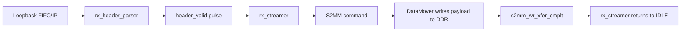
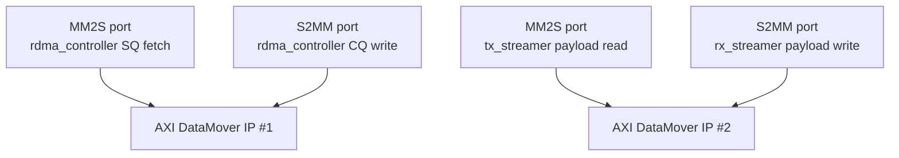

# Section 3: Hardware Architecture

This section describes the structural organization of the programmable logic (PL) design and the division of responsibilities across hardware blocks. The focus is on **functional ownership**, **data flow direction**, and **control boundaries**, rather than internal state machines or register-level behavior.

---

## 3.1 Top-Level PL Architecture

The programmable logic is organized around a **single control authority** and **multiple specialized data path components**:

### Core Components

#### rdma_controller

**Role:** Acts as the global coordinator and control-plane owner.

**Exclusive Responsibilities:**
- Interacts directly with submission and completion queues
- Advances SQ_HEAD and CQ_TAIL hardware pointers
- Determines when an RDMA operation begins and ends
- Issues transmit commands to tx_streamer
- Generates and writes CQ entries to DDR

**File:** `rdma_controller.v`

---

#### tx_streamer

**Role:** Owns the transmit-side data movement and packetization process.

**Converts controller-issued transmit commands into:**
- Header insertion events (to tx_header_inserter)
- Payload read requests to memory (MM2S DataMover commands)
- Fragmentation logic for 4 KB boundary alignment

**File:** `tx_streamer.v`

---

#### rx_streamer

**Role:** Owns the receive-side memory write process.

**Consumes parsed header metadata and incoming payload streams to:**
- Issue S2MM DataMover commands for payload writes
- Commit received data to DDR at computed addresses
- Validate opcodes (WRITE operations only)

**File:** `rx_streamer.v`

---

#### Header Inserter / Header Parser

**Role:** Stateless stream-processing blocks that translate between structured RDMA metadata and AXI-Stream representations.

**tx_header_inserter:**
- Serializes 7-beat (28-byte) RDMA headers
- Ensures headers are emitted before payload data
- Transitions into payload pass-through mode after header

**rx_header_parser:**
- Accumulates incoming 7-beat header from AXI-Stream
- Extracts fields (opcode, addresses, length, etc.)
- Asserts `header_valid` pulse when parsing completes

**Files:** `tx_header_inserter.v`, `rx_header_parser.v`

---

#### AXI DataMover

**Role:** Provides all memory access functionality for both transmit and receive paths.

**Key Functions:**
- High-throughput, burst-based DDR access
- AXI4-Stream interfaces on both read (MM2S) and write (S2MM) paths
- Completion signaling for memory transactions

**Type:** [Xilinx AXI DataMover IP](https://www.xilinx.com/support/documents/ip_documentation/axi_datamover/v5_1/pg022_axi_datamover.pdf)

---

## 3.2 Queue Management Blocks (SQ and CQ)

Queue management is **centralized entirely** within the `rdma_controller`. No other block has visibility into queue pointers or queue state. This guarantees a **single source of truth** for work ownership and completion semantics.


---

### Submission Queue (SQ)

**Location:** DDR memory (circular buffer)

**Access Pattern:**
- **Written exclusively by:** Software (PS)
- **Read exclusively by:** rdma_controller (via DataMover MM2S)

**Pointers:**
- `SQ_TAIL` — Software-owned, writable via AXI-Lite register
- `SQ_HEAD` — Hardware-owned, read-only to software

---

### Completion Queue (CQ)

**Location:** DDR memory (circular buffer)

**Access Pattern:**
- **Written exclusively by:** rdma_controller (via DataMover S2MM)
- **Read exclusively by:** Software (PS)

**Pointers:**
- `CQ_TAIL` — Hardware-owned, updated by rdma_controller
- `CQ_HEAD` — Software-owned, writable via AXI-Lite register

**Queue Entry Size:** 32 bytes  
**Address Calculation:** `CQ_BASE + (CQ_TAIL × 32)`

---

### Queue Isolation Principle

**Key Design Decision:** No other block has visibility into queue pointers or queue state.

**Benefits:**
- Single source of truth for work ownership
- No race conditions or pointer synchronization issues
- Clear ownership boundaries (control plane owns queues, data plane moves bytes)
- Simplified verification (only rdma_controller FSM needs queue logic proofs)

---

## 3.3 Transmit Path (TX)

The transmit path is responsible for converting a work descriptor into a serialized RDMA packet stream (header + payload).

---

### Ownership Split

| **Block** | **Decides** | **Responsibilities** |
|-----------|-------------|----------------------|
| **rdma_controller** | When transmission occurs | • Issues single transmit command per work request<br/>• Provides tx_cmd interface with descriptor fields<br/>• Waits for tx_cpl completion signal |
| **tx_streamer** | How transmission occurs | • Owns payload address, length, fragmentation decisions<br/>• Issues MM2S DataMover commands<br/>• Coordinates header insertion and payload streaming |

---

### TX Pipeline Components

#### 1. TX Streamer

**Role:** Orchestrates the complete transmission sequence.

**Receives from rdma_controller:**
- `tx_cmd` interface with fields: opcode, local_addr, remote_addr, length, dest_qp, etc.

**Owns and controls:**
- Payload address computation
- Fragmentation logic (1 KB boundary alignment, BLOCK_SIZE limits)
- MM2S command generation to DataMover
- Header insertion coordination via `start_tx` pulse
- Transmission completion signaling via `tx_cpl` interface

**Key Operations:**

```
① Receive tx_cmd from controller
② Compute fragment boundaries (if needed)
③ Program tx_header_inserter with header fields
④ Issue MM2S command for payload read
⑤ Monitor mm2s_rd_xfer_cmplt for DataMover completion
⑥ Assert tx_cpl_valid to signal completion to controller
```

**File:** `tx_streamer.v`

---

#### 2. TX RDMA Header Inserter

**Role:** Serializes RDMA metadata into AXI-Stream header beats.

**Functionality:**
- Converts structured header fields into 7 × 32-bit beats (28 bytes total)
- Ensures headers are emitted before payload data
- Transitions transparently into **payload pass-through mode** after beat 6
- Propagates backpressure from downstream (FIFO/RX) to DataMover MM2S

**Header Beat Structure:**

| **Beat** | **Content** | **Bytes** |
|----------|-------------|-----------|
| 0 | PSN[23:0] \| Opcode[7:0] | 4 |
| 1 | Reserved[7:0] \| Dest_QP[23:0] | 4 |
| 2 | Remote_Addr[31:0] | 4 |
| 3 | Reserved[15:0] \| Fragment_Offset[15:0] | 4 |
| 4 | Length[31:0] | 4 |
| 5 | Reserved[15:0] \| Partition_Key[15:0] | 4 |
| 6 | Constant[23:0] \| Service_Level[7:0] | 4 |

**State Machine:**
- `IDLE` → Wait for `start_tx` pulse
- `SEND_HEADER` → Stream 7 header beats
- `SEND_DATA` → Pass-through payload from MM2S to master interface

**File:** `tx_header_inserter.v`

---

### TX Exclusivity

**The tx_streamer is the only block that:**
- Issues payload read DMA commands (MM2S)
- Determines fragment boundaries
- Declares transmit completion back to the controller

**The rdma_controller:**
- Does not observe payload data directly
- Does not participate in streaming-level flow control
- Does not issue DataMover commands for payload (only for SQ descriptor fetch)

This separation ensures that control overhead does not block data throughput.

---

## 3.4 Receive Path (RX)

The receive path performs the **inverse transformation** of the transmit path: converting an incoming RDMA packet stream into memory writes.

**Design Decision:** The receive pipeline operates **independently** of the rdma_controller.

---

### RX Pipeline Components

#### 1. RX RDMA Header Parser

**Role:** Extracts RDMA metadata from the incoming AXI-Stream.

**Functionality:**
- Consumes incoming AXI-Stream (from loopback FIFO or IP logic)
- Accumulates 7 × 32-bit beats into internal buffer
- Decodes fixed-size RDMA header
- Extracts metadata: opcode, destination address, length, fragment offset, etc.
- Asserts `header_valid` pulse to signal downstream logic
- Forwards payload beats in pass-through mode after header

**State Machine:**
- `IDLE` → Wait for incoming packet (TVALID)
- `PARSE_HEADER` → Accumulate 7 header beats
- `FORWARD_DATA` → Pass-through payload to rx_streamer

**File:** `rx_header_parser.v`

---

#### 2. RX Streamer

**Role:** Orchestrates receive-side DMA write operations.

**Functionality:**
- Receives parsed header fields via `header_valid` pulse
- Validates opcode (WRITE operations only: 0x06, 0x07, 0x08, 0x0A, 0x01)
- Computes destination address: `dest_addr = remote_addr + fragment_offset`
- Issues S2MM DataMover commands for payload writes
- Streams payload data directly into DDR via DataMover S2MM
- Monitors `s2mm_wr_xfer_cmplt` for write completion

**Key Operations:**

```
① Receive header_valid pulse from rx_header_parser
② Check if opcode matches WRITE operation
③ Compute S2MM destination address
④ Issue S2MM command to DataMover
⑤ Monitor s2mm_wr_xfer_cmplt for completion
⑥ Return to IDLE (no CQ write, no controller notification)
```

**File:** `rx_streamer.v`

---

### Data Flow Through RX Path




---

## 3.5 Memory Access via AXI DataMover

All DDR access in the design is performed through the [Xilind AXI DataMover](https://www.xilinx.com/support/documents/ip_documentation/axi_datamover/v5_1/pg022_axi_datamover.pdf).

---

### Role of the DataMover

The DataMover provides:

**High-throughput, burst-based DDR access**  
Converts simple command interfaces into optimized AXI4 burst transactions.

**AXI-Stream interfaces on both read and write paths**  
MM2S (Memory-Mapped to Stream) for reads, S2MM (Stream to Memory-Mapped) for writes.

**Completion signaling for memory transactions**  
Asserts single-cycle pulses (`mm2s_rd_xfer_cmplt`, `s2mm_wr_xfer_cmplt`) when transfers finish.

**Command/status separation**  
72-bit command interfaces for address/BTT specification, independent status outputs.

---

### Ownership Model: Single Logical Owner per Channel

**Key Design Principle:** Each DataMover command channel has a **single logical owner** at any given time.

**Why this matters:**
- **No arbitration needed**: Command channels are not shared between competing requestors
- **Clear ownership boundaries**: Each FSM knows when it has exclusive access to its channel
- **Simplified verification**: No race conditions or command interleaving to reason about
- **Deterministic behavior**: Command order is explicit and controlled by owner FSM

**Note:** The design uses **separate DataMover instances or channels** to avoid contention. Each owner has dedicated command/status interfaces.

**Ownership Assignment:**




---

### Control vs. Data Responsibilities

**Clear division of labor:**

| **Responsibility** | **Owner** |
|--------------------|-----------|  
| Command generation | Issuing block (controller, tx_streamer, rx_streamer) |
| Command formatting | Issuing block (72-bit command word construction) |
| Completion tracking | Issuing block (monitors `*_xfer_cmplt` signals) |
| Error handling | Issuing block (should monitor `*_err` outputs, currently unimplemented) |
| **Data movement** | **DataMover IP** (passive execution engine) |

**The DataMover itself:**
- Does not decide when to issue commands
- Does not implement retries or error recovery
- Does not reorder commands
- Does not maintain operation state beyond current transfer

This **DataMover-centric design** reinforces the project's philosophy:
- **Explicit control**: All decisions are visible in RTL FSMs
- **Observable behavior**: Completion signals are explicit
- **Minimal hidden state**: No implicit buffering or speculation

---


### DataMover Command Format (72-bit)

Both MM2S and S2MM channels use the same 72-bit command format:


**Example: SQ Descriptor Fetch**
```verilog
mm2s_cmd = {8'h0, SQ_BASE+(SQ_HEAD<<6), 1'b0, 1'b1, 6'h0, 1'b1, 23'd64};
```
