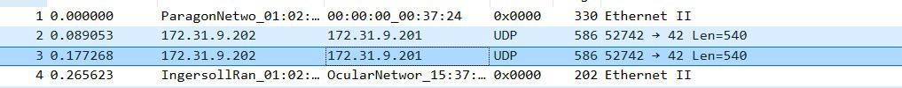
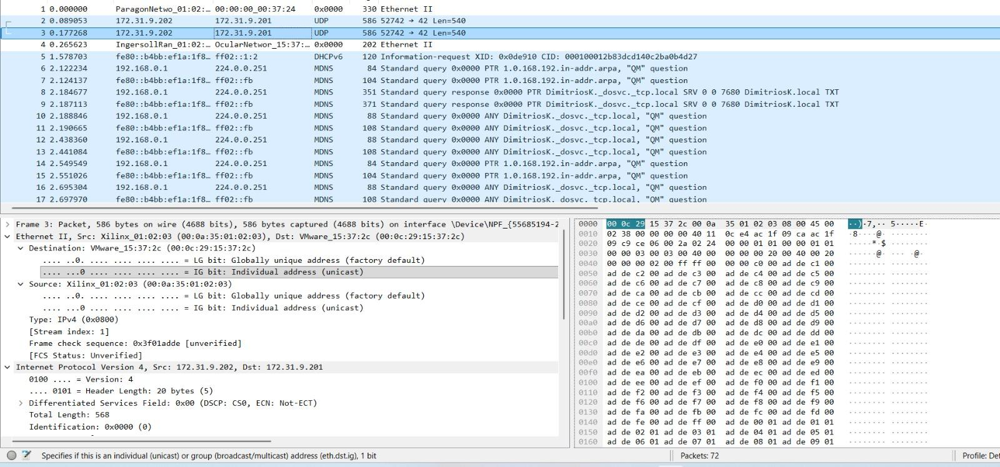
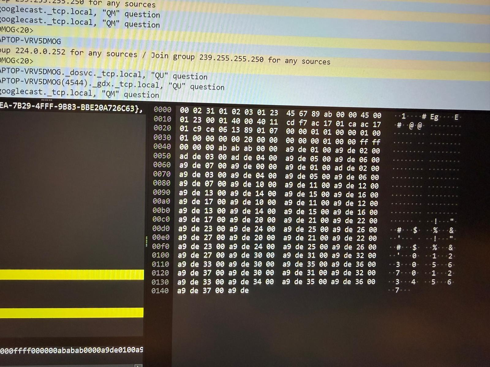

# 7. Results and Conclusion

This chapter presents the experimental results obtained from the loopback RDMA design and summarizes the conclusions that can be drawn regarding performance characteristics, architectural trade-offs, and future extensibility.

---

## 7.1 Experimental Setup

The performance evaluation focuses on **end-to-end RDMA operation latency and throughput**, measured entirely from the software-visible interface.

### Test Configuration

* **Payload size**: Fixed at **1 MB**
* **Block size**: Varied from **32 bytes to 16 KB**
* **Transport**: Internal loopback (TX → FIFO → RX)
* **Memory**: DDR accessed exclusively via AXI DataMover
* **CPU role**:

  * Pre-initializes payload buffer in DDR with a monotonic counter
  * Pre-writes SQ and CQ entries in memory
  * Advances **SQ_TAIL** to submit work
  * Polls **CQ_TAIL** to detect completion
* **No interrupts**, no dynamic descriptor construction during the test
* **Timing method**:
  Timestamp captured immediately before SQ submission and immediately after CQ completion detection

The measured duration therefore includes:

* Descriptor fetch
* Header insertion and parsing
* Payload DMA read (TX)
* Loopback streaming
* Payload DMA write (RX)
* CQ entry writeback

This represents a **full hardware round-trip**, not a synthetic micro-benchmark.

---

## 7.2 Throughput vs. Block Size

The measured throughput as a function of block size demonstrates how the RDMA engine performance scales from small to large transfer sizes. The relationship between block size and achieved bandwidth reveals three distinct operating regions.

*Figure 7.1: Measured throughput (MB/s) as a function of block size for 1 MB payload transfers. The curve shows three distinct regions: small-block overhead-dominated regime, transition region with sharp throughput increase, and saturation at DDR bandwidth limits.*

### Observed Trend

The results show three clearly distinguishable regions:

#### 1. Small Block Regime (32 B – 512 B)

Throughput is very low and increases slowly.

* Dominated by **fixed per-operation overhead**:

  * SQ descriptor fetch
  * Header generation and parsing
  * DataMover command issuance
  * Completion queue writeback
* Payload size is too small to amortize these costs
* The design behaves as **latency-bound**

This region reflects the fundamental cost of initiating an RDMA operation, independent of payload size.

---

#### 2. Transition Region (1 KB – 4 KB)

Throughput increases sharply.

* Payload transfer begins to dominate total execution time
* DMA engines are kept busy for longer bursts
* Control-plane overhead is amortized across more data
* Fragmentation boundaries (4 KB alignment) begin to align favorably with block size

This region demonstrates that the design effectively scales once DMA efficiency becomes dominant.

---

#### 3. Saturation Region (≥ 8 KB)

Throughput saturates at approximately **950–1000 MB/s**.

* The system reaches the practical bandwidth limit imposed by:

  * AXI DataMover configuration
  * DDR memory bandwidth
  * AXI interconnect width and clocking
* Increasing block size beyond this point does not yield additional throughput

This saturation indicates that the RDMA data path is no longer the bottleneck; the design successfully drives the underlying memory system close to its sustainable limit.

---

## 7.3 Functional Validation via Loopback and Packet Inspection

Although the loopback design bypasses Ethernet, packet correctness was validated both functionally (DDR buffer comparison) and structurally (packet-level inspection via Wireshark screenshots).

### Packet-Level Validation

To verify the structural correctness of RDMA packets beyond functional DDR tests, the output of the ethernet module was captured and analyzed to confirm header format, field ordering, and payload alignment.

#### Packet Reception Confirmation

*Figure 7.2: Capture showing successful reception of 4 RDMA packets. Each packet represents a complete header + payload transaction, demonstrating reliable streaming without packet loss.*

#### RDMA Header and Payload Structure

*Figure 7.3: Detailed view of a single ethernet packet*

#### Payload Data Inspection

*Figure 7.4: Detailed view of a single RDMA packet showing the 7-beat header section followed by payload data. The header contains the serialized fields (opcode, PSN, dest_qp, remote_addr, fragment_offset, length, partition_key, service_level) as described in Section 6.3.*

---

## 7.4 Conclusion

This project successfully demonstrates a complete RDMA-style execution pipeline implemented in FPGA logic, from software submission to hardware completion, with explicit control over memory movement and completion semantics.

Key outcomes:

* Functional correctness validated end-to-end
* Throughput scales predictably with block size
* Peak throughput approaches the memory system limit
* Control and data paths are cleanly separated
* The architecture is extensible toward full RDMA-over-Ethernet

Most importantly, the design provides a **clear, inspectable baseline** upon which additional features, such as network transport, concurrency, and reliability, can be built without architectural rework.
