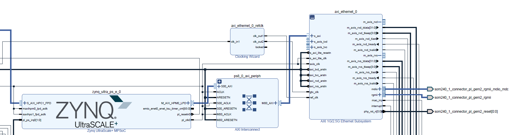
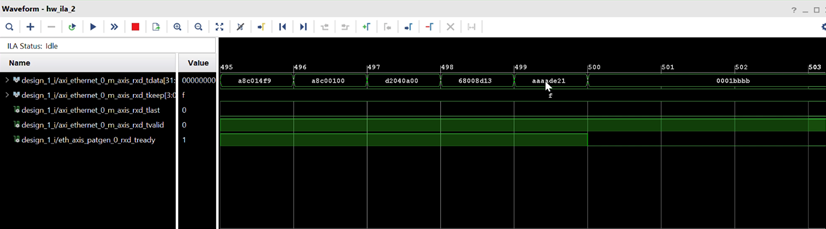
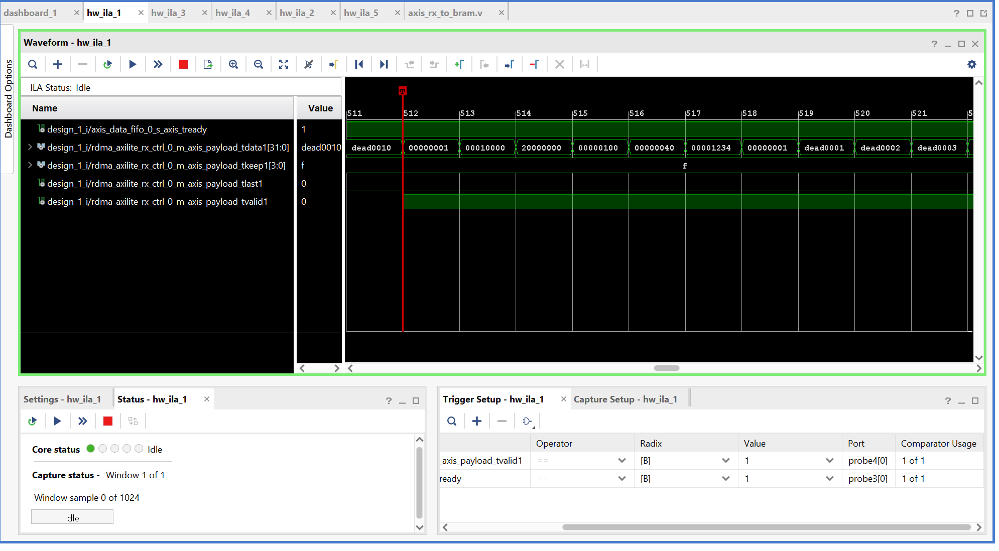

# Final RDMA RX Design

This section describes the final RDMA RX project, which was tested both with standalone Python scripts and with the RDMA TX KR260 board by verifying the data stored in DDR memory.
The focus here is on:

- How we generated RDMA-like packets using Scapy
- How the AXI Ethernet Subsystem delivers data to our custom logic
- How our header/payload receiver captures and validates the stream
- Why the ILA shows a 2-byte shift





## 1. Overview
Before plugging our RDMA receiver into the real producer KR260, we needed a controllable way to inject valid packets with simulated RDMA-shaped headers into the AXI Ethernet Subsystem.

We achieved this by:
1.Using Scapy on a PC to craft packets containing:

- A simulated RDMA header
- A predictable payload pattern

2.Sending them directly to the KR260 through RGMII

3.Capturing them through the AXI-Stream RX interface, passing them to the decapsulator to remove the IP headers, and then forwarding the resulting payload to the RDMA logic.

4.Verifying correctness using ILA and DRR memory reads

## 2. Packet Generator (Python Script)
We sent RDMA-like test packets using the following Scapy script:

```c
from scapy.all import *
IFACE = r"\Device\NPF_{5B3E40F0-7FD8-4EE9-9860-86842955260A}"

DST_MAC  = "00:0a:35:01:02:03"
DST_IP   = "192.168.0.10"
DST_PORT = 5005

SRC_IP   = "192.168.0.1"
SRC_PORT = 1234

# ------------------------------------------------
# write a 32-bit word in reversed byte order
# ------------------------------------------------
def rev32(word):
    return word.to_bytes(4, byteorder="little")
    # “little” means byte0 is the least significant → reversed order on the wire


# ------------------------------------------------
# 1) RDMA HEADER 
# We write the words REVERSED here so that they appear STRAIGHT on the FPGA side.
# ------------------------------------------------
rdma_header = b"".join([
    rev32(0x00000001),  # word0 = opcode + psn  
    rev32(0x00010000),  # word1 = dest_qp
    rev32(0x20000000),  # word2 = remote_addr
    rev32(0x00000000),  # word3 = fragment_offset
    rev32(0x00000400),  # word4 = rdma_length (1024 bytes → 0x400) (4*NUM_WORDS)
    rev32(0x00001234),  # word5 = pkey
    rev32(0x00000001),  # word6 = service_level
])    

# ------------------------------------------------
# 2) DEADxxxx PAYLOAD — each word is also written in REVERSED byte order
# ------------------------------------------------
NUM_WORDS = 256
payload_bytes = b""

for i in range(1, NUM_WORDS + 1):
    word = 0xDEAD0000 | i   # DEAD0001, DEAD0002, ...
    payload_bytes += rev32(word)   # reversed → FPGA AXIS stream shows normal order

# ------------------------------------------------
# 3) Final payload
# ------------------------------------------------
payload = rdma_header + payload_bytes


print(f"Sending RDMA-style Magic Packets on {IFACE} ...")

eth = Ether(dst=DST_MAC)
ip  = IP(src=SRC_IP, dst=DST_IP)
udp = UDP(sport=SRC_PORT, dport=DST_PORT)

pkt = eth / ip / udp / Raw(payload)

sendp(pkt, iface=IFACE, count=30, inter=0.1, verbose=True)

print("Magic Packets Sent.")

```

### Why this pattern?

The RDMA test packet is built from two parts:

1.**A simulated RDMA header**  
   
   - opcode + psn = `0x00000001`  
   - dest_qp      = `0x00010000`  
   - remote_addr  = `0x20000000`  
   - fragment_offset = `0x00000000`  
   - rdma_length  = `0x00000400` (1024 bytes)  
   - pkey         = `0x00001234`  
   - service_level = `0x00000001`

2.**A DEADxxxx payload**  
   
   - 256 consecutive 32-bit words:  
     `DEAD0001, DEAD0002, …, DEAD0100`

I connected an ILA to monitor the AXI-Stream between the Ethernet MAC and my custom IP. Because there is a 2-byte shift **after beat 499→500** (the reason will be explained in the next part), the correct way to interpret each 32-bit word is by combining the rightmost 2 bytes of the next beat with the leftmost 2 bytes of the previous beat. For example, in the last ILA capture (between clock cycles 511 and 513), you should first read the right two bytes of the 512→513 beat (DE AD), and then the left two bytes of the 511→512 beat (00 01). This misalignment will be corrected after the decapsulator; however, at this stage we must manually interpret the data in this way to compensate for the 2-byte offset.





**Why we put rev32() for rdma header and payload.**

In our test setup, the IP/UDP/Ethernet headers generated by Scapy are not passed through rev32(), so they arrive at the AXI Ethernet Subsystem in normal network byte order. Due to the MAC’s byte-lane mapping (placing the first wire byte into tdata[7:0]), these header fields appear byte-reversed in ILA. In contrast, the RDMA header and payload were deliberately passed through rev32() on the PC side. After the MAC performs its lane reordering, the two transformations cancel each other, causing the RDMA header and the DEADxxxx payload words to appear in the correct, readable order inside our decapsulator and RDMA parser. As a result, only the IP/UDP/Ethernet headers look reversed in raw ILA captures, while the RDMA fields appear perfectly aligned. You can see that from the pictures. However, this is not a problem for us, because in the final two-board design the TX-side KR260 and the RX-side KR260 will cancel each other’s byte-lane mappings.

The `DEADxxxx` sequence is easy to recognize in ILA and DDR dumps, which makes it ideal for debugging byte order, lane mapping and alignment issues.
Even though this test design is not the full RDMA implementation, we **mimicked the RDMA header format** that the real sender KR260 will generate. The software header contains: As a result, the behavior we see with Scapy packets matches what we expect from the **second KR260** that will act as the real RDMA transmitter.

---

## 4. The 2-Byte AXI-Stream Shift in the ILA

One important observation during debugging was the **2-byte shift** of RDMA header words inside the ILA.

### Why does this happen?

The Ethernet frame before our RDMA payload is not aligned to the 64-bit AXI-Stream width:

| Layer            | Size    |
|------------------|---------|
| Ethernet Header  | 14 bytes |
| IP Header        | 20 bytes |
| UDP Header       | 8 bytes  |
| **TOTAL**        | **42 bytes** |

AXI-Stream is 32 bits (4 bytes) wide. Since the Ethernet/IP/UDP headers together occupy 42 bytes, which is not a multiple of 4, the RDMA header begins 2 bytes into the next AXI-Stream beat. This misalignment is completely normal and expected.

I want to show how the packet looks after our decapsulator removes the first 42 bytes and shifts the remaining data by two bytes. This fixes the alignment issue and everything appears correctly aligned.



---

## 6. Final Notes

We tested 16 KB of data (4 KB of 32-bit words) without any loss between the KR260 TX and KR260 RX boards. The system operates correctly. Although the little-endian byte-reversal issue could have been handled inside our custom Ethernet IP blocks, the final design uses two KR260 boards communicating with each other over Ethernet for RDMA. As a result, the endianness reversal effectively cancels out between the two sides, and no design modification was required. This effect is only observed during Python-script-based tests.

### Forcing KR260 Into JTAG Boot Mode (Required Every Time You Reconnect the Board)

The KR260 does **not** automatically boot in JTAG mode after power-cycling.  
Every time you unplug, replug, or reboot the board, it returns to its default boot
configuration and cannot be used directly with Vitis/XSCT for PS application loading.

For development through, you must manually force the board back into **JTAG boot mode** after each power cycle.

The following XSCT commands reset the multiboot register and switch the PS to JTAG boot:

```c
connect

# Switch to JTAG boot mode #
targets -set -filter {name =~ "PSU"}

# update multiboot to ZERO
mwr 0xffca0010 0x0

# change boot mode to JTAG
mwr 0xff5e0200 0x0100

# reset
rst -system

```


