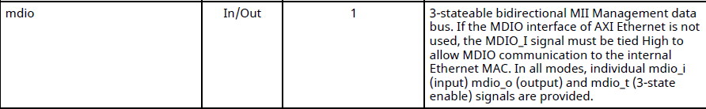
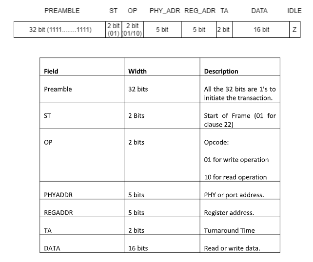
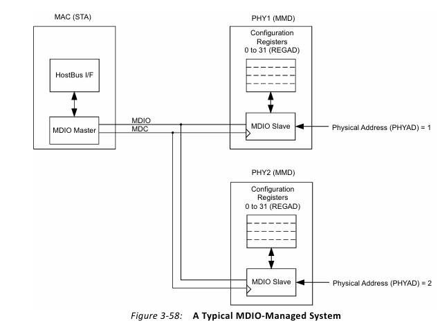
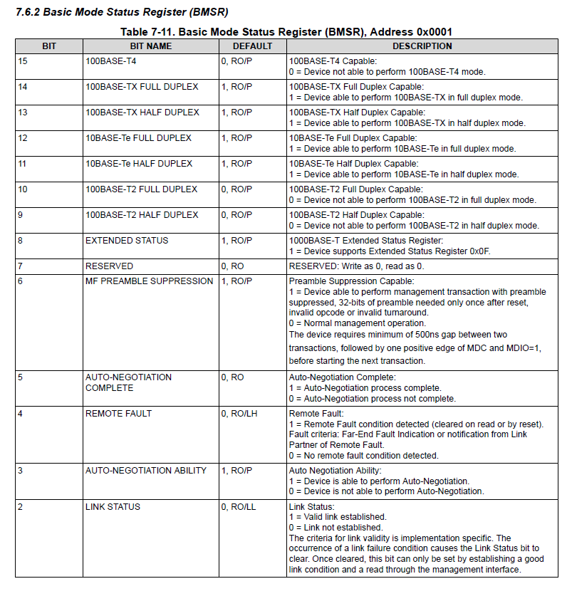

## MDIO Management Interface

The **MDIO (Management Data Input/Output)** interface is used by the AXI 1G/2.5G Ethernet Subsystem to **configure and monitor the external PHY** (The Texas Instruments **DP83867CS**  on the KR260) over a low-speed serial bus. It is a Bi-directional management instruction/data signal that is sourced by the management station or the PHY during portions of communication. This interface is present in MII, GMII, RGMII and SGMII modes.

The Management Data Input/Output (MDIO) component can be used to read and write the PHY control register. Each PHY can be monitored before operation and the connection status can be monitored during operation. These registers provide status and control information such as link status, speed ability, and selection, power down for low power consumption, duplex mode (full or half), auto-negotiation, fault signaling, and loopback. 




| Port | Description |
|------|-------------|
| `mdio_mdc` | MDIO clock |
| `mdio_mdio_i` | PHY → MAC |
| `mdio_mdio_o` | MAC → PHY |
| `mdio_mdio_t` | Tristate enable |

At a high level:

- The **MAC** contains an **MDIO controller**.
- Software (running on the PS) talks to the MAC via **`s_axi`** port we have on PL ethernet block.
- The MAC’s MDIO controller then generates **MDC** and **MDIO** transactions towards the **DP83867 PHY**.
- All PHY configuration (speed/duplex/auto-negotiation, RGMII delays, loopback, status reads, etc.) goes through this path.

---

### 1. MDIO Signals and Direction

On the AXI Ethernet Subsystem, the MDIO interface typically appears as the following ports:

#### **mdio_mdc**

   - Output from the MAC to the PHY.  
   - Serial **clock** generated by the internal MDIO controller.  

#### **mdio_i / mdio_o / mdio_t** 
  
  - **`mdio_o`**: Output from the MAC to the PHY (during write operations or PHY address).  
  - **`mdio_i`**: Input from the PHY to the MAC (during read operations and status responses).  
  - **`mdio_t`**: Tri-state control for the MDIO line (controls when the MAC releases the line so the PHY can drive it).  

 In a write instruction, the MAC provides the address and data. For a read instruction, the PHY receives from the MDIO stream during the turnaround, supplies the MAC with the requested register data, and then releases the MDIO stream.

---

### 2. MDIO Protocol Frame Format (CLAUSE 22):



The MDIO data format for clause 22 is defined in the IEEE 802.3 Ethernet standard, as shown in the figure above.

Since there is a limit to using only 5-bit addresses for both PHYADDR and REGADDR, MDIO supports up to 32 PHYs. Kr260 has 4 PHY addresses and our GEM 2 PL ethernet port PHY address is 2.


**Data (DATA[15:0])**  
   - This field is 16-bit wide. During the read instruction, the PHY chip writes the data read from the REGAD register corresponding to the PHYAD in Data. During the write instruction, the MAC writes the value of the REGAD register corresponding to the PHYAD in Data. 
   - All PHY configuration is done by writing appropriate bitfields into these registers.

All of this is handled **inside the AXI Ethernet Subsystem**. From software’s perspective, you simply call the appropriate driver functions to **read/write a 16-bit PHY register**, and the IP generates the MDIO waveforms automatically. So I used multiple read and writes to configure the phy or see the status of the connection from vitis. I will explain them in the next part. 



---

### 3. Software  from Vitis: Using MDIO via `s_axi` on PL ethernet IP

This part explains **every place where MDIO is used** in the vitis code and how each piece relates to configuring and monitoring the external PHY via the AXI Ethernet MDIO controller.

In vitis, all MDIO access is done through the functions:

- `XAxiEthernet_PhyRead()`
- `XAxiEthernet_PhyWrite()`

These functions talk to the **MAC’s MDIO block** using AXI-Lite; the MAC then drives
the **MDC/MDIO** pins toward the external PHY.

`XAxiEthernet_PhyRead()`

  - Reads a 16-bit register from the PHY via MDIO.
 
`XAxiEthernet_PhyWrite()`

  - Writes a 16-bit value to a PHY register via MDIO.

Higher-level functions build on top of these to:

  - Configure **auto-negotiation**.
  - Set **speed** (10/100/1000 Mbps).
  - Configure **duplex mode**.
  - Enable **RGMII internal delays**.
  - Read **link status**.

Thus, **all PHY configuration is indirect**:
> PS software → `s_axi` → MAC MDIO controller → MDC/MDIO → DP83867CS PHY.

### 3.1 MDIO-Related Constants (PHY address, registers, and bits)

| Interface | PHY Type | PHY Address | Board Location | Notes |
|----------|----------|--------------|----------------|-------|
| **PS GEM0** | **SGMII** | **0x04** | Front upper right | Uses SGMII mode |
| **PS GEM1** | **RGMII** | **0x08** | Front lower right | RGMII interface |
| **PL GEM2** | **RGMII** | **0x02** | Front upper left  | RGMII interface |
| **PL GEM3** | **RGMII** | **0x03** | Front lower left  | RGMII interface |

```c
/* PHY address used on the KR260 board for GEM2 PL ethernet*/
#define PHY_ADDR_CONFIG     2   //important

/* PHY register addresses (written in DP83867CS PHY datasheet)*/
#define PHY_REG_BMCR   0
#define PHY_REG_BMSR   1

/* BMCR bits (Basic Mode Control Register) */
#define BMCR_AUTONEG_EN  0x1000   //enable auto negotiation bit 12
#define BMCR_RESTART_AN  0x0200   //restart auto negotiation bit 9 

/* BMSR bits (Basic Mode Status Register) */
#define BMSR_LINK_STATUS  0x0004  //link status bit 2
```

`PHY_ADDR_CONFIG`: This is the MDIO PHY address of the external PHY DP83867CS. The MDIO protocol allows addresses 0–31, but the board only has four PHY, strapped to a specific address by pull-ups/pull-downs on its address pins. All later calls to XAxiEthernet_PhyRead/Write() use this address to target that PHY.

`PHY_REG_BMCR` and `PHY_REG_BMSR`: These are register indices inside the PHY. 

- BMCR (Address 0x0000): Basic Mode Control Register → controls reset, autoneg, speed, duplex, etc.
- BMSR (Address 0x0001): Basic Mode Status Register → reports link status, autoneg completed, etc.

On the MDIO bus, these values go into the REGAD field of the MDIO frame.

`BMCR_AUTONEG_EN` and `BMCR_RESTART_AN`: Bit masks used when writing BMCR:

- BMCR_AUTONEG_EN (0x1000): enables auto-negotiation.
- BMCR_RESTART_AN (0x0200): tells the PHY to restart auto-negotiation.

These values are OR’ed into the 16-bit BMCR value and sent to the PHY via MDIO.

`BMSR_LINK_STATUS`: Bit mask for BMSR bit 2 (0x0004), which indicates link up when set. The code uses this bit to poll until the PHY reports a valid link. 

### 3.2 First BMSR Read (ETH-5: PHY init)

```c
    {
        u16 Bmsr;
        XAxiEthernet_PhyRead(&EthInst, PhyAddr, PHY_REG_BMSR, &Bmsr);
        xil_printf("  PHY addr %d: BMSR = 0x%04x\r\n",
                   PhyAddr, (unsigned)Bmsr);
    }
```

**What this does on the MDIO bus:**

1. `XAxiEthernet_PhyRead(&EthInst, PhyAddr, PHY_REG_BMSR, &Bmsr);` tells the MAC MDIO controller:

    - Target PHY address: PhyAddr → MDIO PHYAD field.
    - Target register: PHY_REG_BMSR → MDIO REGAD field.

This prints the value of the BMSR register, and we can see that the link is down at that moment because PHY autonegotiation has not occurred yet.

```c
ETH-5: PHY init
PHY addr 2: BMSR = 0x7949
```

### 3.3 Enabling / Restarting Autonegotiation via BMCR (ETH-6: PHY autoneg enable/restart)

```c
    xil_printf("ETH-6: Enable/restart PHY autonegotiation\r\n");
    {
        u16 Bmcr;
        XAxiEthernet_PhyRead(&EthInst, PhyAddr, PHY_REG_BMCR, &Bmcr);
        xil_printf("  BMCR old = 0x%04x\r\n", Bmcr);
        Bmcr |= BMCR_AUTONEG_EN | BMCR_RESTART_AN;
        XAxiEthernet_PhyWrite(&EthInst, PhyAddr, PHY_REG_BMCR, Bmcr);
        xil_printf("  BMCR new written = 0x%04x\r\n", Bmcr);
    }
```
This is what is printed in serial monitor:

```c
ETH-6: PHY autoneg enable/restart
BMCR old        = 0x1140
BMCR new written= 0x1340
```

### What Actually Changed

`0x1340` differs from `0x1140` only in **bit 9 (Restart Auto-Negotiation)**:

- **0x1140** → Bit 9 = 0  
- **0x1340** → Bit 9 = 1 → *Triggers an Auto-Negotiation restart*

When we set AUTONEG_EN | RESTART_AN, we do it because the DP83867 PHY treats these two bits very differently: AUTONEG_EN (bit 12) simply tells the PHY to use auto-negotiation mode, but it does not force the PHY to renegotiate if auto-negotiation was already enabled by hardware straps at boot. On the KR260, the PHY powers up with auto-negotiation already enabled, so rewriting this bit alone does absolutely nothing—it keeps the previous negotiated speed and duplex. To make sure the PHY actually performs a fresh negotiation cycle after we initialize the AXI Ethernet MAC, we also set RESTART_AN (bit 9), which is a self-clearing command bit that immediately instructs the PHY to restart the auto-negotiation state machine. By combining both bits, we ensure two things at once: auto-negotiation is definitely enabled, and a brand-new negotiation cycle is forced to start right now. This guarantees that the link partner and the PHY agree on 1 Gbps full-duplex mode after system startup, preventing any stale or inconsistent link configuration.

### 3.3 Polling Link Status with BMSR (ETH-8)

```c
    xil_printf("ETH-8: Waiting for LINK...\r\n");
    {
        int i;
        u16 Bmsr = 0;
        for (i = 0; i < 100; i++) {
            XAxiEthernet_PhyRead(&EthInst, PhyAddr, PHY_REG_BMSR, &Bmsr);
            XAxiEthernet_PhyRead(&EthInst, PhyAddr, PHY_REG_BMSR, &Bmsr);
            if (Bmsr & BMSR_LINK_STATUS) {
                xil_printf("  LINK UP, BMSR = 0x%04x\r\n", Bmsr);
                break;
            }
            usleep(100000);
        }
        if (!(Bmsr & BMSR_LINK_STATUS))
            xil_printf("  [WARN] Link DOWN, last BMSR = 0x%04x\r\n", Bmsr);
    }
```

The reason we perform two consecutive reads each loop iteration is that in DP83867CS PHY, the link-status bit is latched low and only shows the current real-time value after the first read clears the latch. So the first read clears the old latched status, and the second read gives the actual up-to-date link state. Inside the loop, we check the BMSR_LINK_STATUS bit, and as soon as it becomes 1, we know the PHY has successfully completed auto-negotiation and established a valid link with the link partner, so we print “LINK UP” and continue. If the loop ends without ever seeing the link bit go high, we print a warning showing the last BMSR value, meaning the PHY never achieved link—usually indicating a cable, switch, or negotiation problem.


**In this part, I explained the functions related to configuring the PHY from Vitis. For successful communication between the PHY and the MAC, these functions are necessary—just like the MAC-side configurations described in the AXI Ethernet MAC section.**

---

### 4. MDIO on the KR260

On the KR260, the AXI Ethernet Subsystem is instantiated in the PL and connected to the PS through the s_axi interface. All PHY management is handled through the MDIO pins exposed by this IP. The MAC’s MDIO controller drives the MDC clock and controls the bidirectional MDIO data line, while the DP83867 PHY responds on the same bus.

During system startup, the PS software initializes the AXI Ethernet core over s_axi, and as part of XAxiEthernet_CfgInitialize(), the driver automatically enables the MDIO block and programs the MDIO clock divider so that the generated MDC frequency meets the IEEE requirement (≤ 2.5 MHz).

Once the MAC and its MDIO controller are active, all PHY control and monitoring operations—register reads, BMCR writes, autonegotiation control, RGMII configuration, and link polling—are performed through MDIO transactions initiated by XAxiEthernet_PhyRead() and XAxiEthernet_PhyWrite(). In other words, MDIO forms the entire control plane between the PS software and the external DP83867 PHY, while the RGMII interface simultaneously forms the data plane that carries the actual Ethernet traffic.

---

### 5. BMSR and BMCR registers 

I already explained how I used these two registers for PHY, here I want to explain you how these registers work in detail. First of all, we learned the addresses of these registers and what each bit means inside these registers from the datasheet. The images are as follows:





Before auto negotiation enabled or restarted, we print the value inside BMCR register. The value inside is: 0x1140 = 0001 0001 0100 0000. Set bit positions: [12, 8, 6]. So 0x1140 means:

- Bit 12 = 1 → Auto-negotiation enabled
- Bit 9 (Restart AN) = 0 → no restart command issued
- Bit 8 = 1 → Full-duplex mode
- Bit 6 = 1, Bit 13 = 0 → Speed select bits (MSB,LSB) = (1,0)

For the DP83867CS, the speed bits are interpreted as:

- 11 → Reserved
- 10 → 1000 Mb/s
- 01 → 100 Mb/s
- 00 → 10 Mb/s

But **important detail** from the datasheet: when AUTO-NEGOTIATION ENABLE (bit 12) = 1, bits 6 and 13 are ignored; the actual speed/duplex comes from autonegotiation, not from these bits. So even if it shows a wrong speed there is nothing to be worry about.

After auto negotiation enabled or restarted, again we print the value inside BMCR register. The value inside is: 0x1340 = 0001 0011 0100 0000. Set bit positions: [12, 8, 6]. So 0x1140 means:

- Bit 9 = 1 → Restart auto-negotiation command

What we’re aiming for with 0x1340 is keep PHY in auto-negotiation + full-duplex mode and issue a fresh auto-negotiation restart via RESTART_AN (bit 9). This is crucial because the PHY may have already negotiated something earlier at power-up using strap pins. Simply rewriting the AUTONEG_ENABLE bit does not force a new negotiation cycle. Setting RESTART_AN guarantees any stale negotiation is discarded and the PHY starts a new autoneg sequence right after we bring up the MAC.

For BMSR, we print the BMSR value before PHY autoneg enable/restart and XAxiEthernet_Start and the result we get is 0x7949 = 0111 1001 0100 1001. Set bit positions: 14, 13, 12, 11, 8, 6, 3, 0.

Now decode 0x7949:

- Bit 14 = 1 → Device can do 100BASE-TX full duplex
- Bit 13 = 1 → Device can do 100BASE-TX half duplex
- Bit 12 = 1 → Device can do 10BASE-T full duplex
- Bit 11 = 1 → Device can do 10BASE-T half duplex
- Bit 8 = 1 → Extended status register is implemented (1000BASE-T Extended Status Register) It has extended status so it’s a gigabit-class PHY.
- Bit 6 = 1 → Device supports MF preamble suppression
- Bit 3 = 1 → Device is capable of auto-negotiation
- Bit 0 = 1 → Extended register capabilities present

And the important zero bits:

- Bit 5 = 0 → Auto-negotiation not complete yet at this read
- Bit 2 = 0 → No valid link yet (link is down)

After PHY autoneg enable/restart and XAxiEthernet_Start we get BMSR = 0x796D = 0111 1001 0110 1101. Now only these two bits are flipped:

- Bit 5 = 1 → Auto-negotiation is complete
- Bit 2 = 1 → Valid link established

Here are also some extra information from the datasheet:

**Restart Auto-Negotiation**

If a link is established by successful Auto-Negotiation and then lost, the Auto-Negotiation process resumes to determine the configuration for the link. This function confirms that a link can be re-established if the cable becomes disconnected and reconnected. After Auto-Negotiation is completed, the process can be restarted at any time by writing 1 to bit 9 of the BMCR. A restart Auto-Negotiation request from any entity, such as a management agent, causes DP83867 to halt data transmission or link pulse activity until the break_link_timer expires. Consequently, the Link Partner goes into link fail mode and the resume Auto-Negotiation. The DP83867 resumes Auto-Negotiation after the break_link_timer has expired by transmitting FLP (Fast Link Pulse) bursts.

**Enabling Auto-Negotiation Through Software**

If Auto-Negotiation is disabled by MDIO access, and the user desires to restart Auto-Negotiation, this can be accomplished by software access. Bit 12 of BMCR can be cleared and then set for Auto-Negotiation operation to take place. If Auto-Negotiation is disabled by strap option, Auto-Negotiation can not be reenabled.

**Auto-Negotiation Complete Time**

Parallel detection and Auto-Negotiation typically take 2-3 seconds to complete. In addition, Auto-Negotiation with next page exchange takes approximately 2-3 seconds to complete, depending on the number of next pages exchanged. 


### 6. What I see in Serial Monitor After Running the Code

```c
========================================
==  PL Ethernet RX -> RDMA + DDR DUMP ==
========================================
=== InitEth() started ===
ETH-1: XAxiEthernet_LookupConfig (ID=0)
  BaseAddress = 0x80000000
ETH-2: CfgInitialize
ETH-2.5: SetOperatingSpeed 1000 Mbps
ETH-3: SetMacAddress
ETH-4: Set Options
ETH-5: PHY init
  PHY addr 2: BMSR = 0x7949         
ETH-6: Enable/restart PHY autonegotiation
  BMCR old = 0x1140               
  BMCR new written = 0x1340        
ETH-7: XAxiEthernet_Start
ETH-8: Waiting for LINK...
  LINK UP, BMSR = 0x796D          
=== InitEth() OK ===
MAIN: PHY addr = 2
MAIN: Send one burst RDMA packet.
```

### 6. Summary

- All **PHY configuration and status reads** (speed, duplex, auto-negotiation, RGMII delays, link status) are done via MDIO transactions.
- In the KR260 design, once MDIO is wired and configured correctly, the PS can fully control and monitor the external PHY entirely over this interface, without touching the RGMII data path or data-plane clocks.

