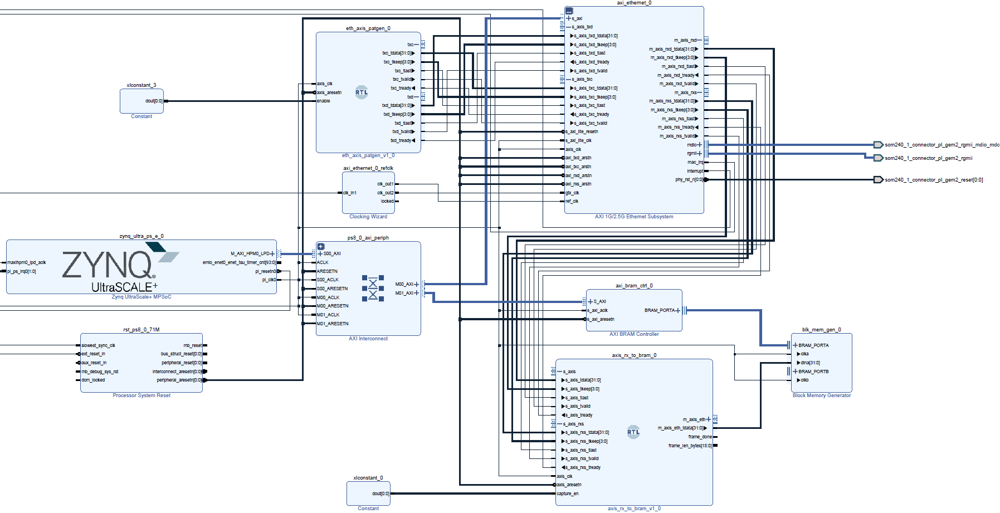
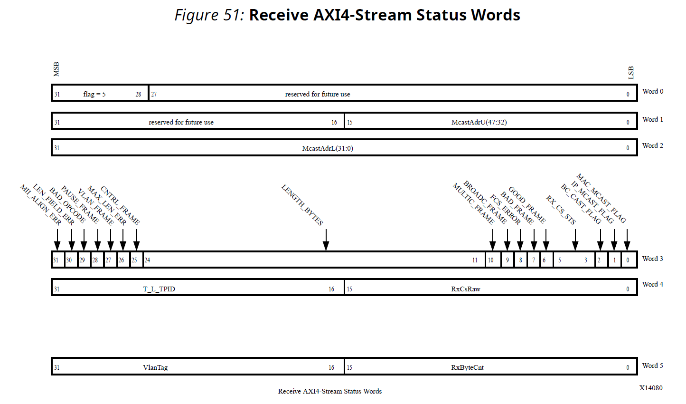
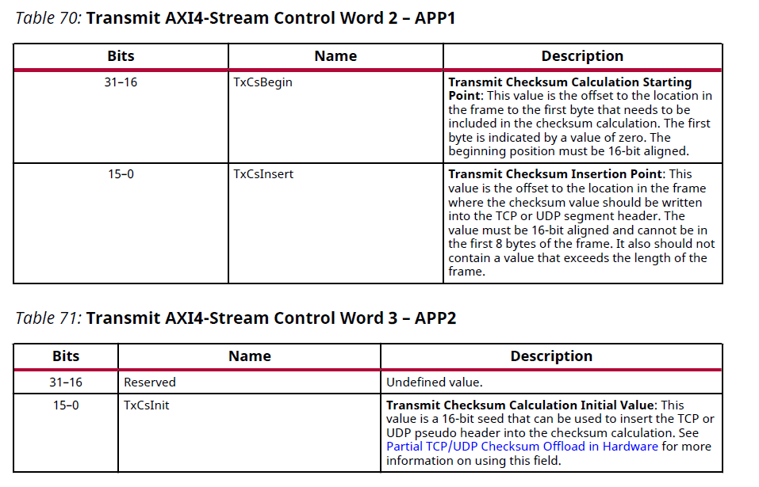
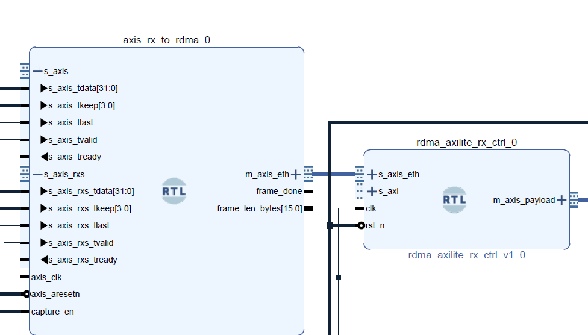

# AXIS_RX/TX_to_RDMA Custom IP Block

After PHY and MAC communication with RGMII we need a custom designed ip block to handle packets that we need to send or receive. Since ethernet ip block (MAC) is using axi stream for txd, txc, rxd, and rxs we need to use axi stream for our custom block as well. In our final rdma design this block will sit between the decapsulator/encapsulator and ethernet IP block (MAC). In my separate test for tx I used this custom block as a pattern generator. For rx tests I used this block as a passthrough block between MAC and bram which I used to read packages that I sent from my laptop. The image of the block design I used for separate tx rx tests is below:



RX_to_RDMA block should use the txd, txc, rxd, and rxs connections correctly to have a succesfull ethernet connection. After reading the datasheet of ethernet ip block we can learn how to drive the rxd data stream and rxs status stream for rx side, and txd data stream and txc control stream for the tx side for the MAC. This will be discussed in following chapters in detail.

Here is a picture of rx side AXIS_RX_to_RDMA custom ip block that I will explain in the following sections.


---

## 1. Role in the System

End-to-end pipeline for RDMA Rx:

```
DP83867 PHY
     ↓ RGMII
AXI Ethernet Subsystem (MAC)
     ↓ m_axis_rxd (data)
     ↓ m_axis_rxs (status)
AXIS_RX_TO_RDMA  ←––––––– this block
     ↓ 
Decapsulator
```
End-to-end pipeline for RDMA Tx:

```
DP83867 PHY
     ↑ RGMII
AXI Ethernet Subsystem (MAC)
     ↑ s_axis_txd (data)
     ↑ s_axis_txc (control)
AXIS_TX_FROM_RDMA  ←––––––– this block
     ↑
Encapsulator
```

---

## 2. AXI4-Stream Interfaces Used in the RDMA RX Block

The AXI4-Stream interface transfers data in one direction only. The Ethernet transmit interface uses an AXI4-Stream Data interface and an AXI4-Stream Control interface. The Ethernet receive interface uses an AXI4-Stream Data interface and an AXI4-Stream Status interface. The AXI4- Stream interfaces used in this implementation are 32-bits wide, have side-band control signals, and operate with a 100 MHz clock. Data is transferred across the AXI4-Stream Data interfaces. Additional control information is transferred across the transmit AXI4-Stream Control interface and additional status information is transferred across the receive AXI4-Stream Status interface.

### 2.1 `m_axis_rxd` — RX Data Stream (MAC → RDMA RX)

| Signal        | Meaning                                          |
|---------------|--------------------------------------------------|
| `tdata[31:0]` | 32-bit RX data beat (Ethernet → RDMA payload)    |
| `tkeep[3:0]`  | Byte enables for last beat                       |
| `tvalid`      | Data valid                                       |
| `tlast`       | End of frame                                     |
| `tready`      | Backpressure generated by RDMA RX block          |

The AXI Ethernet Subsystem guarantees each Ethernet frame arrives as **one continuous AXI-Stream burst** ending with `tlast = 1`.

---

### 2.2 `m_axis_rxs` — RX Status Stream (MAC → Decapsulator)

After receiving the Ethernet data, the receive channel initiates
transfer on the AXI4-Stream Status Interface before starting the transfer on AXI4-Stream Data
Interface.

The receive AXI4-Stream Status frame always contains six 32-bit status words (words 0 to 5). Receive AXI4-Stream Status word 5, bits 15-0 always contains the number of bytes in length of
the frame being sent across the receive AXI4-Stream Status interface. I put an output pin for the check of rxs byte length signal but we did not need to implement that to the final design. The following figure and tables show the definitions of these 6 words.



The detailed information about every part of these 6 words can be found in page 116-119 of AXI 1G/2.5G Ethernet Subsystem v7.2 Product Guide.

---

## 3. AXI4-Stream Interfaces Used in the RDMA TX Block

The transmit control block must maintain coherence between the data and control buses. Because data frames can vary from 1 byte to over 9 Kb in length and the control information for each frame is a constant six 32-bit words, care must be taken under conditions where the buffer for the frame data or control data fills up to prevent an out-of-sequence condition. To maintain coherency, the AXI4-Stream data ready signal is held not ready until a AXI4-Stream control stream has been received. After this has occurred, the AXI4-Stream data ready signal is driven ready (as long as there is buffer space available) and the AXI4-Stream control ready signal is held not ready until the data stream transfer is complete. 

The following figure shows this flow clearly:


### 3.1 `s_axis_txc` — TX Control Channel (MAC Mirror → Debug)
**Normal Transmit AXI4-Stream Control Words**
The Normal Transmit AXI4-Stream Control frame always contains six 32-bit control words
(Words 0 to 5). Of these words, only control words 0, 1, 2, and 3 are used by the AXI Ethernet
Subsystem.
See the following figures for the Transmit AXI4-Stream Control Word definition.




---

### 3.2 `s_axis_txd` — TX Data Stream (Encapsulator → MAC)

TX equivalent of `m_axis_rxd`.  
Used in TX Path and standalone Part-1 tests.

| Signal        | Meaning                                        |
|---------------|------------------------------------------------|
| `tdata[31:0]` | 32-bit TX frame data beat                      |
| `tkeep[3:0]`  | Byte enables for the last beat                 |
| `tvalid`      | Data valid                                     |
| `tlast`       | End of frame                                   |
| `tready`      | Backpressure from MAC                          |

The sender must stream each frame as a single contiguous burst.

---

### 3.3 Summary of How the MAC Expects TXC and TXD

The AXI Ethernet Subsystem has a strict transmit rule:
**TXC must be completely sent before TXD is allowed to start.**

This rule is enforced by the MAC internally:
1. MAC first waits for all 6 control words (`s_axis_txc`)
2. After the last TXC word (`tlast = 1`) is accepted:
     -MAC drives `s_axis_txd_tready = 1`
     -Only then the data stream may begin
If the control and data sequences overlap or arrive in the wrong order, the MAC drops the entire frame.

This is why in our FSM of custom ip block for tx: `ST_SEND_CTRL → ST_SEND_DATA` sequence must never be violated.

### 3.4 TXC Control Word 0 (TAG) — Flag (0xA) vs Receive-Status Mode (0x5)

| Flag        | Meaning                                        |
|-------------|------------------------------------------------|
| `0xA`       | Normal Transmit AXI4-Stream Frame              |
| `0x5`       | Receive-Status Transmit                        |

We always use 0xA for the flag because:
-We are sending a real ethernet frame
-No MAC status injection
-No internal receive-status forwarding
-No checksum offload

### 3.5 TXC Words 1–5 — All Zero in Our Design

Txc words 1-5 supports optional features such as:
-Transmit Checksum Enable
-Transmit Checksum Calculation Starting Point
-Transmit Checksum Insertion Point
-Transmit Checksum Calculation Initial Value

In our RDMA design we did not use any checksum so my custom tx ip sets `default: txc_tdata<= 32'h00000000;`. The MAC ignores unused fields.

### 4. Tx/Rx Custom IP - Encapsulator/Decapsulator Connection

So far, I have described the MAC-side connections. Briefly, the custom IP block is connected to the decapsulator/encapsulator block using an AXI4-Stream interface. Although a frame_len_bytes signal carrying byte-length information from the RX side is available and was discussed earlier, it is not used in the final design. Therefore, the connection between these blocks consists solely of the AXI4-Stream interface.



### 5. Final Words

In this part, I discussed the most critical aspect of PL Ethernet: designing a custom IP block to interface with the Media Access Controller (MAC), i.e., the AXI 1G/2.5G Ethernet IP core. By studying the datasheet, we learned how to use the txd, txc, rxd, and rxs AXI4-Stream interfaces to enable communication between the Ethernet IP core and our custom logic. This section covers the final stage of PL Ethernet for RDMA RX and the initial stage of PL Ethernet for RDMA TX.
