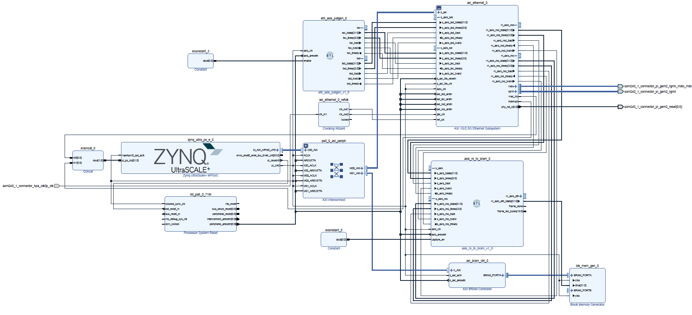

# Combined TX/RX Ethernet Test Subsystem  

This part describes the final integrated TX/RX test subsystem used to validate the full Ethernet datapath before attaching the RDMA pipeline.  
All lower-level topics like PHY, MDIO, MAC options, clocking, reset sequencing, AXI-Lite, RGMII, GEM2 mapping, and design rules are documented in separate module files and are not repeated here.

This section focuses exclusively on the **combined functional test design** that brings together:

- AXI Ethernet Subsystem (MAC)
- TX packet generator (eth_axis_patgen)
- AXI-Stream to BRAM RX capture module (axis_rx_to_bram)
- AXI BRAM controller + Block RAM
- Proper clocking/reset domains

This block design is the **last step** before enabling the complete RDMA RX pipeline.

---

# 1. Purpose of the Combined TX/RX Test Design

The goal of this design is to **verify all layers of the Ethernet subsystem** on the KR260 PL GEM2 port:

- The **MAC** must successfully transmit and receive Ethernet frames.
- The **PHY** must establish gigabit link and correctly drive RGMII.
- The **AXI-Stream TX and RX paths** must be validated end-to-end.
- The **AXI handshakes** (TVALID/TREADY/TLAST/TKEEP) must be correct.
- The pipeline must handle **backpressure** without dropping or corrupting frames.
- The received traffic must be captured **deterministically** into BRAM for debugging.
- This subsystem must integrate cleanly with the **future RDMA RX datapath**.

This project is intentionally lightweight: it isolates and tests only Ethernet TX/RX, without higher-level RDMA logic, to ensure the underlying subsystem is solid.

---

# 2. High-Level Architecture

The design consists of five major components:

1.**AXI Ethernet Subsystem (MAC)** 

   - Configured in 1G RGMII mode.  
   - Controlled from PS via AXI4-Lite.  
   - Provides m_axis_rxd/rxs (RX) and s_axis_txd/txc (TX).

2.**eth_axis_patgen (TX Test Generator)**  

   - Custom IP that generates AXI-Stream Ethernet frames.  
   - Sends test frames with proper header, payload, TLAST and TVALID sequences.  
   - Manually drive txc and txd lines.

3.**axis_rx_to_bram (RX Capture Module)** 

   - Custom IP that receives frames from m_axis_rxd/rxs.  
   - Handles all AXIS signaling.  
   - Stores received bytes into BRAM.  

4.**AXI BRAM Controller + Block Memory Generator**  

   - Simple dual-port BRAM used to store captured RX frames.  
   - Allows PS to read captured data after each test.

5.**Clocking + Reset Infrastructure**  

   - Clock Wizard supplying 125 MHz TX clock for MAC.  
   - The 100 MHz Processor System Reset block is connected to all blocks driven by the PS clock. 
   - All IP blocks are clocked at 100 MHz from the PS, so all internal communication operates at 100 MHz. The connection from the TEMAC to the PHY, however, uses a 125 MHz clock.

---

# 3. Dataflow Summary

## TX Path
eth_axis_patgen → s_axis_txd → AXI Ethernet → PHY → RJ45

Steps:

1. The pattern generator creates AXI-Stream frames.
2. Frames enter the MAC through `s_axis_txd`.
3. MAC encodes + serializes into RGMII for the PHY.
4. PHY performs line encoding and sends frames out via 1000BASE-T.

## RX Path
RJ45 → PHY → AXI Ethernet → m_axis_rxd → axis_rx_to_bram → BRAM

I used a python script to send data from my laptop.

Steps:

1. Incoming packets (from PC/Scapy) arrive on Ethernet wire.
2. PHY decodes and outputs RGMII to the MAC.
3. The MAC outputs AXI-Stream frames via `m_axis_rxd` & `m_axis_rxs`.
4. axis_rx_to_bram receives the stream, handles AXIS protocol, and writes bytes to BRAM.
5. PS reads the BRAM buffer to verify correctness.

---

# 4. Role of Each Module

## 4.1 AXI Ethernet Subsystem  
Core of the design.  
Provides:

- AXI4-Lite registers for control
- AXI-Stream I/O for TX and RX
- MDIO pins to PHY
- RGMII interface
- Internal buffer management

The configuration of speed, duplex, MAC address, MDIO access, and options is handled entirely in PS software (InitEth).

---

## 4.2 eth_axis_patgen (TX Pattern Generator)

This module generates controlled test frames. Features include:

- Custom payload generation 
- Proper TLAST assertion at frame boundary
- Adjustable frame size
- Option to send periodic packets or one-shot bursts
- Fully AXI-Stream compliant
- Backpressure support: the generator waits when MAC deasserts TREADY

---

## 4.3 axis_rx_to_bram (RX Capture Module)

This module receives frames from MAC and stores them to BRAM. Features:

- AXIS input with TVALID/TREADY/TLAST/TKEEP parsing
- Byte-accurate write into BRAM
- Frame length info via a rx status line
- Handles variable-length frames and backpressure propagation

---

## 4.4 AXI BRAM Controller + Block Memory  
  
Advantages:

- Simple interface  
- Zero-latency access  
- Easy PS-side memory reads 

The RX module writes directly into the BRAM, and PS reads out captured frame bytes.

---

# 6. Software Side (PS Application)

Vitis application performs:

1. Initialize caches
2. InitEth() sequence 

   - LookupConfig  
   - CfgInitialize  
   - Set MAC address  
   - Configure Options  
   - PHY bring-up via MDIO  
   - Autoneg enable  
   - Wait for LINK UP

3. Read BRAM by polling and print captured frame formatting

---

