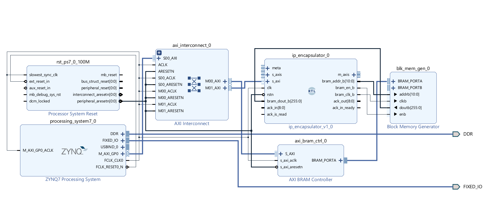
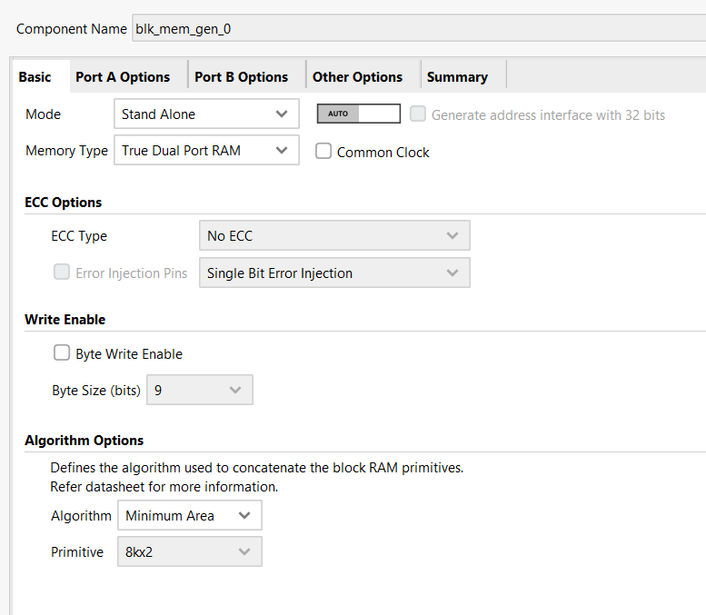
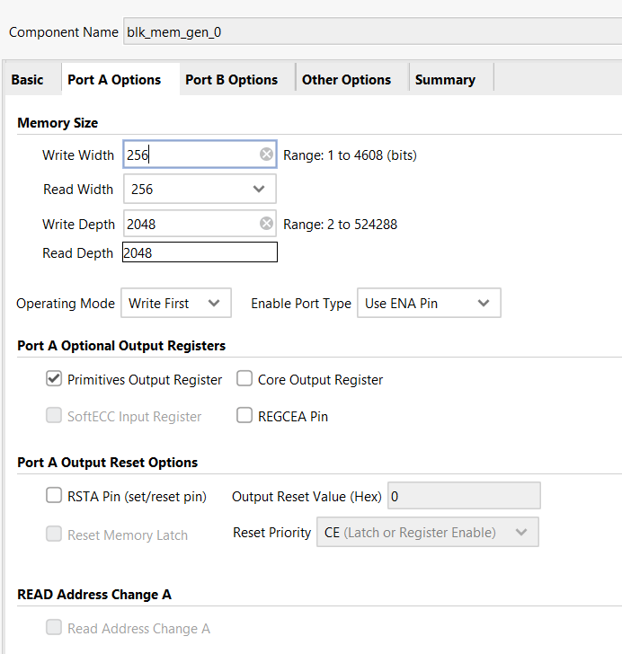

# ARP Table and Endpoint Lookup – Software & Hardware Integration

## 1. Overview

This document describes the design and verification of an ARP-like endpoint lookup mechanism implemented using Block RAM (BRAM) in a Xilinx FPGA design. The system enables automatic IP-to-MAC resolution for an IP encapsulation engine.

The solution integrates:

- Hardware-side endpoint lookup logic inside the IP encapsulator
- Dual-port BRAM generated using Vivado’s Block Memory Generator
- AXI BRAM Controller for processor (PS) access
- Vitis software for configuration, testing, and validation

The design allows the system to learn and store IP-to-MAC mappings, similar to classical ARP behavior, while maintaining high-throughput datapath performance.



---

## 2. System Architecture

### 2.1 High-Level Architecture

The endpoint lookup system consists of the following components:

- **Block Memory Generator (BRAM)**
    - Stores IP-to-MAC mapping entries
    - Configured as true dual-port memory

- **Port A (AXI BRAM Controller → PS)**
    - Used by the ARM processor (via Vitis)
    - Writes and reads ARP/endpoint entries

- **Port B (Endpoint Lookup Logic → PL)**
    - Used by the IP encapsulator
    - Performs real-time MAC lookup during packet transmission

- **AXI-Lite Control Interface**
    - Used to configure and monitor the IP encapsulator
    - Exposes status, counters, and control bits

This architecture enables simultaneous software configuration and hardware lookup, without stalling the datapath.

---

### 2.2 BRAM Configuration

The endpoint lookup table is implemented using a **Block Memory Generator** IP core configured explicitly to support concurrent hardware and software access with full control over memory parameters.





---

#### 2.2.1 Standalone Mode Selection

The BRAM is configured in **Standalone mode**, rather than AXI-based memory mode.  
This choice provides:

- Full control over data width and depth
- Direct, deterministic access from custom RTL logic
- Independence from AXI protocol timing on the data path

AXI access is instead provided externally via a dedicated **AXI BRAM Controller**, allowing the processing system (PS) to interact with the memory without constraining the internal memory organization.

---

#### 2.2.2 True Dual-Port RAM Configuration

The memory is configured as **True Dual-Port RAM**, meaning:

- Port A and Port B are fully symmetric
- Each port supports independent read and write operations
- Both ports can operate simultaneously and asynchronously

This is essential for the ARP-style endpoint table, as it allows:

- **Port A (PS-side)** to insert, update, or inspect IP-to-MAC mappings
- **Port B (PL-side)** to perform real-time lookups during packet encapsulation

without arbitration logic or throughput degradation.

---

#### 2.2.3 Data Width Configuration

Both Port A and Port B are configured with:

- **Read width = 256 bits**
- **Write width = 256 bits**

This wide data path was selected to:

- Align each BRAM entry to a single memory word
- Allow complete endpoint entries to be read in one cycle
- Simplify address calculation and software access

Each 256-bit word corresponds exactly to one endpoint table entry, containing:

- Valid flag
- Destination IP address
- Destination MAC address
- Source MAC address
- Reserved padding for alignment and future extension

This eliminates the need for multi-cycle reads or word assembly in hardware.

---

#### 2.2.4 Memory Depth Configuration

The memory depth is configured as:

- **Read depth = 2048**
- **Write depth = 2048**

This allows storage of up to **2048 endpoint entries**, which provides:

- Sufficient capacity for medium-scale network deployments
- Flexibility for hash-based indexing and collision management
- Headroom for future extensions such as aging, statistics, or VLAN tagging

From a hardware perspective, the depth also aligns well with FPGA block RAM granularity, resulting in efficient resource utilization.

---

#### 2.2.5 Port Utilization

| Port | Connected To | Purpose |
|-----|-------------|--------|
| Port A | AXI BRAM Controller (PS) | Software-driven ARP table management |
| Port B | Endpoint Lookup Logic (PL) | Real-time IP-to-MAC lookup |

This configuration enables **lock-free, parallel access** to the ARP table and clean separation between the control plane (software) and the data plane (hardware).

---

### 2.3 BRAM Entry Format

Each endpoint entry is stored as a fixed-size 256-bit (32-byte) BRAM word, even though only 192 bits are actively used. This simplifies alignment and AXI access.

**Entry Layout (MSB First):**

| Bit Range     | Field        | Description |
|---------------|--------------|-------------|
| [255:192]     | Reserved     | Unused |
| **[191]**     | `valid`      | Entry valid flag |
| [190:160]     | Reserved     | Padding |
| **[159:128]** | `dst_ip`     | Destination IPv4 address |
| **[127:80]**  | `dst_mac`    | Destination MAC address |
| **[79:32]**   | `src_mac`    | Source MAC address |
| [31:0]        | Reserved     | Padding |

The same format is used consistently in **RTL logic** and **Vitis software**.

---

### 2.4 BRAM Indexing and Hash Function

#### 2.4.1 Hash-Based Indexing

To avoid large CAMs or associative memories, a simple hash-based index is used:

``` c
index = dst_ip[7:0] ^ dst_ip[15:8]
```

This provides:

- Low hardware cost
- Deterministic access
- Reasonable distribution for small endpoint tables

---

#### 2.4.2 Software Implementation

``` c
uint8_t compute_bram_index(uint32_t dst_ip) {
    return (dst_ip & 0xFF) ^ ((dst_ip >> 8) & 0xFF);
}
```

This function must match the RTL logic exactly, ensuring correct lookup behavior.

---

## 3. Vitis Driver Layer

### 3.1 AXI-Lite Register Map

The IP encapsulator exposes control, status, and statistics registers via AXI-Lite.

Key registers include:

| Offset   | Name                | Description                      |
|----------|---------------------|----------------------------------|
|0x00      | CONTROL             | Enable, reset, IRQ control       |
|0x04	   | STATUS              | Ready, lookup error, IRQ pending |
|0x10–0x1C |Packet/Byte Counters | 64-bit statistics                |
|0x40	   |IRQ_ACK	             | Interrupt acknowledgment         |

Control bits allow:

- Enabling/disabling encapsulation
- Clearing counters
- Enabling interrupts

---

### 3.2 Writing Endpoint Entries to BRAM

The software constructs a BRAM entry word-by-word:

- Sets the valid bit
- Packs IP and MAC fields according to the defined format
- Writes all 8 words using AXI

``` c
void write_endpoint_entry(uint32_t bram_base, uint32_t dst_ip, 
                          uint64_t dst_mac, uint64_t src_mac) {
    uint8_t index = compute_bram_index(dst_ip);
    uint32_t addr = bram_base + (index * 32);

    bram_entry_t e;
    memset(e.word, 0, sizeof(e.word));

    e.word[7] = 0x80000000;

    e.word[6] = dst_ip;

    e.word[5] = (uint32_t)(dst_mac >> 16);     
    e.word[4] = (uint32_t)((dst_mac & 0xFFFF) << 16) | 
                  (uint32_t)((src_mac >> 32) & 0xFFFF); 

    e.word[3] = (uint32_t)src_mac;    
    

    for (int i = 0; i < WORDS_PER_ENTRY; i++)
    {
        Xil_Out32(addr + (i * 4), e.word[i]);
    }
    
    printf("Wrote endpoint entry: IP=0x%08X, DST_MAC=0x%012llX, SRC_MAC=0x%012llX, Index=%d\n",
           dst_ip, dst_mac, src_mac, index);
}
```

This guarantees bit-exact alignment with the hardware endpoint lookup logic.

---

### 3.3 Reading and Verifying Entries

To validate correctness, entries are read back and parsed:

- Read all 8 BRAM words
- Extract:
    - Valid bit
    - Destination IP
    - Destination MAC
    - Source MAC
- Print decoded values

``` c
void read_endpoint_entry(uint32_t bram_base, uint8_t index) {
    uint32_t addr = bram_base + (index * 32);

    bram_entry_t e;

    for (int i = 0; i < WORDS_PER_ENTRY; i++)
    {
        e.word[i] = Xil_In32(addr + (i * 4));
        xil_printf("Addr %08x W[%d] = %08x\n", addr + i*4, i, e.word[i]);
    }

    uint8_t valid = (e.word[7] >> 31) & 0x1;
    
    uint32_t read_dst_ip = e.word[6];
    
    uint64_t read_dst_mac = ((uint64_t)e.word[5] << 16) | // W5: MAC[47:16] -> [63:16]
                            ((e.word[4] >> 16) & 0xFFFF); // W4: MAC[15:0] -> [15:0]
    
    uint64_t read_src_mac = ((uint64_t)(e.word[4] & 0xFFFF) << 32) | // W4: MAC[47:32] -> [47:32]
                            e.word[3]; // W3: MAC[31:0] -> [31:0]
    
    printf("--- Parsed Values ---\n");
    printf(" Valid: %u\n", valid);
    printf(" IP: 0x%08X\n", read_dst_ip);
    printf(" DST_MAC: 0x%012llX\n", read_dst_mac);
    printf(" SRC_MAC: 0x%012llX\n", read_src_mac);

}
```

This step confirms:

- BRAM accessibility
- Correct endianness
- Correct field packing

---

### 3.4 IP Encapsulator Setup

To enable the IP Encapsulator module:

``` c
void enable_ip_encapsulator(uint32_t ip_base) {
    uint32_t ctrl = Xil_In32(ip_base + IP_ENCAP_REG_CONTROL);
    Xil_Out32(ip_base + IP_ENCAP_REG_CONTROL, ctrl | IP_ENCAP_CTRL_ENABLE);
    printf("IP Encapsulator enabled (CONTROL=0x%08X)\n", 
           Xil_In32(ip_base + IP_ENCAP_REG_CONTROL));
}
```

To disable the IP Encapsulator module:

``` c
void disable_ip_encapsulator(uint32_t ip_base) {
    uint32_t ctrl = Xil_In32(ip_base + IP_ENCAP_REG_CONTROL);
    Xil_Out32(ip_base + IP_ENCAP_REG_CONTROL, ctrl & ~IP_ENCAP_CTRL_ENABLE);
    printf("IP Encapsulator disabled\n");
}
```

These functions manipulate the AXI-Lite control register to start or stop packet processing.

---

### 3.5 Counter Management

Counters track:

- Number of packets processed
- Number of bytes transmitted

The clear_counters() function pulses a control bit to reset them atomically:

``` c
void clear_counters(uint32_t ip_base) {
    uint32_t ctrl = Xil_In32(ip_base + IP_ENCAP_REG_CONTROL);
    Xil_Out32(ip_base + IP_ENCAP_REG_CONTROL, ctrl | IP_ENCAP_CTRL_CLEAR_COUNTERS);
    Xil_Out32(ip_base + IP_ENCAP_REG_CONTROL, ctrl & ~IP_ENCAP_CTRL_CLEAR_COUNTERS);
    printf("Counters cleared\n");
}
```

---

### 3.6 Status Monitoring

The status register provides:

- Ready indication
- Lookup error flag (e.g., missing ARP entry)
- Interrupt pending status

The print_status() helper aggregates all diagnostic information into a human-readable format:

``` c
void print_status(uint32_t ip_base) {
    uint32_t status = read_status(ip_base);
    uint32_t control = Xil_In32(ip_base + IP_ENCAP_REG_CONTROL);
    uint64_t pkt_count = read_packet_count(ip_base);
    uint64_t byte_count = read_byte_count(ip_base);
    
    printf("=== IP Encapsulator Status ===\n");
    printf("Control:  0x%08X\n", control);
    printf("  Enable:         %s\n", (control & IP_ENCAP_CTRL_ENABLE) ? "Yes" : "No");
    printf("  Loopback:       %s\n", (control & IP_ENCAP_CTRL_LOOPBACK) ? "Yes" : "No");
    printf("  IRQ Enable:     %s\n", (control & IP_ENCAP_CTRL_IRQ_ENABLE) ? "Yes" : "No");
    printf("Status:   0x%08X\n", status);
    printf("  Ready:          %s\n", (status & IP_ENCAP_STATUS_READY) ? "Yes" : "No");
    printf("  Lookup Error:   %s\n", (status & IP_ENCAP_STATUS_LOOKUP_ERROR) ? "Yes" : "No");
    printf("  IRQ Pending:    %s\n", (status & IP_ENCAP_STATUS_IRQ_PENDING) ? "Yes" : "No");
    printf("Packet Count:  %llu\n", pkt_count);
    printf("Byte Count:    %llu\n", byte_count);
    printf("==============================\n");
}
```

---

## 5. Test Application Flow

The test application performs incremental system validation:

### 5.1 Test 1 – BRAM Access

- Writes a known pattern (0xDEADBEEF)
- Reads back and verifies correctness
- Confirms:
    - AXI BRAM Controller configuration
    - Address mapping correctness

``` c
// Write test pattern
printf("Writing test pattern to BRAM[0]...\r\n");
Xil_Out32(BRAM_BASE_ADDR, 0xDEADBEEF);
    
// Read back
uint32_t test_read = Xil_In32(BRAM_BASE_ADDR);
if (test_read == 0xDEADBEEF) {
    printf("  ✓ BRAM accessible (read: 0x%08X)\r\n\r\n", test_read);
} else {
    printf("  ✗ BRAM read FAILED! (expected 0xDEADBEEF, got 0x%08X)\r\n", test_read);
    printf("  Check BRAM base address in Address Editor!\r\n\r\n");
    return -1;
}
```

---

### 5.2 Test 2 – AXI-Lite Access

- Reads CONTROL and STATUS registers
- Detects invalid reads (0xFFFFFFFF)
- Confirms:
    - IP integration in block design
    - Clock/reset connectivity

``` c
printf("Reading STATUS register...\r\n");
uint32_t status = Xil_In32(IP_ENCAP_BASE_ADDR + IP_ENCAP_REG_STATUS);
printf("  STATUS:  0x%08X\r\n", status);
    
printf("Reading CONTROL register...\r\n");
uint32_t control = Xil_In32(IP_ENCAP_BASE_ADDR + IP_ENCAP_REG_CONTROL);
printf("  CONTROL: 0x%08X\r\n\r\n", control);
    
if (status == 0xFFFFFFFF || control == 0xFFFFFFFF) {
    printf("  ⚠️  WARNING: Register reads returned 0xFFFFFFFF\r\n");
    printf("  This usually means:\r\n");
    printf("    - Wrong base address\r\n");
    printf("    - IP not connected in block design\r\n");
    printf("    - Clock/reset issue\r\n\r\n");
}
```

---

### 5.3 Test 3 – Endpoint Entry Programming

- Writes two IP-to-MAC mappings into BRAM
- Uses hash-based indexing
- Simulates ARP table population.

``` c
write_endpoint_entry(BRAM_BASE_ADDR, TEST_IP_1, TEST_MAC_1, SRC_MAC_1);
write_endpoint_entry(BRAM_BASE_ADDR, TEST_IP_2, TEST_MAC_2, SRC_MAC_2);
```

---

### 5.4 Test 4 – Verification Readback

- Computes indices
- Reads back entries
- Prints parsed fields
- Confirms:
    - Correct memory packing
    - Hash function consistency

``` c
uint8_t index1 = compute_bram_index(TEST_IP_1);
uint8_t index2 = compute_bram_index(TEST_IP_2);
read_endpoint_entry(BRAM_BASE_ADDR, index1);
read_endpoint_entry(BRAM_BASE_ADDR, index2);
```

---

### 5.5 Test 5 – IP Configuration

- Clears counters
- Enables encapsulator
- Prints initial status
- Confirms control path operation

``` c
clear_counters(IP_ENCAP_BASE_ADDR); 
enable_ip_encapsulator(IP_ENCAP_BASE_ADDR);
print_status(IP_ENCAP_BASE_ADDR);
```

---

### 5.6 Test 6 – Runtime Monitoring

- Periodically polls packet counters
- Detects packet activity
- Prints live status
- Useful for:
    - Hardware-in-the-loop testing
    - Throughput validation
    - Debugging lookup behavior

``` c
int iteration = 0;
uint64_t last_pkt_count = 0;
    
while (1) {
    // Delay
    for (volatile int i = 0; i < 50000000; i++);
        
    // Read current packet count
    uint64_t curr_pkt_count = read_packet_count(IP_ENCAP_BASE_ADDR);
        
    // Print status every 10 iterations or if packets changed
    if (iteration % 10 == 0 || curr_pkt_count != last_pkt_count) {
        printf("\r\n[Iteration %d]\r\n", iteration);
        print_status(IP_ENCAP_BASE_ADDR);
            
        if (curr_pkt_count != last_pkt_count) {
            printf("  ⚠️  Packet count changed! (%llu -> %llu)\r\n",
                    last_pkt_count, curr_pkt_count);
        }
    } else {
        printf(".");  // Progress indicator
    }
        
    last_pkt_count = curr_pkt_count;
    iteration++;
}
```

---

## 6. Design Benefits

This ARP-table approach provides:

- Zero-cycle lookup latency in the datapath
- Concurrent software and hardware access
- Scalable endpoint storage
- Clean separation of control and data planes

It closely mirrors real-world ARP behavior while remaining FPGA-friendly.


The implemented system successfully demonstrates:

- A BRAM-based ARP/endpoint table
- Tight HW/SW integration via AXI
- Deterministic, high-performance MAC resolution
- Robust Vitis-based validation strategy

This design forms a solid foundation for a complete FPGA-based Ethernet/IP/UDP networking stack.
