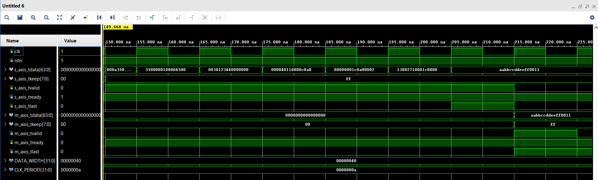
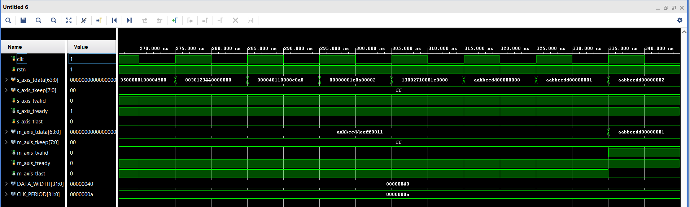
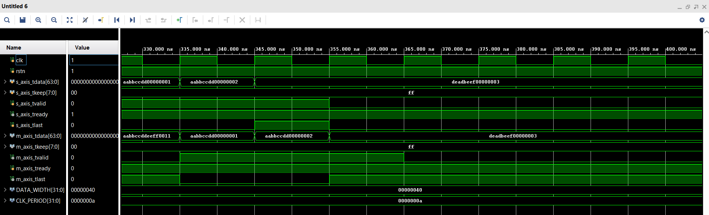
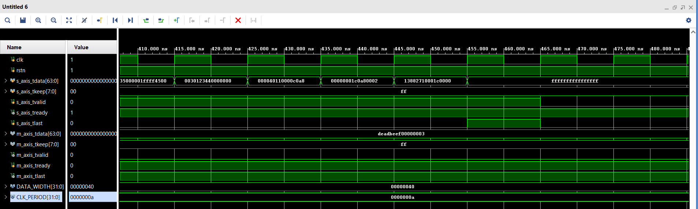

# Ethernet RX Parser Testbench

## 1. Overview

The `ethernet_rx_parser_v2_tb` module is a directed testbench designed to verify the functional correctness of the `ethernet_rx_parser` RTL module.

The purpose of this testbench is to ensure that the RX parser correctly:

- Accepts complete Ethernet frames via AXI-Stream  
- Parses Ethernet, IPv4, and UDP headers  
- Forwards only the UDP payload  
- Preserves AXI-Stream protocol semantics  
- Correctly drops invalid packets (e.g., wrong EtherType)

The testbench focuses on **functional behavior**, **FSM transitions**, and **payload forwarding correctness**.

---

## 2. Testbench Parameters and Timing

### 2.1 Data Width Configuration

- `DATA_WIDTH = 64`  
  The AXI-Stream interface operates on 64-bit data beats (8 bytes per cycle).

- `DATA_WIDTH/8 = 8`  
  Defines the width of `tkeep`, enabling per-byte validity.

### 2.2 Clock Configuration

- `CLK_PERIOD = 10 ns`  
  Produces a 100 MHz simulation clock.

The clock is generated using a free-running `always` block toggling every half period.

---

## 3. Signal Definitions

### 3.1 Reset and Clock

- `clk`: Global clock  
- `rstn`: Active-low synchronous reset  

The DUT remains in reset during initialization and begins operation once `rstn` is asserted.

---

### 3.2 AXI-Stream Input Interface

This interface models the Ethernet MAC RX stream connected to the parser:

| Signal | Description |
|------|------------|
| `s_axis_tdata` | Incoming Ethernet frame data |
| `s_axis_tkeep` | Byte-valid mask |
| `s_axis_tvalid` | Input data valid |
| `s_axis_tready` | Backpressure from DUT |
| `s_axis_tlast` | End of Ethernet frame |

The testbench fully respects the AXI-Stream handshake protocol.

---

### 3.3 AXI-Stream Output Interface

This interface carries the extracted UDP payload:

| Signal | Description |
|------|------------|
| `m_axis_tdata` | Output payload data |
| `m_axis_tkeep` | Byte-valid mask |
| `m_axis_tvalid` | Payload valid |
| `m_axis_tready` | Downstream ready |
| `m_axis_tlast` | End of UDP payload |

The testbench intentionally controls `m_axis_tready` to test backpressure behavior.

---

## 4. DUT Instantiation

The testbench instantiates the `ethernet_rx_parser` module with:

- Matching `DATA_WIDTH`
- Direct connection of all AXI-Stream signals
- No additional monitoring or signal manipulation

This ensures the DUT is tested in a realistic streaming environment.

---

## 5. Reset and Initialization Sequence

At simulation start:

1. All AXI-Stream signals are deasserted  
2. Downstream `m_axis_tready` is initially low  
3. Reset is asserted for several clock cycles  
4. Reset is released  
5. Downstream readiness is enabled  

This sequence ensures deterministic DUT startup behavior.

---

## 6. Output Monitoring

An always block monitors the output AXI-Stream interface:

- Each valid payload beat is printed  
- `tdata` and `tlast` are displayed  
- Only active when `m_axis_tvalid && m_axis_tready`  

This provides immediate visibility into forwarded payload data during simulation.

---

## 7. Test Cases

### 7.1 Test Case 1 – Short UDP Packet

**Objective:**  
Verify correct parsing and forwarding of a minimal UDP payload.

**Description:**

- Valid Ethernet + IPv4 + UDP headers  
- Single-beat payload  
- `tlast` asserted on first payload beat  

**Expected Behavior:**

- Parser transitions through all header states  
- Payload forwarded correctly  
- Output `tlast` asserted  
- No packet drop

**Testbench Waveform:**

---

### 7.2 Test Case 2 – Long UDP Packet

**Objective:**  
Verify multi-beat payload forwarding.

**Description:**

- Valid headers  
- Payload spans multiple AXI beats  
- `tlast` asserted only on final beat  

**Expected Behavior:**

- Continuous payload forwarding  
- Proper `tvalid` and `tlast` handling  
- No dropped or duplicated beats  

**Testbench Waveform:**

---

### 7.3 Test Case 3 – Invalid EtherType

**Objective:**  
Verify packet rejection behavior.

**Description:**

- EtherType set to `0xFFFF` instead of IPv4 (`0x0800`)  
- Remaining frame beats still transmitted  

**Expected Behavior:**

- FSM detects invalid EtherType in `ETH_BEAT1`  
- Transition to `DROP` state  
- No payload forwarded  
- Input stream drained until `tlast`  

**Testbench Waveform:**

---

## 8. Packet Generation Tasks

### 8.1 `send_udp_packet`

This task sends a complete Ethernet + IPv4 + UDP frame with a short payload.

Key characteristics:

- Header beats precisely aligned to FSM expectations  
- Payload begins at `UDP_BEAT`  
- `tlast` asserted correctly for single-beat payloads  

---

### 8.2 `send_long_udp_packet`

This task extends the previous logic to multi-beat payloads.

Features:

- Identical header structure  
- Payload loop generates multiple beats  
- Last beat asserts `tlast`  

This verifies payload streaming behavior across multiple cycles.

---

### 8.3 `send_axis_word`

Low-level AXI-Stream driver task.

Responsibilities:

- Drives `tdata`, `tkeep`, `tvalid`, and `tlast`  
- Waits for `s_axis_tready` before advancing  
- Safely deasserts signals after handshake  

This task enforces **correct AXI-Stream protocol timing**.

---

## 9. Summary

This testbench provides:

- Directed verification of RX parsing logic  
- Accurate modeling of AXI-Stream behavior  
- Explicit FSM-aligned packet generation  
- Positive and negative test scenarios  
- Clear simulation visibility via output monitoring  

It serves as a **solid functional verification foundation** for the `ethernet_rx_parser` module and complements higher-level system testing.
