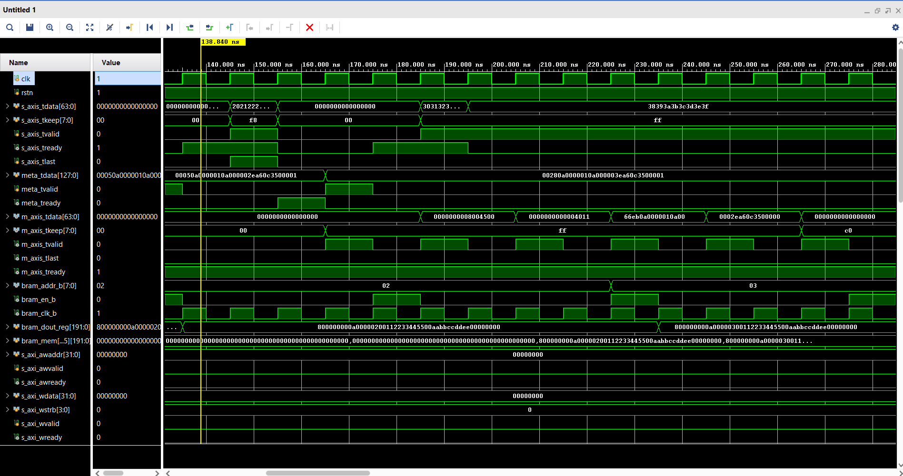
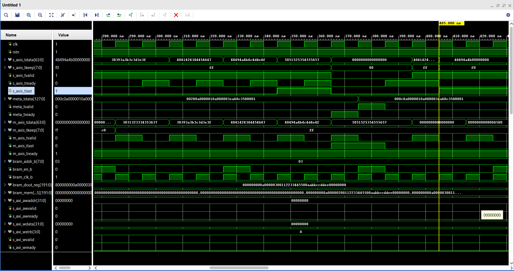
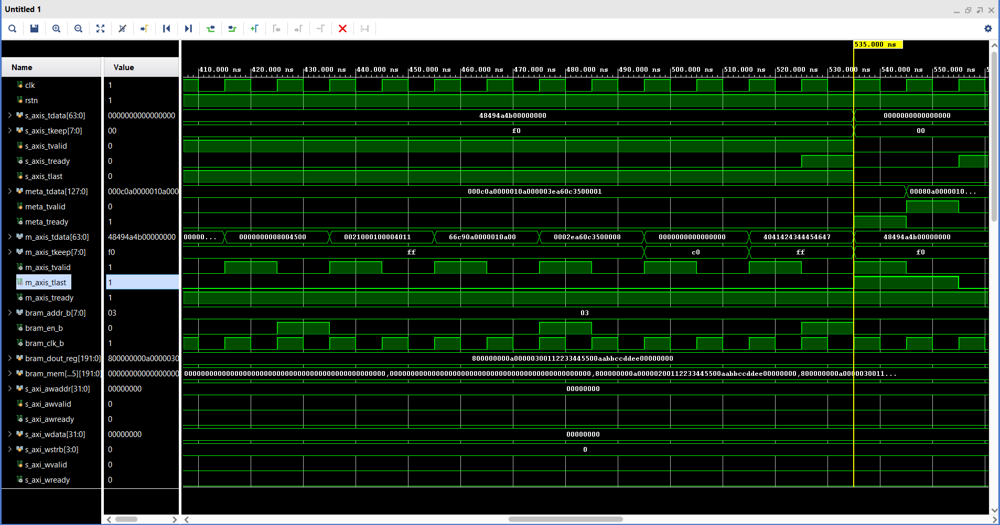
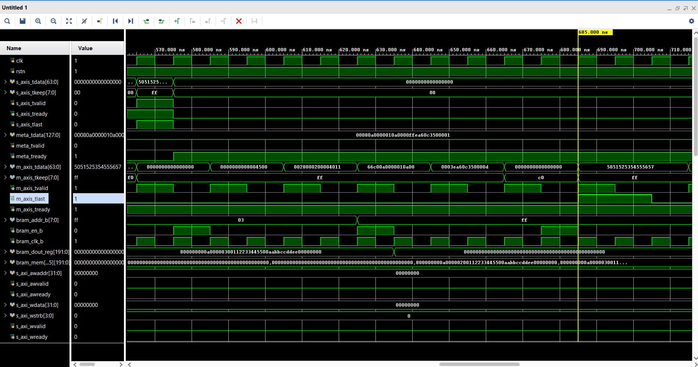

# IP Encapsulator Testbench

## 1. Purpose of the Testbench

The `ip_encapsulator_v3_tb` module is a self-checking, comprehensive verification environment for the ip_encapsulator RTL module.
Its primary objectives are:

- To validate correct Ethernet, IPv4, and UDP encapsulation
- To verify metadata and payload alignment
- To exercise BRAM-based endpoint lookup behavior
- To confirm correct handling of corner cases (zero-length payloads, lookup misses)
- To automatically compare generated frames against expected reference data

The testbench models both control-plane behavior (BRAM programming) and data-plane behavior (AXI-Stream traffic), enabling realistic end-to-end verification.

---

## 2. Global Parameters and Timing

The testbench defines several local parameters to match the DUT configuration:

- DATA_WIDTH = 64: AXI-Stream data width (8 bytes per beat)
- KEEP_WIDTH = 8: Byte-enable granularity
- META_WIDTH = 128: Metadata side-channel width
- BRAM_ADDR_WIDTH = 8: Endpoint table address width
- BRAM_DATA_WIDTH = 192: Packed endpoint entry width
- HEADER_BYTES = 42: Ethernet (14) + IPv4 (20) + UDP (8)
- MAX_FRAME_BYTES = 512: Maximum captured frame size
- CLK_PERIOD = 10 ns: 100 MHz clock

A free-running clock is generated, and an active-low synchronous reset (rstn) is applied during initialization.

---

## 3. AXI-Stream Interfaces

### 3.1 Payload Input Interface

The payload input models a standard AXI-Stream master:

- `s_axis_tdata`: Payload data
- `s_axis_tkeep`: Per-byte validity
- `s_axis_tvalid`: Beat validity
- `s_axis_tready`: Backpressure from DUT
- `s_axis_tlast`: End-of-packet marker

The testbench fully respects AXI-Stream handshake semantics and waits for tready before advancing.

---

### 3.2 Metadata Side Channel

Packet metadata is driven through a dedicated side-channel:

- Source IP address
- Destination IP address
- Source and destination UDP ports
- Payload length
- Flags and endpoint identifier

Metadata transmission is synchronized with the DUT’s internal alignment logic by waiting for meta_tready before asserting meta_tvalid.

---

### 3.3 Output AXI-Stream Interface

The output AXI-Stream interface is configured as always ready, allowing the DUT to stream frames without backpressure:

- Output bytes are captured using tdata, tkeep, and tlast
- Each frame is reconstructed byte-by-byte into a capture buffer
- Frame boundaries are detected via tlast

This enables full-frame reconstruction and later comparison.

---

## 4. BRAM Endpoint Table Model

The testbench models the endpoint lookup table using a behavioral BRAM:

- True dual-port semantics are emulated
- Port B is used by the DUT for lookup operations
- Read latency is modeled as one clock cycle

Each BRAM entry is packed as a single wide word containing:

- Valid bit
- Destination IP address
- Destination MAC address
- Source MAC address

The BRAM is preloaded during initialization to simulate software-configured endpoint entries.

---

## 5. AXI-Lite Interface Handling

The AXI-Lite interface is instantiated but intentionally left idle. This reflects real system usage where:

- Control-plane configuration occurs independently
- Data-plane encapsulation is verified without register interaction

All AXI-Lite signals are tied off safely to avoid unintended transactions.

---

## 6. Lookup Error Monitoring

The testbench tracks lookup failures using the DUT’s lookup_error signal:

- Rising edges are detected using a delayed register
- Each lookup miss increments a counter
- The final test asserts that exactly one lookup error occurs

This verifies correct error signaling behavior without false positives.

---

## 7. Payload and Frame Capture Infrastructure

### 7.1 Payload Generation

Payload data is generated deterministically using a seed value:

- Each byte increments sequentially
- Enables easy visual and automated verification
- Supports arbitrary payload lengths

---

### 7.2 Frame Capture Logic

As output data is streamed:

- Valid bytes are extracted using tkeep
- Bytes are stored sequentially in a per-frame buffer
- Frame lengths are recorded on tlast

This allows exact reconstruction of transmitted Ethernet frames.

---

## 8. Expected Frame Generation

For each transmitted packet, the testbench independently constructs the expected Ethernet frame:

- Ethernet header (MAC addresses, EtherType)
- IPv4 header (including checksum calculation)
- UDP header
- Payload bytes

The IPv4 checksum is computed using a reference function that follows RFC 791 semantics.

Lookup miss scenarios intentionally force MAC addresses to zero, validating DUT behavior under error conditions.

---

## 9. Test Scenarios

The test sequence exercises a wide range of operational cases:

- Zero-length payload test verifies header-only frame handling
- Short payload test checks less than one AXI beat
- Multi-beat payload test generates payload spans multiple cycles
- Back-to-back packets test where no idle cycles between frames
- Endpoint lookup miss test triggers error signaling and zeroed MACs

All scenarios are executed sequentially without resetting the DUT between packets.

Below is the result of the testbench waveform:

---

## 10. Self-Checking and Assertions

After all packets are transmitted:

- Frame count is checked against expected count
- Frame lengths are verified
- Each byte of every frame is compared
- Lookup error count is validated

Any mismatch triggers a $error, making the testbench fully self-checking and suitable for regression testing.

---

## 11. Summary

This testbench provides:

- Cycle-accurate AXI-Stream modeling
- Realistic BRAM endpoint lookup emulation
- Automated reference frame generation
- Comprehensive coverage of normal and error cases

It serves as a robust verification foundation for the ip_encapsulator module and significantly reduces integration risk.