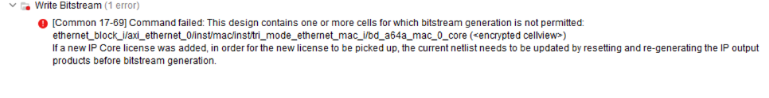
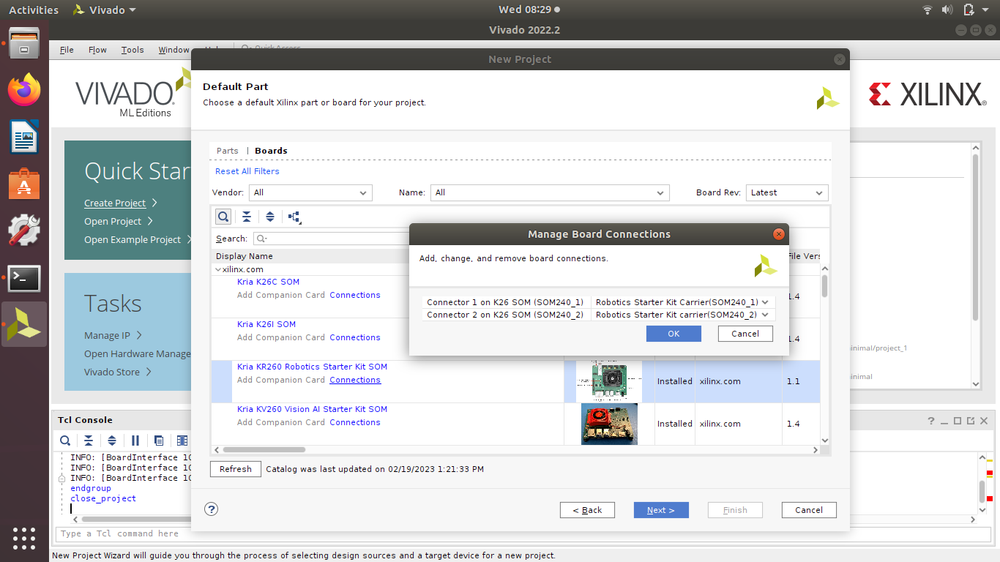
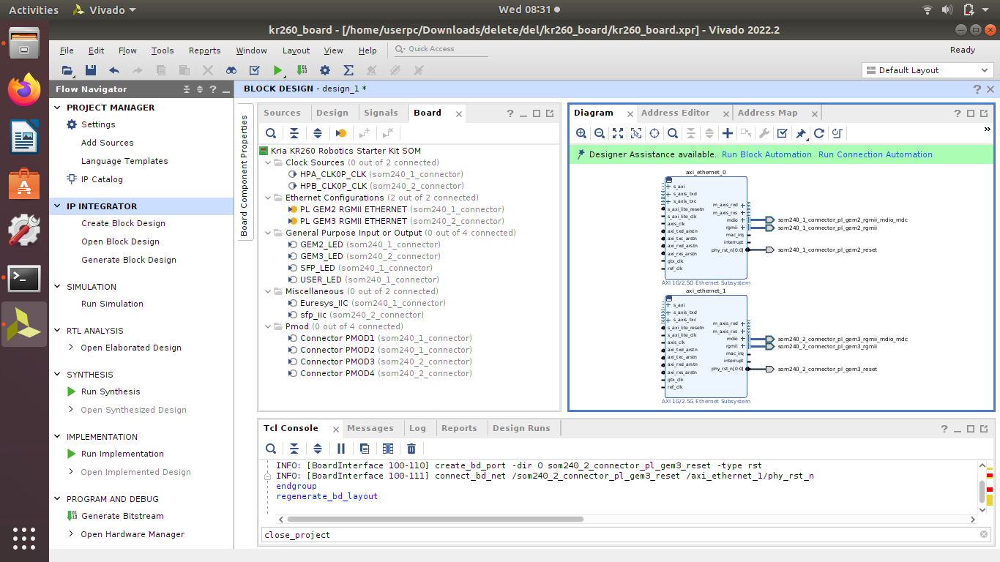
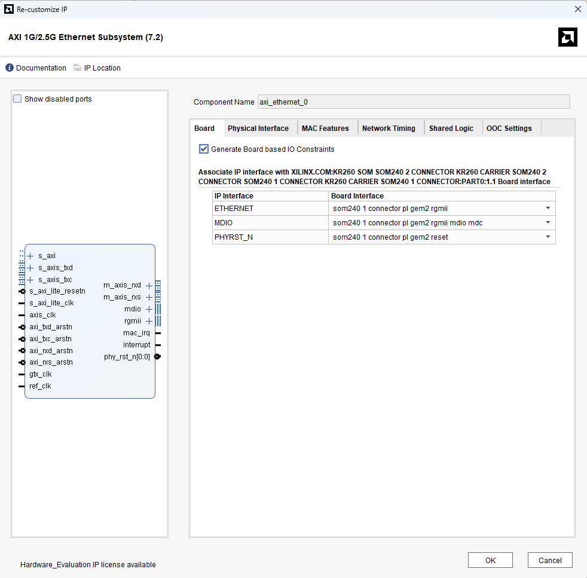
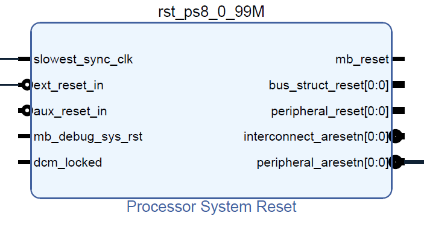

# AXI 1G/2.5G Ethernet Subsystem — Full Port & Interface Documentation

This section explains every major interface of the AXI 1G/2.5G Ethernet Subsystem IP,
including the AXI4-Lite control path, AXI4-Stream TX/RX channels,
RGMII PHY interface, MDIO management, clock/reset structure, and how these are used
in the KR260 + DP83867 PHY design.

---

## 1. Overview
**Information about the Ethernet IP Block Used**
The AMD AXI Ethernet Subsystem implements a tri-mode (10/100/1000 Mb/s) Ethernet MAC
or a 10/100 Mb/s Ethernet MAC. This core supports the use of MII, GMII, SGMII, RGMII, and
1000BASE-X interfaces to connect a media access control (MAC) to a physical-side interface
(PHY) chip. It also provides an on-chip PHY for 1G/2.5G SGMII and 1000/2500 BASE-X modes.
The MDIO interface is used to access PHY Management registers. This subsystem optionally
enables TCP/UDP full checksum offload, VLAN stripping, tagging, translation, and extended
filtering for multicast frames features.


This subsystem provides additional functionality and ease of use related to Ethernet. Based on
the configuration, this subsystem creates interface ports, instantiates required infrastructure cores, and connects these cores.

The AXI Ethernet Subsystem is logically divided into three layers:

1. **AXI4-Lite Control Interface**  
2. **AXI4-Stream TX/RX Data Interfaces**  
3. **RGMII Physical Ethernet Interface**

System position:

```
DP83867 PHY
     ↓ RGMII
AXI Ethernet Subsystem (MAC) ←––––––– this block
     ↓ m_axis_rxd (data)
     ↓ m_axis_rxs (status)
AXIS_RX_TO_RDMA (Custom IP)
```
Here is a picture of this MAC ip used in the final RDMA design.


---
## 2. VERY IMPORTANT INFORMATIONS BEFORE STARTING WITH THE MAC
### 2.1 LICENSE INFORMATION ABOUT THIS IP BLOCK
Note that an evaluation license (Hardware Evaluation) for Tri-Mode Ethernet MAC IP has been obtained. It will not compile without it.



From the following link, it is possible to get 4 month free trial license for this ip.

[License Link](https://login.amd.com/app/amd_accountamdcom_1/exk559qg7f4aW4yim697/sso/saml?SAMLRequest=fVLLbsIwEPyVyHdwEhECFkGioKpItEVAW6kX5JgNWHXs4HVa%2BPuaQF%2BHcvJqPTuznvEAeakqNqrdTi9gXwO64FAqjay5yEhtNTMcJTLNS0DmBFuO7mcsboesssYZYRQJRohgnTR6bDTWJdgl2Hcp4Gkxy8jOuQoZpVwIU2vX5uWmLUxJTwoUK%2BppCqmAVgadByEJJn4NqfmJ8Gdcma3U38O8qqiv1xdSX%2FruOqJweEuS%2Fn6bFh3%2B0jnKsttPKaJp1EgwnWRk3Sl6ScRTHnbTYtMNedELU9hESd6BKM9FHIl%2BnsQejFjDVKPj2mUkDuOkFcWtOFlFfZb0WJi2wzB%2BJcGtsQIaCzNScIVAgvnFmhupN1Jvr%2FuYn0HI7lareWv%2BuFyR4BksNs%2F3ADIcnLZnzT72Vz7XaflXKGT4XwT%2BvLQG9JfEWa9iD55zOpkbJcUxGCllPsYWuIOMOFsDocPz1N%2F%2FM%2FwE&RelayState=https%3A%2F%2Faccount%2Eamd%2Ecom%2Fen%2Fforms%2Flicense%2Flicense%2Dform%2Ehtml)

Choose this option and the ethernet ip block will be functional.


You can follow this link for the detailed explanation. 
[License Link](https://digilent.com/reference/vivado/temac?srsltid=AfmBOopFCrHFR-mmgt0yZ6U_JD0973M5YUpqqRmJV5cOFaeGCqq5kVro)

### 2.2 Creating VIVADO Projects with Kria - Manage Board Connection for PL ETHERNET

While creating VIVADO project for Kria Boards, there is option for "Connections --> Manage Board Connections". This option is really helpful for designing projects for Kria Boards which include popular interfaces as GPIO, MIPI, I2C on KV260 and PL Ethernet, SFP connection, Pmod, Clocks etc on KR260. After proper selection of "Manage Board Connection" option we can get some of most used interface connection easily and it also pulls the Constraint itself.

#### KR260 VIVADO project creation with Board Connections
1. Here we can select Connector for KR260- SoM240_1 and SoM240_2, here is an example:

2. Now on creating Block Design, we can again see multiple Interfaces available on KR260 Board Connector, example we can get SFP connector , PL Ethernet , Pmod etc.

As an example, i have added two PL Ethernet (GEM2 and GEM3 RGMII Ethernet) on above Kria KR260 Board based Block Design. VIVADO automatically configure the PL Ethernet IP(AXI 1G/2.5G Ethernet Subsystem IP) and pulls the constraint for it from Board file. Similarly other interfaces can also be added on VIVADO block design.


### 2.3 Customizing the Subsystem in the Vivado IDE
First of all, the most important two steps to do before being able to work with this ip block in our RDMA project were getting the license and setting board-based I/O constraints before starting the project as I already explained them. So after doing these two steps we can finally customize the block specifically for our board kria kr260.





## 3. AXI-Stream TX Path (Custom IP → MAC)

This part will be a quick summary to include all pin explanations in this section. These two tx channels will be explained in detail in the rxtx_to_rdma custom ip block.

TX requires **two separate AXI4-Stream channels**:

1. **TX Control** (`s_axis_txc`)  
2. **TX Data** (`s_axis_txd`)  

The MAC enforces a strict ordering rule:

> **TXC must finish completely before TXD is allowed.  
> If not, the MAC drops the entire frame.**

---

### 3.1 `s_axis_txc` — TX Control Stream

Exactly **6 words** per Ethernet frame (Normal Transmit Mode).

| Signal | Description |
|--------|-------------|
| `tdata[31:0]` | Control word |
| `tkeep[3:0]` | Byte mask (always `0xF`) |
| `tvalid` | Control word valid |
| `tready` | MAC ready |
| `tlast` | Asserted on word 5 (6th txc word) |

#### TXC Word Format (from PG138 ethernet block datasheet)

| Word | Purpose |
|------|---------|
| Word 0 | Flag = `0xA` (Normal Transmit) |
| Words 1–5 | Reserved, set to `0x00000000` |

We always use:
`0xA0000000`


This selects **Normal Transmit AXI4-Stream Frame**, not “Receive-Status Transmit”.

---

### 3.2 `s_axis_txd` — TX Data Stream

Actual Ethernet bytes are streamed here.

| Signal | Description |
|--------|-------------|
| `tdata[31:0]` | 32-bit payload word |
| `tkeep[3:0]` | Last-word mask |
| `tvalid` | Payload valid |
| `tready` | Backpressure from MAC |
| `tlast` | End of frame |

#### Requirements

- Data beats must be **continuous** until `tlast=1`
- `tkeep` accurate on the last word
- No gaps while `tvalid=1`

---

### 3.3 Full TX Timing (AXI4-Stream Transmit Control → AXI4-Stream Transmit Data)

TXC Stage:
Word0 Word1 Word2 Word3 Word4 Word5 (tlast=1) [tready=1] → MAC accepts full TXC frame

TXD Stage:
Data0 Data1 ... DataN (tlast=1) [tready=1] → MAC transmits via RGMII

If TXC does not finish cleanly:  
**MAC will not raise `s_axis_txd_tready` → TXD is blocked forever.**

---

## 4. AXI-Stream RX Path (MAC → Custom IP)

MAC sends **two streams** back-to-back:

1. Full Ethernet payload (`m_axis_rxd`)
2. A 6-word RX status frame (`m_axis_rxs`)

---

### 4.1 `m_axis_rxd` — RX Data Stream

| Signal | Meaning |
|--------|---------|
| `tdata[31:0]` | Ethernet/IP/RDMA bytes |
| `tkeep[3:0]` | Last-word mask |
| `tvalid` | Data valid |
| `tlast` | End of frame |
| `tready` | Backpressure from RDMA RX |

MAC guarantees each packet arrives as **one contiguous AXI burst**.

---

### 4.2 `m_axis_rxs` — RX Status Stream

Each RX packet is followed by **6 words** of status information.

#### Word 5, bits[15:0]:


Other words contain:

- Frame OK  
- VLAN info  
- Checksum flags  
- MAC filtering results  
- Optional offload information  

Our custom RDMA RX uses only the **length field**, which I did not implement in the final design.

---

## 5. Reset Signals

| Port | Purpose |
|------|----------|
| `axi_txc_aresetn` | Reset for TXC |
| `axi_txd_aresetn` | Reset for TXD |
| `axi_rxd_aresetn` | Reset for RXD |
| `axi_rxs_aresetn` | Reset for RXS |

All of these reset pins are connected to Processor System Reset block which is connected to the clock coming from PS `pl_clk0` from slowest_sync_clk pin. Like all other ip blocks in the block design, all four reset pins of the MAC are connected to this `peripheral_aresetn` pin of the reset block. So as a summary, since all ip blocks are driven by PS clock I connected them to the same clock domain reset.

Also as a sidenote, `ext_reset_in` pin of that reset block is connected to `pl_resetn0` pin of PS.



---

## 6. Clocks

Clocks are another important part of this ethernet ip block. From the PG138 datasheet we can have a detailed information about clock pins and how to set them. 


KR260 Part-1 clock structure:

| Clock | Description |
|--------|-------------|
| `axis_clk` | 100 MHz clock for all AXI-Stream TX/RX paths |
| `ref_clk` | 125 MHz reference (required for RGMII transmit clock) |
| `gtx_clk` | GMII-only — unused in RGMII mode |

---

## 7. RGMII PHY Interface (DP83867)

### 7.1 RX (PHY → MAC)

| Port | Description |
|------|-------------|
| `rgmii_rxd[3:0]` | Incoming nibble |
| `rgmii_rx_ctl` | RX_DV + RX_ER |
| `rgmii_rx_clk` | PHY-generated RX clock |

### 7.2 TX (MAC → PHY)

| Port | Description |
|------|-------------|
| `rgmii_txd[3:0]` | Outgoing nibble |
| `rgmii_tx_ctl` | TX_EN + TX_ER |
| `rgmii_tx_clk` | MAC-generated TX clock (125 MHz) |

DP83867 is strapped in **RGMII-ID Mode (internal TX clock delay)**.

---

## 8. MDIO/MDC Management

| Port | Description |
|------|-------------|
| `mdio_mdc` | MDIO clock |
| `mdio_mdio_i` | PHY → MAC |
| `mdio_mdio_o` | MAC → PHY |
| `mdio_mdio_t` | Tristate control |

Used for:

- Reading PHY link status  
- Auto-negotiation control  
- Speed/duplex configuration  
- Reading BMSR/BMCR registers  

---

## 9. Interrupt

| Port | Description |
|------|-------------|
| `mac_irq` | TX complete, RX complete, errors |

Unused in this project.

---

## 10. PHY Reset

| Port | Description |
|------|-------------|
| `phy_rst_n[0]` | Reset output to DP83867 |

---

## 11. GMII/MII Ports

These are unused because KR260 operates in **RGMII mode only**.

---

## 12. Summary

The AXI Ethernet Subsystem bridges:

AXI-Lite → MAC configuration
AXI-Stream → TX/RX datapaths
RGMII → Physical link to DP83867