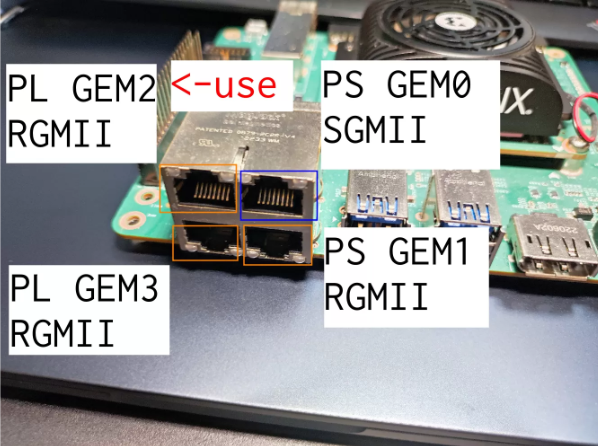
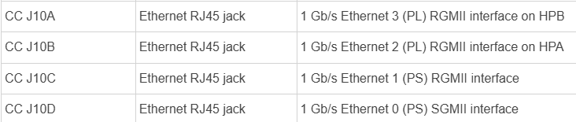
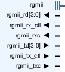
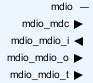
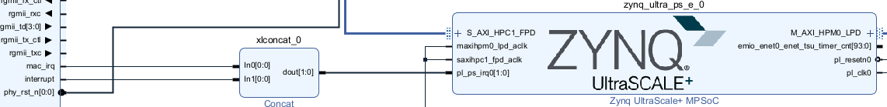
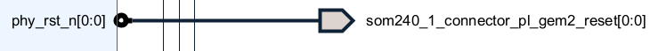

# AXI 1G/2.5G Ethernet Subsystem — Full Port & Interface Documentation

This section explains every major interface of the AXI 1G/2.5G Ethernet Subsystem IP,
including the AXI4-Lite control path, AXI4-Stream TX/RX channels,
RGMII PHY interface, MDIO management, clock/reset structure, and how these are used
in the KR260 + DP83867 PHY design.

---

## 1. Overview
**Information about the Ethernet IP Block Used**
The AMD AXI Ethernet Subsystem implements a tri-mode (10/100/1000 Mb/s) Ethernet MAC
or a 10/100 Mb/s Ethernet MAC. This core supports the use of MII, GMII, SGMII, RGMII, and
1000BASE-X interfaces to connect a media access control (MAC) to a physical-side interface
(PHY) chip. It also provides an on-chip PHY for 1G/2.5G SGMII and 1000/2500 BASE-X modes.
The MDIO interface is used to access PHY Management registers. This subsystem optionally
enables TCP/UDP full checksum offload, VLAN stripping, tagging, translation, and extended
filtering for multicast frames features.

This subsystem provides additional functionality and ease of use related to Ethernet. Based on
the configuration, this subsystem creates interface ports, instantiates required infrastructure cores, and connects these cores.

The AXI Ethernet Subsystem is logically divided into three layers:

1. **AXI4-Lite Control Interface**  
2. **AXI4-Stream TX/RX Data Interfaces**  
3. **RGMII Physical Ethernet Interface**

System position:

```
DP83867 PHY (present in kr260 ethernet ports)
     ↓ RGMII
AXI Ethernet Subsystem (MAC) ←––––––– this block
     ↓ m_axis_rxd (data)
     ↓ m_axis_rxs (status)
AXIS_RX_TO_RDMA (Custom IP)
```
Here is a picture of this MAC ip used in the final RDMA design.


Inside of PL ethernet ip:


---
## 2. VERY IMPORTANT INFORMATIONS BEFORE STARTING WITH THE MAC
### 2.1 LICENSE INFORMATION ABOUT THIS IP BLOCK
Note that an evaluation license (Hardware Evaluation) for Tri-Mode Ethernet MAC IP has been obtained. It will not compile without it.


From the following link, it is possible to get 4 month free trial license for this ip.

[License Link](https://login.amd.com/app/amd_accountamdcom_1/exk559qg7f4aW4yim697/sso/saml?SAMLRequest=fVLLbsIwEPyVyHdwEhECFkGioKpItEVAW6kX5JgNWHXs4HVa%2BPuaQF%2BHcvJqPTuznvEAeakqNqrdTi9gXwO64FAqjay5yEhtNTMcJTLNS0DmBFuO7mcsboesssYZYRQJRohgnTR6bDTWJdgl2Hcp4Gkxy8jOuQoZpVwIU2vX5uWmLUxJTwoUK%2BppCqmAVgadByEJJn4NqfmJ8Gdcma3U38O8qqiv1xdSX%2FruOqJweEuS%2Fn6bFh3%2B0jnKsttPKaJp1EgwnWRk3Sl6ScRTHnbTYtMNedELU9hESd6BKM9FHIl%2BnsQejFjDVKPj2mUkDuOkFcWtOFlFfZb0WJi2wzB%2BJcGtsQIaCzNScIVAgvnFmhupN1Jvr%2FuYn0HI7lareWv%2BuFyR4BksNs%2F3ADIcnLZnzT72Vz7XaflXKGT4XwT%2BvLQG9JfEWa9iD55zOpkbJcUxGCllPsYWuIOMOFsDocPz1N%2F%2FM%2FwE&RelayState=https%3A%2F%2Faccount%2Eamd%2Ecom%2Fen%2Fforms%2Flicense%2Flicense%2Dform%2Ehtml)

Choose this option and the ethernet ip block will be functional.


You can follow this link for the detailed explanation. 
[License Link](https://digilent.com/reference/vivado/temac?srsltid=AfmBOopFCrHFR-mmgt0yZ6U_JD0973M5YUpqqRmJV5cOFaeGCqq5kVro)

### 2.2 Creating VIVADO Projects with Kria - Manage Board Connection for PL ETHERNET

While creating VIVADO project for Kria Boards, there is "Connections --> Manage Board Connections" option. This option is really helpful for designing projects for Kria Boards which include popular interfaces as GPIO, MIPI, I2C on KV260 and PL Ethernet, SFP connection, Pmod, Clocks on KR260. After proper selection of "Manage Board Connection" option we can get some of the most used interface connections easily and it also pulls the Constraint itself.

#### KR260 VIVADO project creation with Board Connections
1. Here we can select Connector for KR260- SoM240_1 and SoM240_2, here is an example:

2. Now on creating Block Design, we can again see multiple Interfaces available on KR260 Board Connector, example we can get SFP connector , PL Ethernet , Pmod etc.


As an example, i have added two PL Ethernet (GEM2 and GEM3 RGMII Ethernet) on above Kria KR260 Board based Block Design. You can drag from the board screen and place the PL GEM2 RGMII ETHERNET ip with external connections in your block design. VIVADO automatically configure the PL Ethernet IP(AXI 1G/2.5G Ethernet Subsystem IP) and pulls the constraint for it from Board file. 

When selecting them via Board Connections:
- Vivado automatically instantiates AXI 1G/2.5G Ethernet Subsystem (the MAC)
- It automatically wires RGMII signals
- It automatically imports the correct constraints like pin locations, I/O standards, RGMII timing requirements
- It automatically wires MDIO signals
- It automatically wires PHY reset signal

I used GEM2 PL ethernet port for the project. Here is an image for the 4 ethernet ports that are present on the kr260 board.



### 2.3 Checking the Settings of the PL Ethernet Subsystem in Vivado 
The most important steps to do before being able to work with this ip block in our RDMA project were getting the license and setting board-based I/O constraints before starting the project. So after doing these two steps we can finally customize the block specifically for our board kria kr260. We can see the board based IO constraints that we previously generated on the first page.


In the physical interface part we can see RGMII and 1gbps speed is preselected. The reason we cannot have any other option is because on the KR260, the GEM2 PL Ethernet port is hard-wired for RGMII. No other MAC–PHY physical interface (GMII, SGMII, MII, RMII) is supported on this port.


The information for all ports is also written in Kria KR260 Robotics Starter Kit User Guide (UG1092).



## 3. `s_axi` / AXI-Lite Interface (Control & Configuration)

The AXI Ethernet Subsystem exposes a full AXI4-Lite slave interface for software control from the PS (A53) or from any AXI-Lite master in the PL. This interface is completely separate from the AXI-Stream data paths. It is used only for configuration, status, and register access.

### 3.1 Why AXI-Lite (`s_axi`) Is Required in Our Project
In our RDMA project, the AXI-Lite interface is responsible for:
- enabling TX and RX paths (XAE_TRANSMITTER_ENABLE_OPTION, XAE_RECEIVER_ENABLE_OPTION)
- setting MAC address for PHY
- initializing and managing the PHY via MDIO
- setting MAC operating speed
- read/write internal MAC registers
- checking BMSR for link up
- starting the MAC after configuration

Without AXI-Lite:
- MAC never turns on
- PHY never negotiates link
- m_axis_rxd / m_axis_rxs remain idle forever
- No Ethernet traffic appears on RGMII

All MAC software functions in vitis (`XAxiEthernet_SetMacAddress`, `*_SetOptions`, `PhyRead/PhyWrite`, `XAxiEthernet_Start()`) operate through this port.

## 4. AXI-Stream TX Path (Custom IP → MAC)

This part will be a quick summary to include all pin explanations in this section. These two tx channels will be explained in detail in the rxtx_to_rdma custom ip block.

TX requires **two separate AXI4-Stream channels**:

1. **TX Control** (`s_axis_txc`)  
2. **TX Data** (`s_axis_txd`)  

The MAC enforces a strict ordering rule:

> **TXC must finish completely before TXD is allowed.  
> If not, the MAC drops the entire frame.**

---

### 4.1 `s_axis_txc` — TX Control Stream

Exactly **6 words** per Ethernet frame (Normal Transmit Mode).

| Signal | Description |
|--------|-------------|
| `tdata[31:0]` | Control word |
| `tkeep[3:0]` | Byte mask (always `0xF`) |
| `tvalid` | Control word valid |
| `tready` | MAC ready |
| `tlast` | Asserted on word 5 (6th txc word) |

#### TXC Word Format (from PG138 ethernet block datasheet)

| Word | Purpose |
|------|---------|
| Word 0 | Flag = `0xA` (Normal Transmit) |
| Words 1–5 | Reserved, set to `0x00000000` |

We always use:
`0xA0000000`


This selects **Normal Transmit AXI4-Stream Frame**, not “Receive-Status Transmit”.

---

### 4.2 `s_axis_txd` — TX Data Stream

Actual Ethernet bytes are streamed here.

| Signal | Description |
|--------|-------------|
| `tdata[31:0]` | 32-bit payload word |
| `tkeep[3:0]` | Last-word mask |
| `tvalid` | Payload valid |
| `tready` | Backpressure from MAC |
| `tlast` | End of frame |

#### Requirements

- Data beats must be **continuous** until `tlast=1`
- `tkeep` accurate on the last word
- No gaps while `tvalid=1`

---

### 4.3 Full TX Timing (AXI4-Stream Transmit Control → AXI4-Stream Transmit Data)

TXC Stage:
Word0 Word1 Word2 Word3 Word4 Word5 (tlast=1) [tready=1] → MAC accepts full TXC frame

TXD Stage:
Data0 Data1 ... DataN (tlast=1) [tready=1] → MAC transmits via RGMII

If TXC does not finish cleanly:  
**MAC will not raise `s_axis_txd_tready` → TXD is blocked forever.**

---

## 5. AXI-Stream RX Path (MAC → Custom IP)

MAC sends **two streams** back-to-back:

1. Full Ethernet payload (`m_axis_rxd`)
2. A 6-word RX status frame (`m_axis_rxs`)

---

### 5.1 `m_axis_rxd` — RX Data Stream

| Signal | Meaning |
|--------|---------|
| `tdata[31:0]` | Ethernet/IP/RDMA bytes |
| `tkeep[3:0]` | Last-word mask |
| `tvalid` | Data valid |
| `tlast` | End of frame |
| `tready` | Backpressure from RDMA RX |

MAC guarantees each packet arrives as **one contiguous AXI burst**.

---

### 5.2 `m_axis_rxs` — RX Status Stream

Each RX packet is followed by **6 words** of status information.

#### Word 5, bits[15:0]:
Receive AXI4-Stream Status word 5, bits 15-0 always contains the number of bytes in length of
the frame being sent across the receive AXI4-Stream Status interface.

Other words contain:

- Frame OK  
- VLAN info  
- Checksum flags  
- MAC filtering results  
- Optional offload information  

Our custom RDMA RX uses only the **length field**, which I did not implement in the final design.

---

## 6. Reset Signals

| Port | Purpose |
|------|----------|
| `axi_txc_aresetn`   | Reset for TXC       |
| `axi_txd_aresetn`   | Reset for TXD       |
| `axi_rxd_aresetn`   | Reset for RXD       |
| `axi_rxs_aresetn`   | Reset for RXS       |
| `s_axi_lite_resetn` | Reset for AXI4-Lite |


All of these reset pins are connected to Processor System Reset block which is connected to the clock coming from PS `pl_clk0` from slowest_sync_clk pin. Like all other ip blocks in the block design, all four reset pins of the MAC are connected to this `peripheral_aresetn` pin of the reset block. So as a summary, since all ip blocks are driven by PS clock I connected them to the same clock domain reset.

Also as a sidenote, `ext_reset_in` pin of that reset block is connected to `pl_resetn0` pin of PS.


---

## 7. Clocks

Clocks are another important part of PL ethernet IP. From the PG138 datasheet we can have a detailed information about clock pins and how to set them. There are four clocks for PL ethernet ip. These are shown in the table below:

| Clock | Description |
|--------|-------------|
| `s_axi_lite_clk` | 100 Mhz |
| `axis_clk` | 100 MHz |
| `ref_clk` | 300 MHz |
| `gtx_clk` | 125 MHz |

---

### 7.1 `s_axi_lite_clk` — AXI4-Lite Clock

This is the dedicated clock input for the AXI4-Lite control interface of the AXI Ethernet Subsystem.

- Used exclusively for **register access** (configuration, status reads, option settings).
- Drives the internal control path that configures the MAC and MDIO management logic.
- Connected to **PS `pl_clk0` (100 MHz)**.

Only AXI-Lite configuration transactions use this clock.  
It has **no impact** on TX/RX datapath timing.

---

### 7.2 `axis_clk` — AXI-Stream TX/RX Data Clock

This is the main high-speed clock for the Ethernet data plane.  
It drives **all AXI-Stream interfaces**:

- `s_axis_txc` (TX Control)
- `s_axis_txd` (TX Data)
- `m_axis_rxd` (RX Data)
- `m_axis_rxs` (RX Status)

Key properties:

- Required for **TXC/TXD/RXD/RXS synchronization**.
- The axis_clk signal should be connected to the same clock source as the AXI4-Stream interface.
- All data-path FIFOs, `tvalid/tready`, and `tlast` signaling occur on this clock.
- The MAC asserts `tready` only when the datapath clock domain is active and synchronized.

For our design:
- Connected to **PS `pl_clk0` (100 MHz)**.
- This clock defines the timing of the **entire Ethernet streaming pipeline** also all our ips connected to this clock so the datapath inside our RDMA logic is driven with the same 100 Mhz clock coming from PS.

---

### 7.3 `ref_clk` — Reference Clock 

This is a stable global clock used by signal delay primitives and transceivers in those respective modes. The clock frequency is 200 MHz for 7 series FPGAs. For UltraScale/UltraScale+/Versalarchitecture, the frequency range is 300-1333 MHz for GMII and RGMII modes. Since kr260 is UltraScale+, I used 300 Mhz coming from the clocking wizard which uses som240_1_connector_hpa_clk0p_cl. This connection refers to the external PL reference clock provided by the KR260 oscillators.

---

### 7.4 `gtx_clk` — RGMII 125 MHz Transmit Clock

`gtx_clk` is often confused with the PHY-side GTX_CLK pin found on RGMII PHYs like the DP83867 present in our kr260 board. Although they share the same name, **they are completely different signals with different purposes.** This section explains the role of gtx_clk inside the AXI Ethernet Subsystem.


Functions:
- Provides the **TX clock domain** for the MAC’s internal datapath.
- Drives the GMII/RGMII transmit timing and synchronizes TX signals.
- Used by the MAC to produce proper Ethernet timings at 1 Gbps.
- Required for **RGMII operation** on KR260 (GEM2 → DP83867).

`gtx_clk` must be a **pure 125 MHz clock**. It feeds the AXI Ethernet Subsystem so the MAC can clock data toward the DP83867 PHY and also uses this clock for its internal logic.
It originates from the Clocking Wizard with the input connected to som240_1_connector_hpa_clk0p_cl. This pin refers to the external PL clock from the oscillator. This is very important specifically for `gtx_clk` because the MAC expects a pure 125 Mhz clock, even the slightest deviation from that value will cause an error. That is why I spent a lot of time trying to figure out how to get a pure 125 MHz source. Initially, I used `pl_clk0` coming from the PS as the input to the Clocking Wizard and tried to derive `gtx_clk` and `ref_clk` from that clock. However, it is impossible to obtain exactly 125 Mhz from it, because `pl_clk0` is ultimately derived from the MPSoC PS PLL outputs, which themselves come from the external 33.333 MHz oscillator on the KR260. As a result, `pl_clk0` is also not a pure 100 Mhz either.  

To solve this issue, we used the external 25 MHz clock from the board as the Clocking Wizard input, allowing us to generate a pure 125 MHz clock for the `gtx_clk` connection.

This is the error you get if you try to use `pl_clk0` to feed the clocking wizard for `gtx_clk` connection.


This clock never changes frequency, even when the actual link operates at 10 Mbps or 100 Mbps. The reason for that will be explained in detail in RGMII & PHY part. For now what you should know is to use 125 Mhz for this PL ethernet ip.

---

## 8. RGMII PHY Interface (DP83867)

This is just a quick represantation for showing all ports of PL ethernet ip. The details will be in RGMII & PHY part.


RGMII is the physical wiring between:
AXI Ethernet Subsystem → DP83867 PHY



### 8.1 RX (PHY → MAC)

| Port | Description |
|------|-------------|
| `rgmii_rxd[3:0]` | Incoming nibble |
| `rgmii_rx_ctl` | RX_DV + RX_ER |
| `rgmii_rx_clk` | PHY-generated RX clock |

### 8.2 TX (MAC → PHY)

| Port | Description |
|------|-------------|
| `rgmii_txd[3:0]` | Outgoing nibble |
| `rgmii_tx_ctl` | TX_EN + TX_ER |
| `rgmii_tx_clk` | MAC-generated TX clock |

No other PHY interface exists on GEM2.

---

## 9. MDIO — `mdio` (Management Data Input Output)



| Port | Description |
|------|-------------|
| `mdio_mdc` | MDIO clock |
| `mdio_mdio_i` | PHY → MAC |
| `mdio_mdio_o` | MAC → PHY |
| `mdio_mdio_t` | Tristate control |

Used for:

- Reading PHY link status  
- Auto-negotiation control  
- Speed/duplex configuration  
- Reading BMSR/BMCR registers  

This is always present for **MII, GMII, RGMII, SGMII** modes.

---

## 10. Interrupt

| Port | Description |
|------|-------------|
| `interrupt` | Global subsystem interrupt |
| `mac_irq`  | TEMAC interrupt |



These two interrupt pins are connected to `xlconcat__0` and from there to pl_ps_irq0[1:0] pin of PS.

---

## 11. PHY Reset



| Port | Description |
|------|-------------|
| `phy_rst_n[0:0]` | Reset output to DP83867 |

---

## 12. Summary
This section provides a detailed explanation of the MAC PL Ethernet IP customized for the KR260 board. Every single port of this IP is described.


