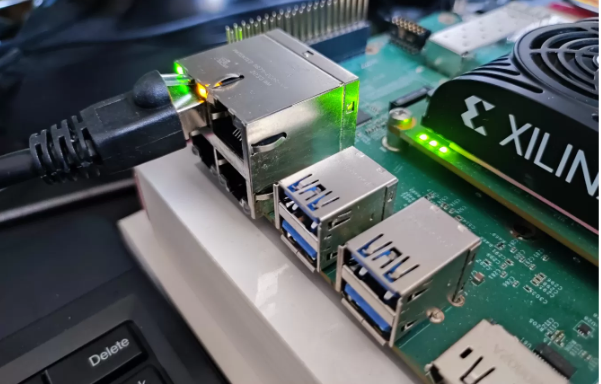
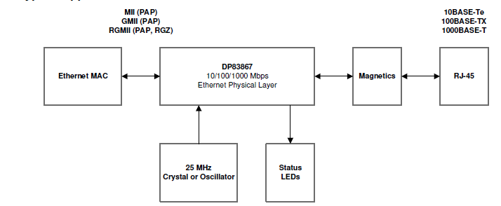
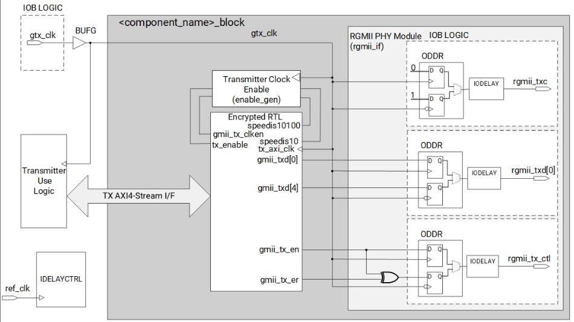
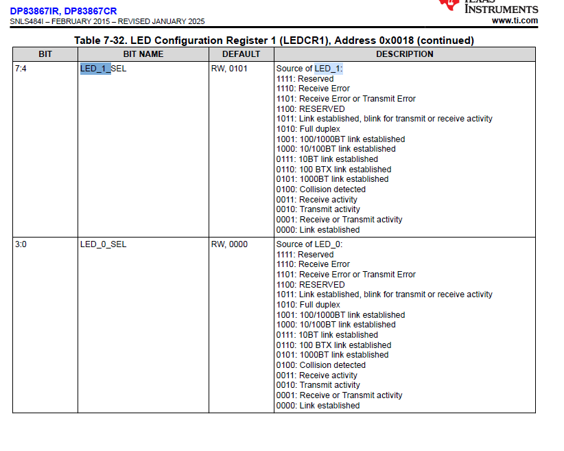
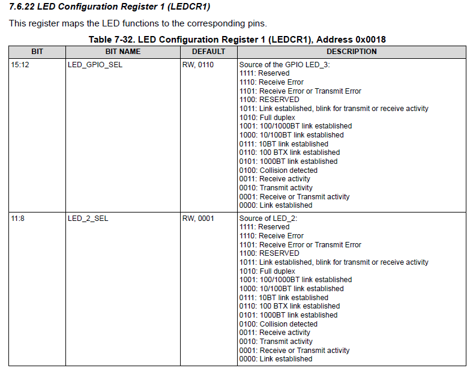
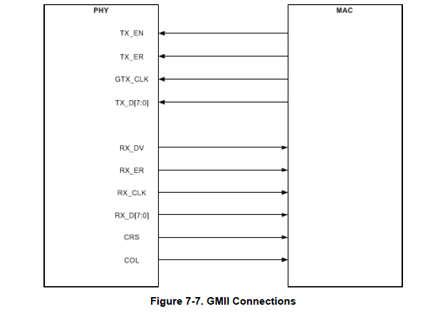

# RGMII & DP83867IR PHY

This chapter documents the RGMII-based Ethernet PHY used in the KR260 PL Ethernet interface and how it is configured and used together with the **AXI 1G/2.5G Ethernet Subsystem (PG138)** and our Vitis software. 

The focus is on:

- Different types of Media-independent interfaces (MII) and their properties
- What RGMII actually is (signals, timing, clocking).
- How the **The Texas Instruments DP83867IR** PHY on the KR260 is wired and configured.
- How the PHY and MAC (AXI Ethernet IP) interact to produce a working 1 Gbps link.

The PHY can be explained through its two main interfaces: MDIO and RGMII. I already have a separate section dedicated to MDIO, where I describe how the PHY is configured and how its status is monitored. This section will focus on RGMII, which is the primary data path between the MAC and the PHY and the most important connection between them. That is why I chose to include PHY in the title of this section instead of MDIO.

---

## 1. KR260 Ethernet Hardware Overview

The KR260 integrates two PL-based Gigabit Ethernet interfaces implemented through **RGMII** and connected to two discrete PHY devices. These interfaces form the physical entry point for all Ethernet frames used in our PL-side data pipeline. This section summarizes the hardware components involved and how Ethernet signals reach the FPGA fabric.

---

### 1.1 PL-Side Ethernet Ports

According to the KR260 Carrier Card User Guide (UG1092), the PL exposes two RGMII-based Ethernet ports:

- **CC J10A** — “1 Gb/s Ethernet 3 (PL) – RGMII on HPB”
- **CC J10B** — “1 Gb/s Ethernet 2 (PL) – RGMII on HPA”

Each port is implemented using a dedicated **TI DP83867** Gigabit Ethernet PHY.



---

### 1.2 Electrical Path: RJ45 → PHY → FPGA

Each Ethernet interface consists of the following hardware path:

1. **RJ45 jack with integrated magnetics**  
   Provides isolation and differential coupling for 10/100/1000BASE-T.

2. **DP83867IR Gigabit PHY**  
   Converts copper Ethernet signaling into digital RGMII signals. Handles: Line coding / decoding , Auto-negotiation, and Speed selection (10/100/1000).

3. **RGMII interface into FPGA PL**  
      `rgmii_td[3:0]`, `rgmii_tx_ctl`, `rgmii_txc`  
      `rgmii_rd[3:0]`, `rgmii_rx_ctl`, `rgmii_rxc`  

4. **AXI 1G/2.5G Ethernet Subsystem (MAC)** 
   The MAC consumes RGMII signals and exposes:
   - AXI-Stream TX/RX interfaces  
   - MDIO management  
   - FCS generation and checking  
   - MAC address filtering  
 


---

### 1.3 Relevant PHY Hardware Features

The DP83867 is a single port 10/100/1000 Ethernet PHY, that supports connections to an Ethernet MAC via RGMII or GMII. Connections to the Ethernet media are made via the IEEE 802 3 defined Media Dependent Interface. DP83867IRRGZ/CRRGZ support only RGMII.

The TI DP83867IR device provides several features essential to KR260 RGMII operation:

- **IEEE 802.3 10/100/1000 Mb/s support**
- **RGMII interface** with optional internal clock delays
- Internal PLL locked to a **25 MHz reference crystal**
- **MDIO/MDC** interface for configuration and status
   
   Strap pins determining:
  - PHY address  
  - RGMII/SGMII mode  
  - TX/RX delay defaults  
  - Autonegotiation behavior  


---

### 1.4 Block Design Integration

Inside the Vivado block design:

- The DP83867 RGMII pins route directly to the **AXI 1G/2.5G Ethernet Subsystem**.
- The MAC is configured explicitly for **RGMII operation**.
- `gtx_clk` (125 MHz) for the MAC is supplied via a Clocking Wizard.
- MDIO is connected for PHY management.

Later sections build on this hardware foundation.
---

## 2. What is RGMII?

RGMII (Reduced Gigabit Media Independent Interface) is one member of the broader MII family of MAC–PHY interfaces, which define how an Ethernet MAC connects to an external PHY. The original MII (Media Independent Interface) supported 10/100 Mbps using a 4-bit data bus clocked at 25/2.5 MHz. As speeds increased, GMII (Gigabit MII) expanded this to an 8-bit bus clocked at 125 MHz, allowing 1 Gbps but requiring 24 signals—too many for compact boards. To reduce complexity, several “reduced” variants were introduced: RMII (Reduced MII) for 10/100 Mbps using only 2 data lines + 50 MHz clock, and RGMII (Reduced GMII) for 1 Gbps using only 4 data lines per direction. RGMII achieves the same throughput as GMII by using **double-data-rate (DDR)** signaling —transmitting data on both clock edges— cutting the pin count roughly in half.

---

### 2.1 RGMII Signal Set

**From the datasheet:**

The Reduced Gigabit Media Independent Interface (RGMII) is designed to reduce the number of pins required to interconnect the MAC and PHY (12 pins for RGMII relative to 24 pins for GMII). To accomplish this goal, the data paths and all associated control signals are reduced and are multiplexed. Both rising and trailing edges of the clock are used. For Gigabit operation the GTX_CLK and RX_CLK clocks are 125MHz, and for 10- and 100Mbps operation, the clock frequencies are 2.5MHz and 25MHz, respectively.

RGMII reduces the classic GMII interface from **8-bit data + multiple control pins** down to:

- **4-bit data bus per direction**  
- **1 control pin per direction**  
- **Separate TX and RX clocks**

To maintain full Gigabit throughput with only 4 bits, RGMII uses **DDR signaling**:

- **Rising edge** of the clock → lower 4 bits  
- **Falling edge** of the clock → upper 4 bits  

This effectively transfers 8 bits every 8 ns at 125 MHz → **1.0 Gbps**.

#### Transmit Path (MAC → PHY)

| Signal | Description |
|--------|-------------|
| `rgmii_td[3:0]` | 4-bit transmit data bus (DDR) |
| `rgmii_tx_ctl` | Encodes TX_EN and TX_ER |
| `rgmii_txc` | 125 MHz transmit clock generated by the MAC |

#### Receive Path (PHY → MAC)

| Signal | Description |
|--------|-------------|
| `rgmii_rd[3:0]` | 4-bit receive data bus (DDR) |
| `rgmii_rx_ctl` | Encodes RX_DV and RX_ER |
| `rgmii_rxc` | 125 MHz receive clock generated by the PHY |

These pins are visible in PL ethernet block.


---

### 2.2 RGMII Speeds and Clocking Behavior

#### 1 Gbps Operation

- The MAC drives/receives data at **125 MHz DDR** on `rgmii_td[3:0]` / `rgmii_rd[3:0]`.
- Each 8 ns clock period carries 8 bits.
- Effective data rate: **1.0 Gbit/s** on the digital RGMII bus.

#### 100 Mbps and 10 Mbps Operation
When the RGMII interface is operating in the 100Mbps mode, the Ethernet Media Independent Interface (MII) is implemented by reducing the clock rate to 25MHz. For 10Mbps operation, the clock is further reduced to 2.5MHz. In the RGMII 10/100 mode, the transmit clock RGMII TX_CLK is generated by the MAC and the receive clock RGMII RX_CLK is generated by the PHY. During the packet receiving operation, the RGMII RX_CLK can be stretched on either the positive or negative pulse to accommodate the transition from the free-running clock to a data synchronous clock domain. When the speed of the PHY changes, a similar stretching of the positive or negative pulses is allowed. No glitch is allowed on the clock signals during clock speed transitions. This interface operates at 10- and 100Mbps speeds the same way as at 1000Mbps mode with the exception that the data can be duplicated on the falling edge of the appropriate clock. The MAC holds the RGMII TX_CLK low until the MAC has confirmed that the MAC is operating at the same speed as the PHY.

---

## 3. MAC Speed vs PHY Autonegotiation

One of the most commonly misunderstood parts of RGMII bring-up is **the relationship between the PHY's negotiated line speed** and **the MAC’s internal operating speed**.

On the KR260, the PHY (DP83867) handles autonegotiation with the link partner entirely in hardware.  
The MAC (AXI 1G/2.5G Ethernet Subsystem), however:

- **Does NOT automatically update its internal speed**
- **Does NOT read PHY speed from BMSR or vendor registers**
- **Relies 100% on software configuration**

This means even if the PHY negotiates 1000 Mbps, the MAC will not operate correctly unless the software configures it for 1000 Mbps.

---

### 3.1 How Autonegotiation Works at PHY Side

The PHY negotiates *link speed* and *duplex* with the remote device via the 802.3 standard autonegotiation FSM.  
The DP83867 performs the following in hardware:

1. Advertises supported modes (10/100/1000, full-duplex, etc.)
2. Exchanges link code words with partner
3. Determines best common mode
4. Enables internal clocking paths for that mode
5. Sets status bits:
   - `BMSR[2]` — LINK_STATUS  

This entire process occurs **independently of the MAC**.

---

### 3.2 How the MAC Operates Internally

The MAC has **no ability to know PHY speed**.

Instead, it must be explicitly configured by software using:

```c
XAxiEthernet_SetOperatingSpeed(&EthInst, XAE_SPEED_1000_MBPS);
```

Supported values:

- `XAE_SPEED_10_MBPS`
- `XAE_SPEED_100_MBPS`
- `XAE_SPEED_1000_MBPS`

If this value does not match the negotiated PHY speed, the MAC will not function correctly.

In our project we always **forced the MAC to 1 Gbps mode**, because both of our kr260 aimed gigabit ethernet.

If we wanted to support 10/100 Mbps links as well, we would first read the negotiated speed from the PHY’s status registers over MDIO and then pass the corresponding XAE_SPEED_* value to XAxiEthernet_SetOperatingSpeed() instead of hard-coding XAE_SPEED_1000_MBPS. In our KR260 setup, we always run the link at 1 Gbps, so this dynamic speed handling is not needed.


When the AXI Ethernet Subsystem operates in a multi-speed environment—meaning the external PHY may negotiate 10, 100, or 1000 Mbps depending on the link partner—the MAC cannot automatically follow the PHY’s negotiated speed because the AXI Ethernet IP in the PL has no hardware logic that interprets MDIO data. The PHY performs auto-negotiation on the cable and decides the link speed, but the MAC remains blind unless software explicitly reads the PHY registers over MDIO and then updates the MAC’s internal speed mode using XAxiEthernet_SetOperatingSpeed(). If this is not done, and the PHY negotiates a speed different from the MAC’s current configuration, the MAC will not pass any traffic due to timing mismatch. 

---

### 3.3 Tri-Mode Ethernet MAC and PHY Communication with RGMII in Detail

Our PL ethernet block contains Tri-Mode MAC which supports three different speeds however the ethernet block itself only supports 1GBPS. Therefore, when we look at the Tri-Mode Ethernet MAC LogiCORE IP Product Guide (PG051) to see our diagram and RGMII explanation we should look at **1 Gbps Ethernet MAC Core Interfaces**. The following figures and informations are taken under 1GBPS section.

**1 Gbps RGMII Transmitter and Clock Logic:**
The logic required to implement the RGMII transmitter logic is shown in the figure. The `gtx_clk`  is a user-supplied 125 MHz reference clock source which is placed onto global clock routing to provide the clock for all transmitter logic, both within the core and for the user-side logic which connects to the transmitter AXI4-Stream interface of the core.


Figure shows how to use the physical transmitter interface of the core to create an external RGMII. The signal names and logic shown in this figure exactly match those delivered with the core. It shows that the output transmitter signals are registered in a device bit slice using output DDR registers, before driving them to the device pads. The logic required to forward the transmitter clock is also shown. This logic uses a bit slice output Double-Data-Rate (DDR) register so that the clock signal produced incurs exactly the same delay as the data and control signals. However, the clock signal is then routed through an output delay element (ODELAY cascaded with IDELAY) before connecting to the device pad. The result of this is to create a 2 ns delay, which places the rgmii_txc forwarded clock in the center of the data valid window for forwarded RGMII data and control signals.

**Note:** For UltraScale+ devices, RGMII interface logic uses only the IDELAY/ODELAY components to provide skew between clock and data lines.

Even though our Ethernet subsystem includes a TEMAC, the KR260 design supports only 1 Gbps operation. Still, I want to demonstrate how the MAC internally generates the effective `GTX_CLK` for different Ethernet speeds while always receiving the same `gtx_clk` input clock. One detail that can be confusing is the naming: in the TI DP83867IR datasheet, the RGMII transmit clock pin on the PHY is labeled `GTX_CLK`, even though the MAC also takes an input clock called `gtx_clk`. These are not the same signal—the MAC-side `gtx_clk` is a 125-MHz reference clock used to drive the transmitter logic, while the PHY-side `GTX_CLK` is the forwarded RGMII transmit clock going to the RJ-45.

Another key point is that the TEMAC always uses the same 125-MHz clock for all three Ethernet speeds (10/100/1000 Mbps). This was my biggest confusion when I started working with PL Ethernet, because the MAC requires a pure 125-MHz clock even when the link operates at lower speeds. The way TEMAC achieves different data rates using a fixed 125-MHz reference is explained in the Tri-Speed RGMII Transmitter and Clock Logic section and illustrated in the figure below.

**For RGMII, this global 125 MHz is used to clock transmitter logic at all three Ethernet speeds. The data rate difference between the three speeds is compensated for by the transmitter clock enable logic (the enable_gen module from the example design describes the required logic). The derived tx_enable signal must be supplied to the Ethernet MAC core level. At all speeds the MAC expects the user logic to supply/accept new data after each validated clock cycle. The generated tx_enable signal is always High at 1 Gbps, High for one in ten cycles at 100 Mbps, and High for one in a hundred cycles at 10 Mbps.**



So basically we enable all clock pulses for our 1GBPS design with enable_gen module inside MAC to have 125 Mhz `gtx_clk`.

---

## 4. RGMII Debugging Guide 

### 4.1 First Question: **Is the PHY Alive?**

Before touching the MAC, always confirm the PHY is actually responding.

#### Check 1 — MDIO Reads Return Valid Values

Run:

```c
XAxiEthernet_PhyRead(&EthInst, PhyAddr, PHY_REG_BMSR, &Bmsr);
```

Expected:

- Not `0xFFFF`
- Not `0x0000`
- It should be 2.

If you get `0xFFFF`:

- Wrong PHY address
- MDIO not connected
- PHY stuck in reset
- PHY has no power
- Something holding MDIO high-Z

---

### 4.2 Link LED Status

LED's for PHY is important for seeing the status of connection without looking at the registers with MDIO. The good thing is there are different status view options that you can adjust by using the LED configuration registers. In the datasheet, there are two tables showing the LED configuration registers.





On the KR260, only two LEDs are used: LED_0_SEL and LED_1_SEL. These pins already have default configurations in the DP83867, and since I had no issues during my initial TX tests, I did not modify them. However, if you encounter problems, you can change one of the LED functions to activity mode, which will blink whenever packets are received and provide useful visual feedback.

With the default settings:

- **Green LED** → 1000BT Link Established 
- **Yellow LED** → Link established


If LINK LED is off:

- Wrong PHY address  
- Autoneg disabled  
- Cable issue  
- Remote device down  
- PHY not out of reset  

---

### 4.3 Autonegotiation Debugging

The DP83867 autoneg FSM may fail silently.

#### Step 1 — BMSR Double-Read

```c
XAxiEthernet_PhyRead(&EthInst, PhyAddr, 1, &b1);
XAxiEthernet_PhyRead(&EthInst, PhyAddr, 1, &b2);

if (b2 & 0x0004)  
    xil_printf("Link Up\n");
```

If link never becomes UP:

- Autoneg disabled in BMCR
- DONT FORCE SPEED in software — let PHY negotiate  
  (MAC speed is independent of PHY speed)

---

## 5. A visual Comparison Between Different Media Independant Interfaces (MII)

### MII (Media Independent Interface)

- 4-bit wide Tx and Rx data paths  
- 25 MHz Tx and Rx clocks @ 100 Mbps (2.5 MHz @ 10 Mbps)  
- Supports 10 Mbps and 100 Mbps operation  
- **16 signals total**


## GMII (Gigabit Media Independent Interface)

- 8-bit wide Tx and Rx data paths  
- 125 MHz Tx and Rx clocks  
- Supports 1000 Mbps operation  
- **24 signals total**



## RGMII (Reduced Gigabit Media Independent Interface)

- 4-bit wide Tx and Rx data paths  
- 125 MHz Tx and Rx clocks with **data latched on both rising and falling edges (DDR)**  
- Supports 1000 Mbps operation  
- **12 signals total**


