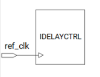

# Timing & Clocks

This chapter quickly explains how clocks and resets are organized in **PL Ethernet** on the KR260, and why the exact frequencies matter for the **AXI 1G/2.5G Ethernet Subsystem, RGMII I/O, and our custom RX/TX logic**. All clocks are explained in detail in different parts, I want to only focus and summarize all clocks here.

We focus on:

- Which clock each IP core uses.
- How we generate 125 MHz and 300 MHz from the 25 MHz board clock.
- How the PS 100 MHz clock is used for AXI-Lite control.

---

## 1. Board-Level Clocks on KR260

On the KR260 carrier card we rely on two main clock sources:

**25 MHz PL reference clock**  
   - Comes from the SOM connector (som240_1_connector_hpa_clk0p_clk) into the PL.  
   - In the block design it is wired to the input of a **Clocking Wizard**.  
   - Used only as a *source*, we never run logic directly at 25 MHz.

**100 MHz PS → PL clock (`pl_clk0`)** 

   - Generated by the Zynq UltraScale+ MPSoC PS.  
   - Exported into the PL through the **PS block** (`zynq_ultra_ps_e`).  
   - Used as the **AXI-Lite and “system” clock** for all ip blocks.

---

## 2. PL Clock Architecture

At the heart of the PL clocking is a **Clocking Wizard IP** with:

| Signal                 | Description                             |
|------------------------|-----------------------------------------|
| `clk_in1` (25 MHz)     | Board reference clock                   |
| `clk_out2` (125 MHz)   | Ethernet data-plane / RGMII clock       |
| `clk_out1` (300 MHz)   | IDELAY reference clock (ref_clk)                  |

These outputs feed three separate clock domains:

1. **100 MHz domain** – PS control & AXI-Lite.  
2. **125 MHz domain** – Ethernet MAC data-plane and `GTX_CLK` (rgmii_txc) between PHY and MAC.  
3. **300 MHz domain** – Internal IDELAY controller calibration.

---

## 3. 100 MHz Control / AXI4-Lite Domain

The 100 MHz domain is driven directly from **`pl_clk0`** of the PS.

**The axis_clk signal of AXI ethernet block should be connected to the same clock source as the AXI4-Stream interface.**

- **All AXI Stream** connections are also on the same 100Mhz so all data stream inside the RDMA logic works with this clock

- **All AXI-Lite slaves** on the same 100 MHz clock.

This simplifies timing closure and ensures that **Vitis drivers and AXI-Lite access timings** match the expected 100 MHz environment.

---

## 4. 125 MHz Ethernet Data-Plane Domain

The **125 MHz clock** (`clk_out2` from the Clocking Wizard) is the **core data-plane clock** for Ethernet ip block.

Clocked at 125 MHz:

- `axi_ethernet_0` data-plane ports:    
  - `gtx_clk`  
  - `GTX_CLK` (RGMII tx clock going from MAC to PHY)
- RGMII I/O logic inside the MAC (TXD/RXD DDR registers).

## 5. 300 MHz IDELAY / I/O Calibration Domain

RGMII I/O timing depends on properly calibrated **IDELAY / ODELAY** elements in the I/O banks.  
On UltraScale+ devices, these are controlled by a **`idelay_ctrl`** block that requires a **300 MHz reference clock**.

---

